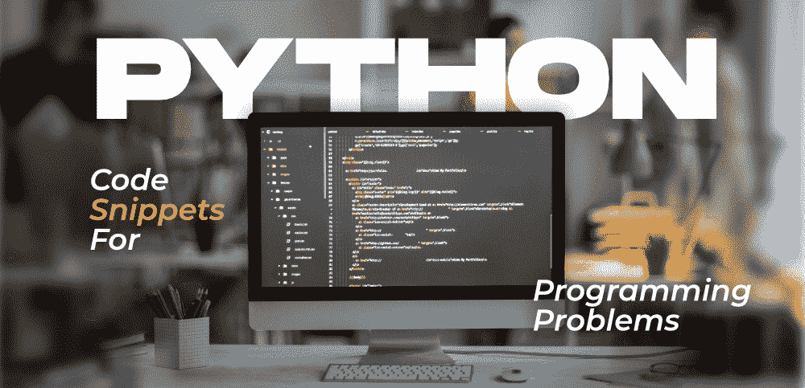

# 10 个日常编程问题的 Python 代码片段

> 原文:[https://www . geesforgeks . org/10-python-代码片段-日常编程-问题/](https://www.geeksforgeeks.org/10-python-code-snippets-for-everyday-programming-problems/)

近年来，Python 编程语言拥有庞大的用户群。原因之一可能是，与其他面向对象的编程语言(如 Java、C++、C#、JavaScript)相比，它更容易学习，因此越来越多进入计算机科学领域的初学者选择了 [Python](https://www.geeksforgeeks.org/python-programming-language/) 。Python 在 T2 的受欢迎程度飙升的另一个原因是，它几乎被用于信息技术行业的所有领域，无论是数据科学、机器学习、自动化、网页抓取、人工智能、网络安全、云计算等等！根据最近的开发人员调查，可以看出 Python 是目前仅次于 JavaScript 的第二大最受欢迎的编程语言，并且在未来几年将很容易蹿升。**对 Python 开发人员**的需求显著上升，尤其是在过去的几个月里，因此学习 Python 可以给你带来一些非常好的职业选择。



所以如果你是 Python 开发人员，这篇文章绝对适合你。今天我们将讨论 **Python 代码片段及其简要解释**，它们对开发人员和程序员的日常生活非常有用。我们将研究经常出现的各种编码问题，以及如何使用这里提供的 **Python 代码片段**来解决这些问题。让我们开始吧！

### 1.使用 If-Else 列出理解

**Python 中的列表理解**超级有帮助和强大。它们将代码长度缩减到很大的长度，使其更具可读性。在下面的代码中，我们可以看到我们使用列表中的 if-else 条件来检查 6 的倍数，然后检查 2 和 3 的倍数，这在很大程度上减少了代码。

## 蟒蛇 3

```py
my_list = ['Multiple of 6' if i % 6 == 0 
           else 'Multiple of 2' if i % 2 == 0 
           else 'Multiple of 3' if i % 3 == 0 
           else i for i in range(1, 20)]
print(my_list)
```

> **输出:**
> 
> [1，“2 的倍数”，“3 的倍数”，“2 的倍数”，5，“6 的倍数”，7，“2 的倍数”，“3 的倍数”，“2 的倍数”，11，“6 的倍数”，13，“2 的倍数”，“3 的倍数”，“2 的倍数”，17，“6 的倍数”，19]

### 2.合并两本词典

合并或追加两本词典听起来可能很混乱。但令人惊讶的是，有不止一种方法可以**合并两本词典**。在下面的代码中，第一种方法使用字典解包，其中两个字典一起解包成*结果*。在第二种方法中，我们首先将第一个字典复制到*结果*中，然后用第二个字典的内容更新它。第三种方法是使用字典理解的简单实现，类似于我们在上面的列表理解中看到的。

## 蟒蛇 3

```py
my_dict1 = {'a' : 1, 'b' : 2, 'c' : 3}
my_dict2 = {'d' : 4, 'e' : 5, 'f' : 6}

# Method 1
result = { **my_dict1, **my_dict2}
print(result)

# Method 2
result = my_dict1.copy()
result.update(my_dict2)
print(result)

# Method 3
result = {key: value for d in (my_dict1, my_dict2) for key, value in d.items()}
print(result)
```

> **输出:**
> 
> {“a”:1，“b”:2，“c”:3，“d”:4，“e”:5，“f”:6 }
> 
> {“a”:1，“b”:2，“c”:3，“d”:4，“e”:5，“f”:6 }
> 
> {“a”:1，“b”:2，“c”:3，“d”:4，“e”:5，“f”

### 3.文件处理

文件处理在各种 Python 程序中使用，尤其是那些与数据相关的程序，在这些程序中，我们需要读取大量逗号分隔的值。**文件处理**有打开文件、读取文件、写入文件、关闭文件等多种操作。

## 蟒蛇 3

```py
# Open a file
f = open('filename.txt')

# Read from a file
f = open('filename.txt', 'r')

# To read the whole file
print(f.read())

# To read single line
print(f.readline())

# Write to a file
f = open('filename.txt', 'w')
f.write('Writing into a file \n')

# Closing a file
f.close()
```

### 4.计算执行时间

经常需要优化代码和分析性能指标。在这里，*时间*库来帮忙。我们可以**测量代码的运行时间**并对其进行优化。我们还可以用它来衡量做同样工作的两段代码的运行时间，这样我们就可以选择最优化的一段。

## 蟒蛇 3

```py
import time

start_time = time.time()

# printing all even numbers till 20
for i in range(20):
  if i % 2 == 0:
    print(i, end = " ")

end_time = time.time()
time_taken = end_time - start_time
print("\nTime: ", time_taken)
```

> **输出:**
> 
> 0 2 4 6 8 10 12 14 16 18
> 
> 时间:2005 年 2 月 31 日

### 5.对字典列表进行排序

**对字典列表进行排序**起初听起来令人生畏，但我们可以使用两种不同但相似的方法来完成。我们可以简单地使用内置的 *sorted()* 或 *sort()* 函数，该函数在列表中使用一个 lambda 函数，根据字典的“id”键对字典进行排序。在第一种方法中，返回类型是无，因为更改已经到位，另一方面，在第二种方法中，返回一个新的排序字典列表。

## 蟒蛇 3

```py
person = [
  {
    'name' : 'alice',
    'age' : 22,
    'id' : 92345
  },
  {
    'name' : 'bob',
    'age' : 24,
    'id' : 52353
  },
  {
    'name' : 'tom',
    'age' : 23,
    'id' : 62257
  }
]

# Method 1
person.sort(key=lambda item: item.get("id"))
print(person)

# Method 2
person = sorted(person, key=lambda item: item.get("id"))
print(person)
```

> **输出:**
> 
> [{'name': 'bob '，' age': 24，' id': 52353}，{'name': 'tom '，' age': 23，' id': 62257}，{'name': 'alice '，' age': 22，' id': 92345}]
> 
> [{'name': 'bob '，' age': 24，' id': 52353}，{'name': 'tom '，' age': 23，' id': 62257}，{'name': 'alice '，' age': 22，' id': 92345}]

### 6.寻找最高频率元素

我们可以通过传递键作为元素的计数，即元素出现的次数，来找到出现时间最长的元素。

## 蟒蛇 3

```py
my_list = [8,4,8,2,2,5,8,0,3,5,2,5,8,9,3,8]
print("Most frequent item:", max(set(my_list), key=my_list.count))
```

> **输出:**
> 
> 最常见项目:8

### 7.错误处理

错误处理是**使用试捕**(最后)消除执行时突然停止的任何可能性。可能导致错误的语句被放入一个 try 块，后面跟着一个捕获异常(如果有的话)的 except 块，然后我们有一个“finally”块，它无论如何都会执行，并且是可选的。

## 蟒蛇 3

```py
num1, num2 = 2,0
try:
    print(num1 / num2)
except ZeroDivisionError:
    print("Exception! Division by Zero not permitted.")
finally:
    print("Finally block.")
```

> **输出:**
> 
> 例外！不允许除以零。
> 
> 最后封锁。

### 8.在字符串列表中查找子字符串

这也是 **Python 程序员**经常遇到的一段非常常见的代码。如果我们需要**在字符串列表**中查找子字符串(也可以应用于更大的字符串，而不仅仅是列表)，我们可以使用 find()方法，如果字符串中没有值，该方法返回-1，或者返回第一个匹配项。在第二种方法中，我们可以直接使用运算符中的**来查看字符串中是否存在所需的子字符串。**

## 蟒蛇 3

```py
records = [
  "Vani Gupta, University of Hyderabad",
  "Elon Musk, Tesla",
  "Bill Gates, Microsoft",
  "Steve Jobs, Apple"
]

# Method 1
name = "Vani"
for record in records:
    if record.find(name) >= 0:
        print(record)

# Method 2
name = "Musk"
for record in records:
    if name in record:
        print(record)
```

> **输出:**
> 
> 海得拉巴大学瓦尼·古普塔
> 
> 埃隆·马斯克，特斯拉

### 9.字符串格式

**字符串格式化**用于格式化或修改字符串。有很多方法可以进行字符串格式化。在第一种方法中，我们使用基本的串联，简单地将字符串加在一起。在第二种方法中，我们使用 f-strings，其中变量名用大括号写，并在运行时替换。与第二种方法类似，我们有第三种方法，其中我们使用%s，其中 s 表示它是一个字符串，在第四种方法中，我们使用 format()函数，该函数将要插入字符串中的字符串或变量作为参数，并将其放在它看到大括号的任何地方。

## 蟒蛇 3

```py
language = "Python"

# Method 1
print(language + " is my favourite programming language.")

# Method 2
print(f"I code in {language}")

# Method 3
print("%s is very easy to learn." % (language))

# Method 4
print("I like the {} programming language.".format(language))
```

> **输出:**
> 
> Python 是我最喜欢的编程语言。
> 
> 我用 Python 编写代码
> 
> Python 非常容易学。
> 
> 我喜欢 Python 编程语言。

### 10.展平列表

要展平或展开包含其他可变长度和数字列表的列表，我们可以使用 append()和 extend()方法，并不断将其添加到新列表中。这两种方法的区别在于 append()在列表的末尾添加了一个变量，这样列表的长度就增加了一个，而 extends()将列表中作为参数传递的所有元素逐个添加到原始列表的末尾。

## 蟒蛇 3

```py
ugly_list = [10,12,36,[41,59,63],[77],81,93]
flat = []
for i in ugly_list:
    if isinstance(i, list): flat.extend(i)
    else: flat.append(i)
print(flat)
```

如果您使用 Python 编程语言，这些是一些经常使用的 Python 代码片段。希望你发现这些有用！