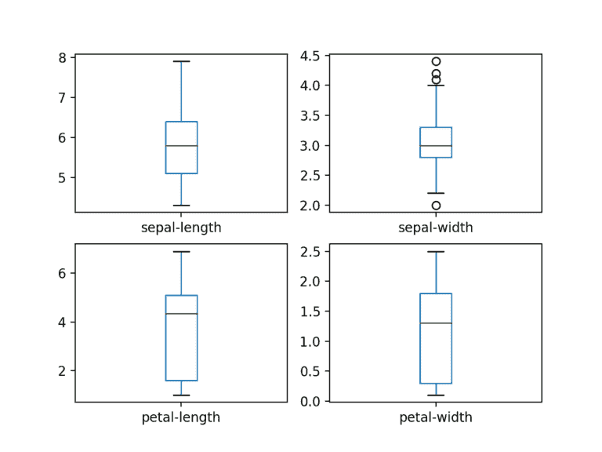
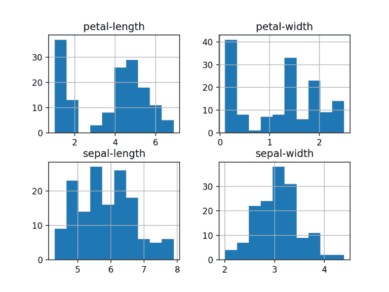

# 30 分钟机器学习

> 原文:[https://www . geesforgeks . org/30 分钟机器学习/](https://www.geeksforgeeks.org/30-minutes-to-machine-learning/)

## **1。下载、安装和启动 Python SciPy**

如果系统上还没有安装 Python 和 SciPy 平台，请将其安装到系统上。人们可以很容易地遵循安装指南。

### **1.1 安装 SciPy 库:**

使用 Python 或 3.5+版本。
你需要安装 5 个关键库。下面是本教程所需的 Python SciPy 库列表:

*   我的天啊
*   numpy
*   马特普洛特利布
*   熊猫
*   斯克里恩

### **1.2 启动 Python 并检查版本:**

确保您的 Python 环境已成功安装并按预期工作是一个好主意。
下面的脚本将有助于测试环境。它导入本教程所需的每个库，并打印版本。
键入或复制并粘贴以下脚本:

## 蟒蛇 3

```py
# Check the versions of libraries

# Python version
import sys
print('Python: {}'.format(sys.version))
# scipy
import scipy
print('scipy: {}'.format(scipy.__version__))
# numpy
import numpy
print('numpy: {}'.format(numpy.__version__))
# matplotlib
import matplotlib
print('matplotlib: {}'.format(matplotlib.__version__))
# pandas
import pandas
print('pandas: {}'.format(pandas.__version__))
# scikit-learn
import sklearn
print('sklearn: {}'.format(sklearn.__version__))
```

如果出现错误，请停止。现在是修复它的时候了。

## **2。加载数据:**

**数据集–**虹膜数据

几乎每个人都将它作为机器学习和统计中的“你好世界”数据集。
数据集包含 150 个鸢尾花的观测值。有四列以厘米为单位的花朵尺寸。第五栏是观察到的花的种类。所有观察到的花都属于三种中的一种。

### **2.1 导入库:**

首先，让我们导入所有要使用的模块、函数和对象。

## 蟒蛇 3

```py
# Load libraries

import pandas
from pandas.plotting import scatter_matrix
import matplotlib.pyplot as plt
from sklearn import model_selection
from sklearn.metrics import classification_report
from sklearn.metrics import confusion_matrix
from sklearn.metrics import accuracy_score
from sklearn.linear_model import LogisticRegression
from sklearn.tree import DecisionTreeClassifier
from sklearn.neighbors import KNeighborsClassifier
from sklearn.discriminant_analysis import LinearDiscriminantAnalysis
from sklearn.naive_bayes import GaussianNB
from sklearn.svm import SVC
```

继续之前需要一个工作的 SciPy 环境。

### **2.2 加载数据集**

数据可以直接加载到 UCI 机器学习存储库中。
利用熊猫加载数据，探索描述性统计和数据可视化。

**注:**加载数据时指定各列名称。这将有助于以后探索数据。

## 蟒蛇 3

```py
url =
"https://raw.githubusercontent.com / jbrownlee / Datasets / master / iris.csv"
names = ['sepal-length', 'sepal-width', 'petal-length',
         'petal-width', 'class']
dataset = pandas.read_csv(url, names = names)
```

如果您确实有网络问题，您可以将 iris.csv 文件下载到您的工作目录中，并使用相同的方法加载它，将 URL 更改为本地文件名。

## **3。汇总数据集:**

现在是时候看看数据了。
以几种不同方式查看数据的步骤:

*   数据集的维度。
*   偷看数据本身。
*   所有属性的统计摘要。
*   按类变量对数据进行细分。

### **3.1 数据集维度**

## 蟒蛇 3

```py
# shape
print(dataset.shape)
```

```py
(150, 5)
```

### **3.2 查看数据**

## 蟒蛇 3

```py
# head
print(dataset.head(20))
```

```py
    sepal-length  sepal-width  petal-length  petal-width        class
0            5.1          3.5           1.4          0.2  Iris-setosa
1            4.9          3.0           1.4          0.2  Iris-setosa
2            4.7          3.2           1.3          0.2  Iris-setosa
3            4.6          3.1           1.5          0.2  Iris-setosa
4            5.0          3.6           1.4          0.2  Iris-setosa
5            5.4          3.9           1.7          0.4  Iris-setosa
6            4.6          3.4           1.4          0.3  Iris-setosa
7            5.0          3.4           1.5          0.2  Iris-setosa
8            4.4          2.9           1.4          0.2  Iris-setosa
9            4.9          3.1           1.5          0.1  Iris-setosa
10           5.4          3.7           1.5          0.2  Iris-setosa
11           4.8          3.4           1.6          0.2  Iris-setosa
12           4.8          3.0           1.4          0.1  Iris-setosa
13           4.3          3.0           1.1          0.1  Iris-setosa
14           5.8          4.0           1.2          0.2  Iris-setosa
15           5.7          4.4           1.5          0.4  Iris-setosa
16           5.4          3.9           1.3          0.4  Iris-setosa
17           5.1          3.5           1.4          0.3  Iris-setosa
18           5.7          3.8           1.7          0.3  Iris-setosa
19           5.1          3.8           1.5          0.3  Iris-setosa
```

### **3.3 统计汇总**

这包括计数、平均值、最小值和最大值以及一些百分位数。

## 蟒蛇 3

```py
# descriptions
print(dataset.describe())
```

很明显，所有的数值都有相同的刻度(厘米)和相似的 0 到 8 厘米的范围。

```py
       sepal-length  sepal-width  petal-length  petal-width
count    150.000000   150.000000    150.000000   150.000000
mean       5.843333     3.054000      3.758667     1.198667
std        0.828066     0.433594      1.764420     0.763161
min        4.300000     2.000000      1.000000     0.100000
25%        5.100000     2.800000      1.600000     0.300000
50%        5.800000     3.000000      4.350000     1.300000
75%        6.400000     3.300000      5.100000     1.800000
max        7.900000     4.400000      6.900000     2.500000
```

### **3.4 等级分布**

## 蟒蛇 3

```py
# class distribution
print(dataset.groupby('class').size())
```

```py
class
Iris-setosa        50
Iris-versicolor    50
Iris-virginica     50
```

## **4。数据可视化**

使用两种类型的图:

1.  单变量图，以更好地理解每个属性。
2.  多元图，以更好地理解属性之间的关系。

### **4.1 单变量图**

单变量图–每个单独变量的图。
假设输入变量是数字，我们可以创建每个变量的方框图和触须图。

## 蟒蛇 3

```py
# box and whisker plots
dataset.plot(kind ='box', subplots = True,
             layout =(2, 2), sharex = False, sharey = False)
plt.show()
```



创建每个输入变量的直方图，以了解分布情况。

## 蟒蛇 3

```py
# histograms
dataset.hist()
plt.show()
```

看起来可能有两个输入变量具有高斯分布。这一点值得注意，因为我们可以使用利用这一假设的算法。



### **4.2 多元图**

变量之间的相互作用。
首先，我们来看看所有属性对的散点图。这有助于发现输入变量之间的结构化关系。

## 蟒蛇 3

```py
# scatter plot matrix
scatter_matrix(dataset)
plt.show()
```