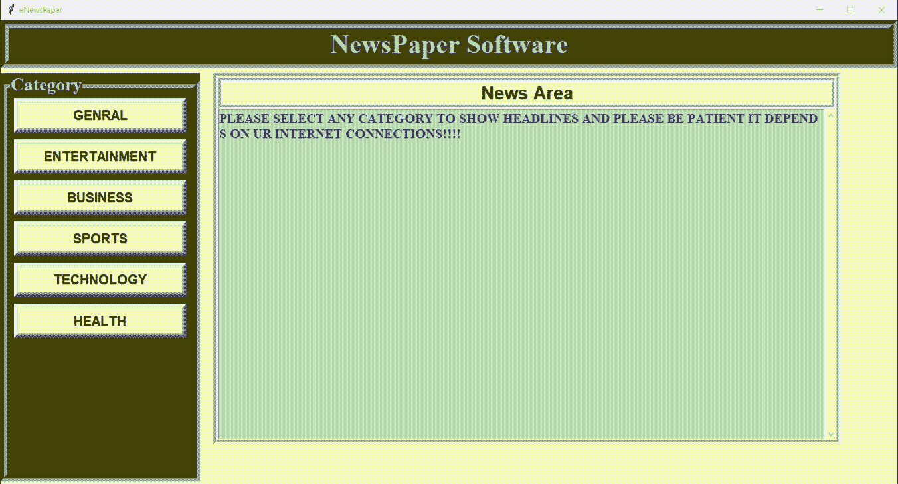

# 一个简单的带有 Tkinter 和 Newsapi 的新闻应用

> 原文:[https://www . geesforgeks . org/a-simple-news-app-with-tkinter-and-news API/](https://www.geeksforgeeks.org/a-simple-news-app-with-tkinter-and-newsapi/)

**先决条件** : [Tkinter](https://www.geeksforgeeks.org/python-gui-tkinter/)

Tkinter 是一个非常著名的 python 库，用于为基于 windows 和 UNIX 的操作系统构建桌面应用程序。这里的想法是生成一个 python 代码，用 Tkinter 构建一个新闻应用程序。您可以很容易地从 newsapi.org 获得一个应用编程接口密钥。

### 方法

*   导入模块
*   创建带有标题的屏幕
*   添加标签
*   添加按钮
*   为要显示的新闻创建一个文本区。
*   将按钮绑定到功能，以便在被点击时，新闻显示在文本区域

**程序:**

## 蟒蛇 3

```py
from tkinter import *
from tkinter import messagebox
import requests
import json
type = 'sports'
apiKey = 'YOUR_API_KEY_HERE'
BASE_URL = f'http://newsapi.org/v2/top-headlines?country=in&category={type}&apiKey='+apiKey

class NewsApp:
    global apiKey, type

    def __init__(self, root):
        self.root = root
        self.root.geometry('1350x700+0+0')
        self.root.title("eNewsPaper")

        #====variables========#
        self.newsCatButton = []
        self.newsCat = ["general", "entertainment",
                        "business", "sports", "technology", "health"]

        #========title frame===========#
        bg_color = "#404040"
        text_area_bg = "#b8e0c4"
        basic_font_color = "#ccc4c4"
        title = Label(self.root, text="NewsPaper Software", font=("times new roman", 30, "bold"),
                      pady=2, bd=12, relief=GROOVE, bg=bg_color, fg=basic_font_color).pack(fill=X)

        F1 = LabelFrame(self.root, text="Category", font=(
            "times new roman", 20, "bold"), bg=bg_color, fg=basic_font_color, bd=10, relief=GROOVE)
        F1.place(x=0, y=80, width=300, relheight=0.88)

        for i in range(len(self.newsCat)):
            b = Button(F1, text=self.newsCat[i].upper(
            ), width=20, bd=7, font="arial 15 bold")
            b.grid(row=i, column=0, padx=10, pady=5)
            b.bind('<Button-1>', self.Newsarea)
            self.newsCatButton.append(b)

        #=======news frame=======#
        F2 = Frame(self.root, bd=7, relief=GROOVE)
        F2.place(x=320, y=80, relwidth=0.7, relheight=0.8)
        news_title = Label(F2, text="News Area", font=(
            "arial", 20, "bold"), bd=7, relief=GROOVE).pack(fill=X)
        scroll_y = Scrollbar(F2, orient=VERTICAL)
        self.txtarea = Text(F2, yscrollcommand=scroll_y.set, font=(
            "times new roman", 15, "bold"), bg=text_area_bg, fg="#3206b8")
        scroll_y.pack(side=RIGHT, fill=Y)
        scroll_y.config(command=self.txtarea.yview)
        self.txtarea.insert(
            END, "PLEASE SELECT ANY CATEGORY TO SHOW HEADLINES AND PLEASE BE PATIENT IT DEPENDS ON UR INTERNET CONNECTIONS!!!!")
        self.txtarea.pack(fill=BOTH, expand=1)

    def Newsarea(self, event):
        type = event.widget.cget('text').lower()
        BASE_URL = f'http://newsapi.org/v2/top-headlines?country=in&category={type}&apiKey='+apiKey
        self.txtarea.delete("1.0", END)
        self.txtarea.insert(END, f"\n Welcome to GFG news paper\n")
        self.txtarea.insert(
            END, "--------------------------------------------------------------------\n")
        try:
            articles = (requests.get(BASE_URL).json())['articles']
            if(articles != 0):
                for i in range(len(articles)):
                    self.txtarea.insert(END, f"{articles[i]['title']}\n")
                    self.txtarea.insert(
                        END, f"{articles[i]['description']}\n\n")
                    self.txtarea.insert(END, f"{articles[i]['content']}\n\n")
                    self.txtarea.insert(
                        END, f"read more...{articles[i]['url']}\n")
                    self.txtarea.insert(
                        END, "--------------------------------------------------------------------\n")
                    self.txtarea.insert(
                        END, "--------------------------------------------------------------------\n")
            else:
                self.txtarea.insert(END, "Sorry no news available")
        except Exception as e:
            messagebox.showerror(
                'ERROR', "Sorry cant connect to internet or some issues with newsapp :'(")

root = Tk()
obj = NewsApp(root)
root.mainloop()
```

**输出:**

## 蟒蛇 3

```py
from tkinter import *
from tkinter import messagebox
import requests
import json
type = 'sports'
apiKey = 'YOUR_API_KEY_HERE'
BASE_URL = f'http://newsapi.org/v2/top-headlines?country=in&category={type}&apiKey='+apiKey

class NewsApp:
    global apiKey, type

    def __init__(self, root):
        self.root = root
        self.root.geometry('1350x700+0+0')
        self.root.title("eNewsPaper")

        #====variables========#
        self.newsCatButton = []
        self.newsCat = ["general", "entertainment",
                        "business", "sports", "technology", "health"]

        #========title frame===========#
        bg_color = "#404040"
        text_area_bg = "#b8e0c4"
        basic_font_color = "#ccc4c4"
        title = Label(self.root, text="NewsPaper Software", font=("times new roman", 30, "bold"),
                      pady=2, bd=12, relief=GROOVE, bg=bg_color, fg=basic_font_color).pack(fill=X)

        F1 = LabelFrame(self.root, text="Category", font=(
            "times new roman", 20, "bold"), bg=bg_color, fg=basic_font_color, bd=10, relief=GROOVE)
        F1.place(x=0, y=80, width=300, relheight=0.88)

        for i in range(len(self.newsCat)):
            b = Button(F1, text=self.newsCat[i].upper(
            ), width=20, bd=7, font="arial 15 bold")
            b.grid(row=i, column=0, padx=10, pady=5)
            b.bind('<Button-1>', self.Newsarea)
            self.newsCatButton.append(b)

        #=======news frame=======#
        F2 = Frame(self.root, bd=7, relief=GROOVE)
        F2.place(x=320, y=80, relwidth=0.7, relheight=0.8)
        news_title = Label(F2, text="News Area", font=(
            "arial", 20, "bold"), bd=7, relief=GROOVE).pack(fill=X)
        scroll_y = Scrollbar(F2, orient=VERTICAL)
        self.txtarea = Text(F2, yscrollcommand=scroll_y.set, font=(
            "times new roman", 15, "bold"), bg=text_area_bg, fg="#3206b8")
        scroll_y.pack(side=RIGHT, fill=Y)
        scroll_y.config(command=self.txtarea.yview)
        self.txtarea.insert(
            END, "PLEASE SELECT ANY CATEGORY TO SHOW HEADLINES AND PLEASE BE PATIENT IT DEPENDS ON UR INTERNET CONNECTIONS!!!!")
        self.txtarea.pack(fill=BOTH, expand=1)

    def Newsarea(self, event):
        type = event.widget.cget('text').lower()
        BASE_URL = f'http://newsapi.org/v2/top-headlines?country=in&category={type}&apiKey='+apiKey
        self.txtarea.delete("1.0", END)
        self.txtarea.insert(END, f"\n Welcome to GFG news paper\n")
        self.txtarea.insert(
            END, "--------------------------------------------------------------------\n")
        try:
            articles = (requests.get(BASE_URL).json())['articles']
            if(articles != 0):
                for i in range(len(articles)):
                    self.txtarea.insert(END, f"{articles[i]['title']}\n")
                    self.txtarea.insert(
                        END, f"{articles[i]['description']}\n\n")
                    self.txtarea.insert(END, f"{articles[i]['content']}\n\n")
                    self.txtarea.insert(
                        END, f"read more...{articles[i]['url']}\n")
                    self.txtarea.insert(
                        END, "--------------------------------------------------------------------\n")
                    self.txtarea.insert(
                        END, "--------------------------------------------------------------------\n")
            else:
                self.txtarea.insert(END, "Sorry no news available")
        except Exception as e:
            messagebox.showerror(
                'ERROR', "Sorry cant connect to internet or some issues with newsapp :'(")

root = Tk()
obj = NewsApp(root)
root.mainloop()
```



最终应用