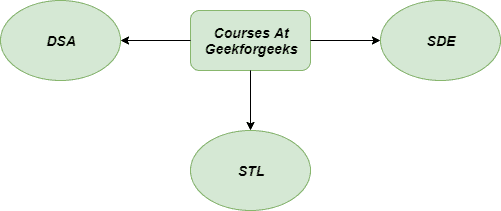
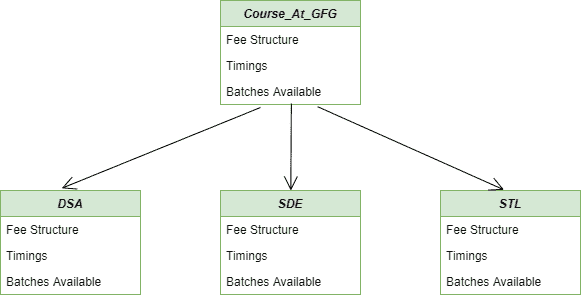
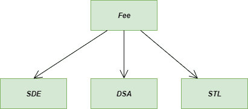
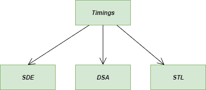

# 抽象工厂方法–Python 设计模式

> 原文:[https://www . geesforgeks . org/abstract-factory-method-python-design-patterns/](https://www.geeksforgeeks.org/abstract-factory-method-python-design-patterns/)

抽象工厂方法是一种[创造性设计模式](https://www.geeksforgeeks.org/design-patterns-set-1-introduction/)，它允许你在不指定具体类的情况下产生相关对象的族。使用抽象工厂方法，我们有最简单的方法来产生类似类型的许多对象。
它提供了一种封装一组单个工厂的方法。基本上，这里我们试图根据逻辑、业务、平台选择等来抽象对象的创建。

### 没有抽象工厂方法我们面临的问题:

想象一下，您想加入[极客论坛](geeksforgeeks.org)的精英团队之一。所以，您会去那里询问可用的课程，它们的费用结构，时间安排，以及其他重要的事情。他们只需查看一下系统，就会为您提供所需的所有信息。看起来很简单吗？想想开发人员是如何使系统如此有组织，以及他们的网站是如何润滑的。

开发人员将为每门课程制作独特的课程，包括费用结构、时间安排等属性。但是 ***他们将如何称呼它们*** 和 ***他们将如何实例化它们的对象*** **？**

这里出现了一个问题，假设最初在 [GeeksforGeeks](geeksforgeeks.org) 只有 3-4 门课程，但是后来他们增加了 5 门新课程。
所以，我们必须手动实例化他们的对象，这对开发者来说不是一件好事。



抽象工厂

**不使用抽象工厂方法的问题图示**

**注意:**以下代码是在没有使用抽象工厂方法的情况下编写的

## 蟒蛇 3

```py
# Python Code for object
# oriented concepts without
# using the Abstract factory
# method in class

class DSA:

    """ Class for Data Structure and Algorithms """

    def price(self):
        return 11000

    def __str__(self):
        return "DSA"

class STL:

    """Class for Standard Template Library"""

    def price(self):
        return 8000

    def __str__(self):
        return "STL"

class SDE:

    """Class for Software Development Engineer"""

    def price(self):
        return 15000

    def __str__(self):
        return 'SDE'

# main method
if __name__ == "__main__":

    sde = SDE()    # object for SDE class
    dsa = DSA()    # object for DSA class
    stl = STL()    # object for STL class

    print(f'Name of the course is {sde} and its price is {sde.price()}')
    print(f'Name of the course is {dsa} and its price is {dsa.price()}')
    print(f'Name of the course is {stl} and its price is {stl.price()}')
```

### 使用抽象工厂方法的解决方案:

它的解决方案是用对特殊抽象工厂方法的调用来代替直接的对象构造调用。实际上，在对象创建中没有区别，但是它们是在工厂方法中被调用的。
现在我们将创建一个名为 **Course_At_GFG** 的唯一类，它将自动处理所有的对象实例化。现在，我们不必担心一段时间后我们会增加多少课程。



使用抽象工厂模式的解决方案

## 蟒蛇 3

```py
# Python Code for object
# oriented concepts using
# the abstract factory
# design pattern

import random

class Course_At_GFG:

    """ GeeksforGeeks portal for courses """

    def __init__(self, courses_factory = None):
        """course factory is out abstract factory"""

        self.course_factory = courses_factory

    def show_course(self):

        """creates and shows courses using the abstract factory"""

        course = self.course_factory()

        print(f'We have a course named {course}')
        print(f'its price is {course.Fee()}')

class DSA:

    """Class for Data Structure and Algorithms"""

    def Fee(self):
        return 11000

    def __str__(self):
        return "DSA"

class STL:

    """Class for Standard Template Library"""

    def Fee(self):
        return 8000

    def __str__(self):
        return "STL"

class SDE:

    """Class for Software Development Engineer"""

    def Fee(self):
        return 15000

    def __str__(self):
        return 'SDE'

def random_course():

    """A random class for choosing the course"""

    return random.choice([SDE, STL, DSA])()

if __name__ == "__main__":

    course = Course_At_GFG(random_course)

    for i in range(5):
        course.show_course()
```

### 抽象工厂方法的类图:

让我们看看类图，考虑 GeeksforGeeks 的课程示例。
极客学院所有课程的收费结构



抽象工厂模式的类图

极客俱乐部所有课程的时间安排



类图 2 抽象方法模式

### 使用抽象工厂方法的优势:

当客户端不知道创建什么类型时，这种模式特别有用。

1.  在不破坏现有客户端代码的情况下，很容易引入产品的新变体。
2.  我们从工厂得到的产品肯定是相互兼容的。

### 使用抽象工厂方法的缺点:

1.  由于大量类的存在，我们简单的代码可能会变得复杂。
2.  我们最终会得到大量的小文件，也就是杂乱的文件。

### 适用性:

1.  最常见的抽象工厂方法模式是在汽车制造中使用的钣金冲压设备中发现的。
2.  它可以用在必须处理不同类别的报告的系统中，例如与输入、输出和中间事务相关的报告。