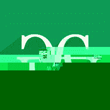

# 使用 Python 为图像添加小故障

> 原文:[https://www . geeksforgeeks . org/使用-python/](https://www.geeksforgeeks.org/adding-glitches-to-images-using-python/) 向图像添加-故障

目前流行的一种滤镜是给图像添加随机毛刺。这些会产生一种随机效应，结果是一个自然的小故障。通常，假信号是由图像帧的损坏或在其上添加一层引起的。在本文中，我们将使用 Python 的两个不同模块来为图像添加小故障。

### 使用故障图模块

这个 Python 库为图像添加了随机毛刺效果。它通过扭曲或破坏图像的一些随机字节的 JPEG 帧来做到这一点，以不损害文件。内部使用[枕](https://www.geeksforgeeks.org/python-pillow-a-fork-of-pil/)库执行任务。

### 装置

要安装此模块，请在终端中键入以下命令。

```py
pip3 install glitchart
```

安装后，会导入 glitchart 库，并根据要进行 glitchart 的图像的扩展名调用 jpeg()或 png()。只需运行脚本，就会在同一路径中创建一个名为 ***<文件名> _glitch*** 的新 glitch 文件。

**使用的功能:**

**png():** 给 png 图像添加毛刺。

**语法:**

> png(照片，种子=random_val，min_amount=0，max_amount=10，inplace=False):
> 
> **参数:**
> 
> *   **照片:**所需。添加毛刺的 png 格式照片。
> *   **种子**:随机数，如果我们希望在下一张照片中加入类似数量的毛刺，可以有相同的种子值。
> *   **min_amount** :所需的最小毛刺量，默认为 0。
> *   **最大 _ 数量**:所需毛刺的最大数量，默认为 10。
> *   **在**处:布尔型字段，如果为真，则更改原始照片，而不是创建新照片。

**示例:**

**输入图像:**


## 蟒蛇 3

```py
import glitchart

glitchart.png('gfg.png')
```

**输出:**



**例 2:** 控制毛刺量。

## 蟒蛇 3

```py
import glitchart

glitchart.png('gfg.png', max_amount=3)
```

**输出:**


**使用故障-该模块**

利用这一点，我们可以通过提供映像路径和级别以及特定的映像和文件管理参数，使用命令行来执行对映像进行毛刺处理的任务。

### 装置

要安装此模块，请在终端中键入以下命令

```py
pip install glitch-this
```

**命令行参数解释**

> Glitch _ this[-h][–version][-c][-s][-g][-ig][-f][-o Outfile _ Path]Image _ Path Glitch _ Level
> 
> **参数:**
> **图像路径:**执行毛刺的图像路径。
> **毛刺 _ 电平:**施加毛刺的电平，从 0.1 到 10.0[含]。
> **-h :** 获取拉式描述
> **-o Outfile_path** :明确提供输出文件的完整/相对路径。
> **-g :** 输出图像为 gif。
> **-ig** :如果输入是 gif，则包含。
> **-f :** 如果输出文件必须被覆盖。
> **-c :** 如果必须添加色彩效果。
> **-s. :** 如果必须添加边线效果。

**示例:控制毛刺量。**


使用毛刺的毛刺示例-这个

**输出:**


毛刺图像输出