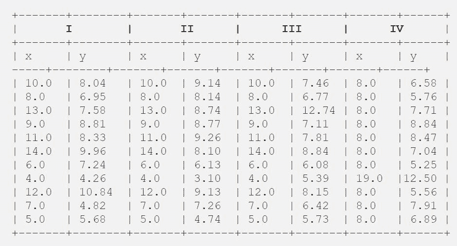
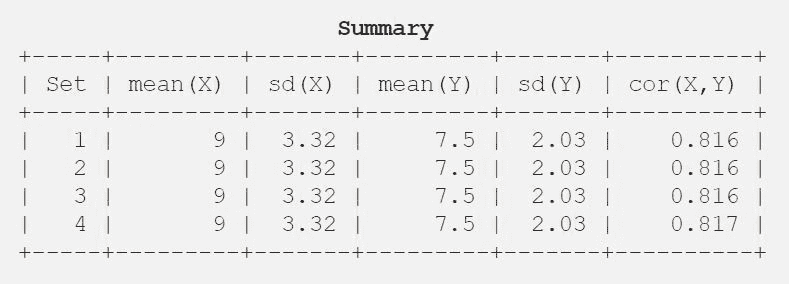
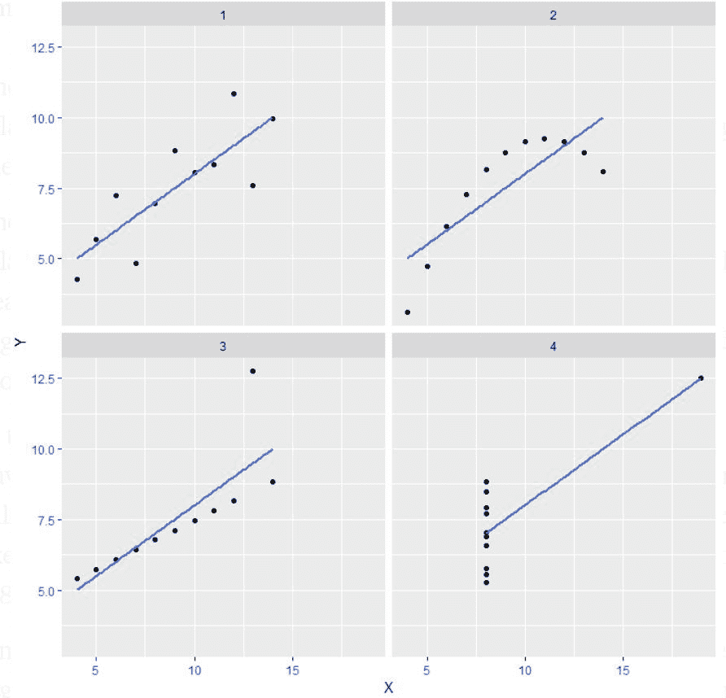

# 安斯科姆的四重奏

> 原文:[https://www.geeksforgeeks.org/anscombes-quartet/](https://www.geeksforgeeks.org/anscombes-quartet/)

根据维基百科**给出的定义，安斯科姆的四重奏**包括四个数据集，它们具有几乎相同的简单统计属性，但在绘制图表时却显得非常不同。每个数据集由十一个(x，y)点组成。统计学家弗朗西斯·安斯科姆(Francis Anscombe)于 1973 年构建了这些图表，以证明在分析数据之前绘制数据图表的重要性，以及异常值对统计特性的影响。

**简单的理解:**
有一次，著名的统计学家弗朗西斯·约翰“弗兰克”安斯科姆在他的梦里发现了 4 组 11 个数据点，并请求委员会作为他绘制这些数据点的最后愿望。这 4 组 11 个数据点如下。


之后，委员会仅使用描述性统计数据对它们进行了分析，并找到了 x 和 y 之间的平均值、标准偏差和相关性。

请在此下载 csv 文件[。](https://query.data.world/s/6p2ntncvkzj5mnvbpkaswfilryvnrk)

**代码:Python 程序求平均值，标准差，x 和 y 的相关性**

```
# Import the required libraries
import pandas as pd
import statistics
from scipy.stats import pearsonr

# Import the csv file
df = pd.read_csv("anscombe.csv")

# Convert pandas dataframe into pandas series
list1 = df['x1']
list2 = df['y1']

# Calculating mean for x1
print('%.1f' % statistics.mean(list1))

# Calculating standard deviation for x1
print('%.2f' % statistics.stdev(list1))

# Calculating mean for y1
print('%.1f' % statistics.mean(list2))

# Calculating standard deviation for y1
print('%.2f' % statistics.stdev(list2))

# Calculating pearson correlation
corr, _ = pearsonr(list1, list2)
print('%.3f' % corr)

# Similarly calculate for the other 3 samples

# This code is contributed by Amiya Rout
```

**输出:**

```
9.0
3.32
7.5
2.03
0.816

```

所以为了更好的理解，让我用表格的形式展示一下结果。


**代码:Python 程序绘制散点图**

```
# Import the required libraries
from matplotlib import pyplot as plt
import pandas as pd

# Import the csv file
df = pd.read_csv("anscombe.csv")

# Convert pandas dataframe into pandas series
list1 = df['x1']
list2 = df['y1']

# Function to plot scatter
plt.scatter(list1, list2)

# Function to show the plot
plt.show()

# Similarly plot scatter plot for other 3 data sets

# This code is contributed by Amiya Rout
```

回归线参见[。](https://www.geeksforgeeks.org/linear-regression-python-implementation/)
**输出:**

**注:**定义中提到，安斯科姆的四重奏由四个数据集组成，它们具有几乎相同的简单统计特性，但在绘制图表时显得非常不同。

**该输出的解释:**

*   在第一个(左上角)如果你看散点图，你会发现 x 和 y 之间似乎是线性关系。
*   在第二个(右上角)如果你看这个图，你可以得出结论，x 和 y 之间存在非线性关系。
*   在第三个(左下)中，你可以说当所有数据点都有一个完美的线性关系时，除了一个似乎是离群值的点，它被指示远离该线。
*   最后，第四个(右下角)显示了一个高杠杆点足以产生高相关系数的例子。

**应用:**
四重奏仍然经常被用来说明在开始根据特定类型的关系进行分析之前，以图形方式查看一组数据的重要性，以及描述现实数据集的基本统计属性的不足。