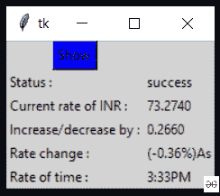

# 使用 Python 获取实时美元/印度卢比汇率的应用程序

> 原文:[https://www . geesforgeks . org/application-to-get-live-USD-INR-rate-use-python/](https://www.geeksforgeeks.org/application-to-get-live-usd-inr-rate-using-python/)

在本文中，我们将编写一个 python 脚本来获取美元/印度卢比汇率的实时信息，并将其与图形用户界面应用程序绑定。

### **所需模块:**

*   **bs4:** *美人汤*是一个从 *HTML* 和 *XML* 文件中拉出数据的 Python 库。

**安装:**

```py
pip install bs4
```

*   **请求:**这个模块可以让你非常轻松的发送 *HTTP/1.1* 请求。

**安装:**

```py
pip install requests
```

### **分步方法:**

*   从给定的网址提取数据。选择所需位置后，复制网址。
*   借助请求和美丽的汤模块来抓取数据。
*   将数据转换成 HTML 代码。
*   找到所需的详细信息并进行筛选。

### **实施:**

**步骤 1:** 导入所有需要的模块。

## 蟒蛇 3

```py
# Import required modules
import requests
from bs4 import BeautifulSoup
```

**第二步:**创建一个 URL 获取功能

## 蟒蛇 3

```py
# Function to extract html data
def getdata(url):
    r=requests.get(url)
    return r.text
```

**第三步:**现在将网址传入 *getdata()* 函数，并将该数据(货币明细)转换为 *HTML* 代码。

这里使用的网址是[https://finance.yahoo.com/quote/usdinr=X?ltr=1](https://finance.yahoo.com/quote/usdinr=X?ltr=1)

## 蟒蛇 3

```py
# Extract and convert
htmldata = getdata("https://finance.yahoo.com/quote/usdinr=X?ltr=1")
soup = BeautifulSoup(htmldata, 'html.parser')
result = (soup.find_all("div", class_="D(ib) Va(m) Maw(65%) Ov(h)")
```

**输出:**


**第四步:**根据给定的数据过滤货币明细和质量(递增/递减)。

## 蟒蛇 3

```py
mydatastr = ''

# Filter converted data
for table in soup.find_all("div", class_="D(ib) Va(m) Maw(65%) Ov(h)"):
    mydatastr += table.get_text()

# Display output
print(mydatastr)
```

**输出:**

```py
'73.2610-0.2790 (-0.38%)As of  3:30PM BST. Market open.'
```

下面是使用 *tkinter* 模块实现的完整程序。

## 计算机编程语言

```py
# Import required modules
from tkinter import *
import requests
from bs4 import BeautifulSoup

# user defined function
# to extract currency details
def getdata(url):
    r = requests.get(url)
    return r.text

# Function to compute and display currency detalis
def get_info():
    try:
        htmldata = getdata("https://finance.yahoo.com/quote/usdinr=X?ltr=1")
        soup = BeautifulSoup(htmldata, 'html.parser')
        mydatastr = ''
        for table in soup.find_all("div", class_="D(ib) Va(m) Maw(65%) Ov(h)"):
            mydatastr += table.get_text()
        list_data = mydatastr.split()
        temp = list_data[0].split("-")
        rate.set(temp[0])
        inc.set(temp[1])
        per_rate.set(list_data[1])
        time.set(list_data[3])
        result.set("success")
    except:
        result.set("Opps! something wrong")

# Driver Code       
# Create tkinter object
master = Tk()

# Set background color
master.configure(bg='light grey')

# Variable Classes in tkinter
result = StringVar()
rate = StringVar()
per_rate = StringVar()
time = StringVar()
inc = StringVar()

# Creating label for each information
Label(master, text="Status :", bg="light grey").grid(row=2, sticky=W)
Label(master, text="Current rate of INR :",
      bg="light grey").grid(row=3, sticky=W)
Label(master, text="Increase/decrease by :",
      bg="light grey").grid(row=4, sticky=W)
Label(master, text="Rate change :", bg="light grey").grid(row=5, sticky=W)
Label(master, text="Rate of time :", bg="light grey").grid(row=6, sticky=W)

# Creating label for class variable
Label(master, text="", textvariable=result,
      bg="light grey").grid(row=2, column=1, sticky=W)
Label(master, text="", textvariable=rate,
      bg="light grey").grid(row=3, column=1, sticky=W)
Label(master, text="", textvariable=inc, bg="light grey").grid(
    row=4, column=1, sticky=W)
Label(master, text="", textvariable=per_rate,
      bg="light grey").grid(row=5, column=1, sticky=W)
Label(master, text="", textvariable=time,
      bg="light grey").grid(row=6, column=1, sticky=W)

# Create submit button
b = Button(master, text="Show", command=get_info, bg="Blue").grid(row=0)

mainloop()
```

**输出:**



<video class="wp-video-shortcode" id="video-496118-1" width="640" height="360" preload="metadata" controls=""><source type="video/mp4" src="https://media.geeksforgeeks.org/wp-content/uploads/20210214174801/FreeOnlineScreenRecorderProject4.mp4?_=1">[https://media.geeksforgeeks.org/wp-content/uploads/20210214174801/FreeOnlineScreenRecorderProject4.mp4](https://media.geeksforgeeks.org/wp-content/uploads/20210214174801/FreeOnlineScreenRecorderProject4.mp4)</video>