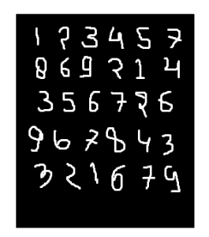
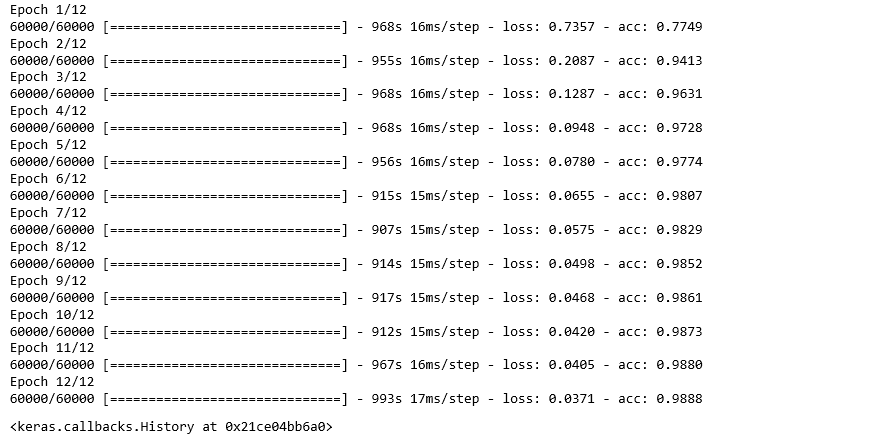

# 将卷积神经网络应用于 mnist 数据集

> 原文:[https://www . geesforgeks . org/application-卷积-神经网络-on-mnist-dataset/](https://www.geeksforgeeks.org/applying-convolutional-neural-network-on-mnist-dataset/)

**CNN** 基本上是一个被称为**卷积神经网络**的模型，最近因为它的有用性而获得了大量的普及。CNN 使用多层感知器进行计算工作。与其他图像分类算法相比，CNN 使用的预处理相对较少。这意味着网络通过过滤器学习传统算法是手工设计的。所以，对于图像处理任务，中枢神经系统是最适合的选择。

**MNIST 数据集:**
mnist 数据集是如下图所示的手写图像数据集。



使用带函数模型的卷积神经网络可以得到 99.06%的准确率。使用功能模型的原因是为了在连接各层时保持简单。

#### 首先，包括所有必要的库

## 蟒蛇 3

```
import numpy as np
import keras
from keras.datasets import mnist
from keras.models import Model
from keras.layers import Dense, Input
from keras.layers import Conv2D, MaxPooling2D, Dropout, Flatten
from keras import backend as k
```

#### 创建列车数据和测试数据

*   **测试数据:**用于测试我们的模型是如何被训练的。
    **列车数据:**用来训练我们的模型。

## 蟒蛇 3

```
(x_train, y_train), (x_test, y_test) = mnist.load_data()
```

*   在继续进行的同时，使用**img _ row**和 **img_cols** 作为图像尺寸。在 mnist 数据集中，它是 28 和 28。我们还需要检查数据格式，即“通道 _ 第一”或“通道 _ 最后”。在美国有线电视新闻网，我们可以在手之前标准化数据，这样大项的计算可以减少到较小项。比如，我们可以通过将 x_train 和 x_test 数据除以 255 来对其进行归一化。
    **检查数据-格式:**

## 蟒蛇 3

```
img_rows, img_cols=28, 28

if k.image_data_format() == 'channels_first':
   x_train = x_train.reshape(x_train.shape[0], 1, img_rows, img_cols)
   x_test = x_test.reshape(x_test.shape[0], 1, img_rows, img_cols)
   inpx = (1, img_rows, img_cols)

else:
   x_train = x_train.reshape(x_train.shape[0], img_rows, img_cols, 1)
   x_test = x_test.reshape(x_test.shape[0], img_rows, img_cols, 1)
   inpx = (img_rows, img_cols, 1)

x_train = x_train.astype('float32')
x_test = x_test.astype('float32')
x_train /= 255
x_test /= 255
```

#### 输出类的描述:

*   因为模型的输出可以包括 0 到 9 之间的任何数字。所以，我们在输出中需要 10 个类。要输出 10 个类，请使用 keras . utils . to _ classic 函数，它将提供 10 列。在这 10 列中，只有一个值是 1，其余 9 个值是 0，输出的这一个值表示数字的类别。

## 蟒蛇 3

```
y_train = keras.utils.to_categorical(y_train)
y_test = keras.utils.to_categorical(y_test)
```

*   现在，数据集已经准备好了，让我们转向 CNN 模型:

## 蟒蛇 3

```
inpx = Input(shape=inpx)
layer1 = Conv2D(32, kernel_size=(3, 3), activation='relu')(inpx)
layer2 = Conv2D(64, (3, 3), activation='relu')(layer1)
layer3 = MaxPooling2D(pool_size=(3, 3))(layer2)
layer4 = Dropout(0.5)(layer3)
layer5 = Flatten()(layer4)
layer6 = Dense(250, activation='sigmoid')(layer5)
layer7 = Dense(10, activation='softmax')(layer6)
```

*   **解释** **CNN 模型中每一层的工作方式:**
    第 1 层是 Conv2d 层，它使用 32 个大小(3*3)的滤镜对图像进行卷积。
    图层 2 也是一个 Conv2D 图层，也用于卷积图像，使用 64 个大小(3*3)的滤镜。
    第 3 层是最大池 2D 层，从大小矩阵(3*3)中选择最大值。
    第 4 层显示辍学率为 0.5。
    第 5 层对从第 4 层获得的输出进行平坦化，该平坦化的输出被传递到第 6 层。
    layer6 是包含 250 个神经元的神经网络的隐藏层。
    layer7 是输出层，具有 10 个神经元，用于使用 softmax 功能的 10 类输出。
*   **调用编译拟合函数:**

## 蟒蛇 3

```
model = Model([inpx], layer7)
model.compile(optimizer=keras.optimizers.Adadelta(),
              loss=keras.losses.categorical_crossentropy,
              metrics=['accuracy'])

model.fit(x_train, y_train, epochs=12, batch_size=500)
```



*   首先，我们制作了一个模型对象，如上面给出的线所示，其中[inpx]是模型中的输入，layer7 是模型的输出。我们使用所需的优化器、损失函数编译了模型，并打印了精度，在最后一个模型中，fit 与 x_train(表示图像向量)、y_train(表示标签)、时期数和批次大小等参数一起被调用。使用拟合函数 x_train，y_train 数据集被馈送到特定批量的模型中。
*   **评估功能:**
    模型。评估为测试数据提供分数，即向模型提供测试数据。现在，模型将预测数据的类别，预测的类别将与 y_test 标签相匹配，以给出我们的准确性。

## 蟒蛇 3

```
score = model.evaluate(x_test, y_test, verbose=0)
print('loss=', score[0])
print('accuracy=', score[1])
```

*   **输出:**

