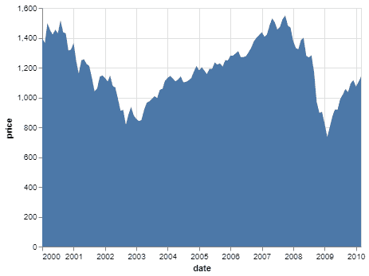
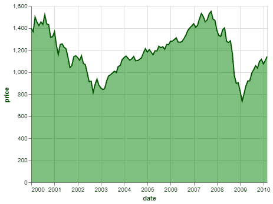

# Python 中带牛郎星的面积图

> 原文:[https://www . geesforgeks . org/python 中带牛郎星的面积图/](https://www.geeksforgeeks.org/area-chart-with-altair-in-python/)

**先决条件:**[Python 中的牛郎星介绍](https://www.geeksforgeeks.org/introduction-to-altair-in-python/)

一个**面积图**显示了一个数量相对于其他变量的变化。它只是一个折线图，其中曲线下的区域是彩色/阴影的。它最适合用来可视化一段时间内的趋势，您希望看到一个变量的值在一段时间内如何变化，或者相对于另一个变量如何变化，而不关心确切的数据值。面积图的一些修改是堆叠面积图和流向图。

面积图在阿尔泰中很容易获得，可以使用 mark_area()函数应用。

### 创建面积图

要制作面积图，只需从数据集中选择合适的变量，并将其映射到 x 和 y 编码，其中定量变量应映射到 x 编码。

本文中使用的数据集来自 Vega_datasets 库。

**代码:**

## 蟒蛇 3

```py
# Python3 program to illustrate 
# How to make an area chart
# using the altair library

# Importing altair and vega_datasets 
import altair as alt 
from vega_datasets import data 

# Selecting the sp500 dataset
sp500 = data.sp500()

# Making the area graph
# using the mark_area function
alt.Chart(sp500).mark_area().encode( 

  # Map the date to x-axis
    x = 'date',

  # Map the price to y-axis
    y = 'price'
)
```

**输出:**



使用牛郎星的简单面积图

### 自定义面积图

可以在面积图上进行以下简单的自定义:

*   **区域颜色:**通过设置 mark_area()方法的颜色参数，可以改变区域颜色的默认颜色。
*   **不透明度:**可以通过设置 mark_area()方法的不透明度参数来更改区域的默认不透明度。范围从 0 到 1。
*   **线条颜色:**您也可以通过在 mark_area()方法的线条字典参数中指定颜色键的值来更改实际线条图的颜色。

**示例:**

## 蟒蛇 3

```py
# Python3 program to illustrate 
# How to make an area chart
# using the altair library

# Importing altair and vega_datasets 
import altair as alt 
from vega_datasets import data 

# Selecting the sp500 dataset
sp500 = data.sp500()

# Making the area graph 
alt.Chart(sp500).mark_area(color = 'green',
                           opacity = 0.5,
                           line = {'color':'darkgreen'}).encode(

  # Map the date to x-axis
    x = 'date',

  # Map the price to y-axis
    y = 'price'
)
```

**输出:**



使用牛郎星定制面积图