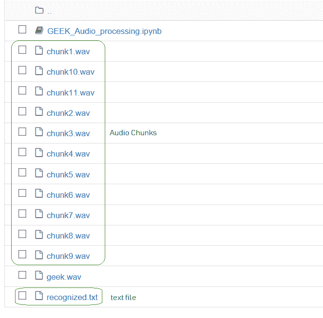

# 使用 Pydub 和谷歌语音识别 API 的音频处理

> 原文:[https://www . geesforgeks . org/audio-processing-using-pydub-and-Google-speechecognition-API/](https://www.geeksforgeeks.org/audio-processing-using-pydub-and-google-speechrecognition-api/)

音频文件是一种广泛的信息传输方式。那么，让我们看看如何分解音频文件(。wav 文件)分成更小的块，并识别其中的内容并将其存储到文本文件中。要了解更多音频文件及其格式，请参考[音频 _ 格式](https://www.geeksforgeeks.org/audio-format/)。

**需要分解一个音频文件吗？**

当我们对音频文件进行任何处理时，都会花费大量时间。在这里，处理可以意味着任何事情。例如，我们可能想要增加或减少音频的频率，或者像本文中所做的那样，识别音频文件中的内容。通过将其分解成称为组块的小音频文件，我们可以确保处理快速进行。

**所需安装:**

```py
pip3 install pydub
pip3 install audioread
pip3 install SpeechRecognition
```

这个程序主要有两个步骤。

**步骤#1:** 它处理将音频文件分割成固定间隔的小块。切片可以重叠，也可以不重叠。重叠意味着创建的下一个块将从一个恒定的时间向后开始，因此在切片期间，如果任何音频/单词被剪切，它可以被这个重叠覆盖。例如，如果音频文件是 22 秒，并且重叠是 1.5 秒，则这些组块的定时将是:

```py
  chunk1 : 0 - 5 seconds
  chunk2 : 3.5 - 8.5 seconds
  chunk3 : 7 - 12 seconds
  chunk4 : 10.5 - 15.5 seconds
  chunk5 : 14 - 19.5 seconds
  chunk6 : 18 - 22 seconds
```

我们可以通过将重叠设置为 0 来忽略这种重叠。

**步骤#2:** 它处理处理切片的音频文件，以完成用户要求的任何操作。在这里，为了演示的目的，这些组块已经通过了谷歌语音识别模块，文本已经被写入一个单独的文件。要了解如何使用谷歌语音识别模块识别来自麦克风的音频，请参考[本](https://www.geeksforgeeks.org/speech-recognition-in-python-using-google-speech-api/)。在本文中，我们将使用切片的音频文件来识别内容。

*步骤#2* 在*步骤#1* 内循环进行。一旦音频文件被分割成块，块就被识别。这个过程一直持续到音频文件结束。

**示例:**

```py
Input :  [Geek.wav](https://media.geeksforgeeks.org/wp-content/uploads/1.wav)

Output : 
Screenshot of cmd running the code:

Text File: recognized

```

下面是实现:

```py
# Import necessary libraries
from pydub import AudioSegment
import speech_recognition as sr

# Input audio file to be sliced
audio = AudioSegment.from_wav("1.wav")

'''
Step #1 - Slicing the audio file into smaller chunks.
'''
# Length of the audiofile in milliseconds
n = len(audio)

# Variable to count the number of sliced chunks
counter = 1

# Text file to write the recognized audio
fh = open("recognized.txt", "w+")

# Interval length at which to slice the audio file.
# If length is 22 seconds, and interval is 5 seconds,
# The chunks created will be:
# chunk1 : 0 - 5 seconds
# chunk2 : 5 - 10 seconds
# chunk3 : 10 - 15 seconds
# chunk4 : 15 - 20 seconds
# chunk5 : 20 - 22 seconds
interval = 5 * 1000

# Length of audio to overlap. 
# If length is 22 seconds, and interval is 5 seconds,
# With overlap as 1.5 seconds,
# The chunks created will be:
# chunk1 : 0 - 5 seconds
# chunk2 : 3.5 - 8.5 seconds
# chunk3 : 7 - 12 seconds
# chunk4 : 10.5 - 15.5 seconds
# chunk5 : 14 - 19.5 seconds
# chunk6 : 18 - 22 seconds
overlap = 1.5 * 1000

# Initialize start and end seconds to 0
start = 0
end = 0

# Flag to keep track of end of file.
# When audio reaches its end, flag is set to 1 and we break
flag = 0

# Iterate from 0 to end of the file,
# with increment = interval
for i in range(0, 2 * n, interval):

    # During first iteration,
    # start is 0, end is the interval
    if i == 0:
        start = 0
        end = interval

    # All other iterations,
    # start is the previous end - overlap
    # end becomes end + interval
    else:
        start = end - overlap
        end = start + interval 

    # When end becomes greater than the file length,
    # end is set to the file length
    # flag is set to 1 to indicate break.
    if end >= n:
        end = n
        flag = 1

    # Storing audio file from the defined start to end
    chunk = audio[start:end]

    # Filename / Path to store the sliced audio
    filename = 'chunk'+str(counter)+'.wav'

    # Store the sliced audio file to the defined path
    chunk.export(filename, format ="wav")
    # Print information about the current chunk
    print("Processing chunk "+str(counter)+". Start = "
                        +str(start)+" end = "+str(end))

    # Increment counter for the next chunk
    counter = counter + 1

    # Slicing of the audio file is done.
    # Skip the below steps if there is some other usage
    # for the sliced audio files.

'''
Step #2 - Recognizing the chunk and writing to a file.
'''

    # Here, Google Speech Recognition is used
    # to take each chunk and recognize the text in it.

    # Specify the audio file to recognize

    AUDIO_FILE = filename

    # Initialize the recognizer
    r = sr.Recognizer()

    # Traverse the audio file and listen to the audio
    with sr.AudioFile(AUDIO_FILE) as source:
        audio_listened = r.listen(source)

    # Try to recognize the listened audio
    # And catch expections.
    try:    
        rec = r.recognize_google(audio_listened)

        # If recognized, write into the file.
        fh.write(rec+" ")

    # If google could not understand the audio
    except sr.UnknownValueError:
        print("Could not understand audio")

    # If the results cannot be requested from Google.
    # Probably an internet connection error.
    except sr.RequestError as e:
        print("Could not request results.")

    # Check for flag.
    # If flag is 1, end of the whole audio reached.
    # Close the file and break.
    if flag == 1:
        fh.close()
        break
```

**输出:**



**recognized . txt**–

从上面的截图中我们可以看到，所有这些组块都存储在本地系统中。我们现在已经成功地分割了重叠的音频文件，并从块中识别出内容。

**该方法的优点:**

*   间隔可以设置为任意长度，这取决于我们需要数据块的长度。
*   重叠可确保即使在间隔结束时准确说出任何单词，也不会丢失任何数据。
*   这些块可以全部存储在不同的音频文件中，并在以后需要时使用。
*   任何可以在音频文件上完成的处理也可以在这些块中完成，因为它们只是音频文件。

**该方法的缺点:**

*   使用谷歌语音识别需要活跃的互联网连接。
*   重叠后，应进行一些文本处理，以删除识别出的重复单词。
*   谷歌语音识别的准确性取决于很多因素，如背景噪音、说话人的口音等。