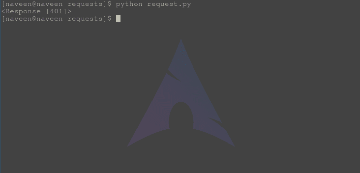

# 使用 Python 请求的身份验证

> 原文:[https://www . geesforgeks . org/authentication-use-python-requests/](https://www.geeksforgeeks.org/authentication-using-python-requests/)

身份验证是指授予用户访问特定资源的权限。因为不能允许每个人从每个网址访问数据，所以首先需要身份验证。为了实现这种身份验证，通常需要通过授权头或服务器定义的自定义头来提供身份验证数据。

**示例–**

```py
# import requests module
import requests
from requests.auth import HTTPBasicAuth

# Making a get request
response = requests.get('https://api.github.com / user, ',
            auth = HTTPBasicAuth('user', 'pass'))

# print request object
print(response)
```

用您的用户名和密码替换“用户”和“密码”。它将验证请求并返回响应 200，否则它将返回错误 403。

如果你输入了无效的用户名或密码，它会返回错误为–


#### 认证的类型

**摘要认证**
另一种非常流行的 HTTP 认证形式是摘要认证，Requests 也支持这种开箱即用的认证:

```py
>>> from requests.auth import HTTPDigestAuth
>>> url = 'https://httpbin.org/digest-auth/auth/user/pass'
>>> requests.get(url, auth=HTTPDigestAuth('user', 'pass'))

```

**OAuth 1 认证**
几种 web APIs 的一种常见认证形式是 OAuth。请求-oauthlib 库允许请求用户轻松地发出 OAuth 1 验证请求:

```py
>>> import requests
>>> from requests_oauthlib import OAuth1

>>> url = 'https://api.twitter.com/1.1/account/verify_credentials.json'
>>> auth = OAuth1('YOUR_APP_KEY', 'YOUR_APP_SECRET',
...               'USER_OAUTH_TOKEN', 'USER_OAUTH_TOKEN_SECRET')

>>> requests.get(url, auth=auth)

```

有关如何操作 OAuth 流的更多信息，请参见 OAuth 官方网站。有关请求-oauthlib 的示例和文档，请参见 GitHub 上的 requests_oauthlib 存储库

**OAuth 2 和 OpenID Connect 认证**
请求-oauthlib 库还处理 OAuth 2，这是支持 OpenID Connect 的认证机制。有关各种 OAuth2 凭据管理流程的详细信息，请参见[请求-oauthlib OAuth2 文档](https://requests-oauthlib.readthedocs.io/en/latest/oauth2_workflow.html):

*   [网络应用流程](https://requests-oauthlib.readthedocs.io/en/latest/oauth2_workflow.html#web-application-flow)
*   [移动应用流程](https://requests-oauthlib.readthedocs.io/en/latest/oauth2_workflow.html#mobile-application-flow)
*   [遗留应用流程](https://requests-oauthlib.readthedocs.io/en/latest/oauth2_workflow.html#legacy-application-flow)
*   [后端应用流程](https://requests-oauthlib.readthedocs.io/en/latest/oauth2_workflow.html#backend-application-flow)

**其他身份验证**
请求旨在允许轻松快速地插入其他形式的身份验证。开源社区的成员经常为更复杂或不常用的身份验证形式编写身份验证处理程序。一些最好的项目被归入“请求”组织，包括:

*   [Kerberos](https://github.com/requests/requests-kerberos)
*   [NTLM](https://github.com/requests/requests-ntlm) 。

如果您想使用这些身份验证形式中的任何一种，请直接进入他们的 GitHub 页面并按照说明操作。