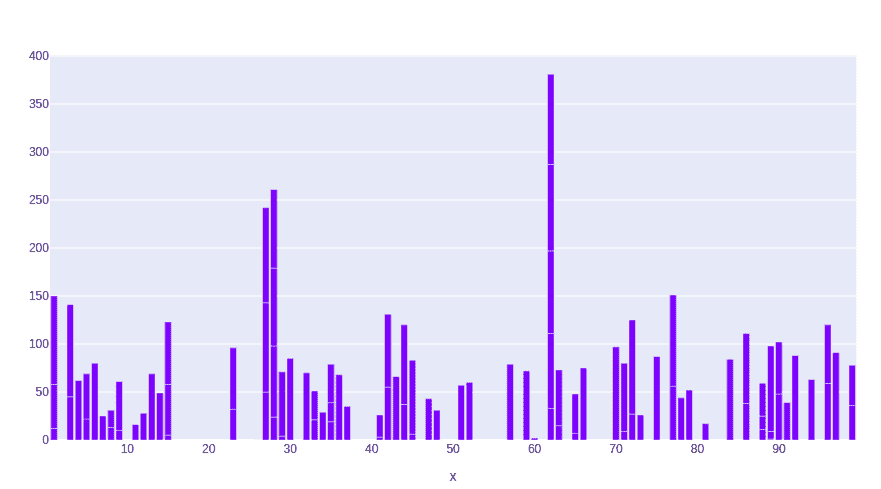
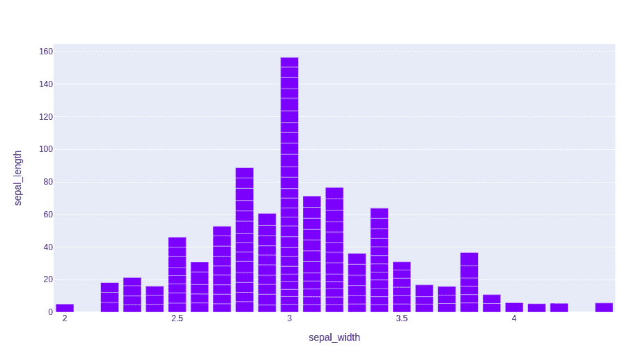

# 在 Python 中使用 Plotly 的条形图

> 原文:[https://www . geesforgeks . org/条形图-使用-plotly-in-python-2/](https://www.geeksforgeeks.org/bar-chart-using-plotly-in-python-2/)

**Plotly** 是一个 Python 库，用来设计图形，尤其是交互图形。它可以绘制各种图形和图表，如直方图、条形图、箱线图、展开图等。它主要用于数据分析以及财务分析。plotly 是一个交互式可视化库。

## 图表中的条形图

**带 plotly express 的条形图**绘制起来方便多了，高级前沿，有助于操作数据的多样化，有助于生成风格简单的图形。用 px。栏中，DataFrame 中的每一行都表示为一个矩形标记，它可以是水平的也可以是垂直的。all 有助于显示离散类别之间的比较。图表中的一个轴显示正在比较的特定类别，另一个轴表示测量值。可以使用 plotly.express 的 bar()方法创建。

> **语法:**plot . express . bar(data _ frame =无，x =无，y =无，color =无，facet _ row =无，facet _ col =无，facet_col_wrap=0，hover _ name =无，hover _ data =无，custom _ data =无，text =无，error _ x =无，error _ x _ 减号=无，error _ y =无，error _ y _ 减号=无，animation _ frame =无，animation _ group =无，category_orders={}，labels={}
> 
> **参数:**
> **data_frame:** 列名需要传递 DataFrame 或类似数组或 dict。
> **x:**data _ frame 中列的名称，或者 pandas Series 或 array_like 对象。此列或 array_like 中的值用于在笛卡尔坐标中沿 x 轴定位标记。
> **y:**data _ frame 中列的名称，或者 pandas Series 或 array_like 对象。此列或 array_like 中的值用于在笛卡尔坐标中沿 y 轴定位标记。
> **颜色:**data _ frame 中列的名称，或者 pandas Series 或 array_like 对象。此列或 array_like 中的值用于为标记指定颜色。
> **hover _ data:**data _ frame 中的列名列表、pandas Series、array_like 对象或以列名为键的 dict，值为 True

**例 1:**

## 蟒蛇 3

```
import plotly.express as px
import numpy

# creating random data through randomint 
# function of numpy.random 
np.random.seed(42) 

random_x= np.random.randint(1,101,100) 
random_y= np.random.randint(1,101,100)

fig = px.bar(random_x, random_y)
fig.show()
```

**输出:**



**示例 2:** 使用虹膜数据集

## 蟒蛇 3

```
import plotly.express as px

# Loading the iris dataset
df = px.data.iris()

fig = px.bar(df, x="sepal_width", y="sepal_length")
fig.show()
```

**输出:**

