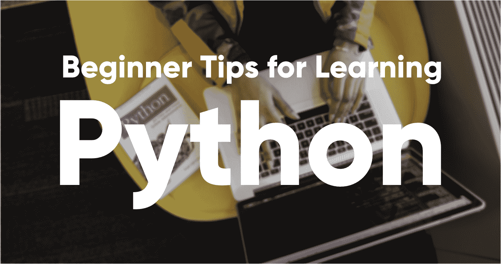

# 学习 Python 的入门技巧

> 原文:[https://www . geesforgeks . org/初学者-学习技巧-python/](https://www.geeksforgeeks.org/beginner-tips-for-learning-python/)

Python 是一种高级、解释的通用编程语言，支持面向对象编程和结构化编程。它非常通用，并且使用标准库提供了许多功能，这使得复杂应用程序的实现变得容易。

Python 也是当今最流行、发展最快的编程语言。记住这一点，下面给出了一些学习 Python 的初学者技巧:

1.  **了解你的兴趣领域–**
    在开始学习 Python 之前，了解你的兴趣领域非常重要，这样你才能保持动力。用 Python 探索的一些领域是机器学习、人工智能、网络开发、机器人、应用程序开发、Python 脚本等。
2.  **学习基本的 Python 语法–**
    在开始任何事情之前，都有必要学习基本的 Python 语法。只需要一点时间来熟悉语法，您就可以继续编码了。以后出现的任何疑问都可以通过参考语法来解决。
3.  **每天练习编码–**
    在学习一门新的编程语言的同时，每天编码是非常重要的。这建立了一致性，并帮助您更加熟悉该语言。你可以从小处着手，随着时间的推移逐渐增加你的编码时间。
4.  **根据需要做笔记–**
    个性化手写笔记是理解 Python 概念和语法的好方法，因为它们需要集中注意力。它们还在以后有任何疑问时提供帮助，因为它们在同一个地方包含了许多重要信息。
5.  **[尝试在线课程](https://practice.geeksforgeeks.org/courses/fork-python?vC=1)–**
    在线课程是学习 Python 的绝佳方式，因为它们提供了必要的信息以及测试方法。在线课程还包含反馈系统，如果需要，您可以请求帮助。此外，这些课程从基本概念发展到高级概念，以有效的方式增加你的知识。
6.  **与他人互动–**
    Python 拥有庞大的在线社区，很容易与他人互动，以消除疑虑或参与讨论。此外，在在线论坛上回答问题对于增加您自己对 Python 的理解和明确您的概念非常有用。
7.  **做小项目–**
    作为初学者，小项目是更深入了解 Python，更胜任 Python 的好方法。这些项目没必要很有用，只要能教会你一些东西。可以制作的项目有计算器应用、闹钟应用、井字游戏等。完成初级阶段后，你可以开始做你想进一步追求的领域的项目(比如网络开发、ML 等)。).
8.  **为开源做贡献–**
    为开源 Python 项目做贡献有助于获得对 Python 更深入的理解。此外，收到的评论和建议将帮助您成为一名更好的程序员，并学习 Python 的最佳实践。
9.  **把蟒蛇传授给别人–**
    据说，只有当你能把它传授给别人时，你才知道一些事情。所以把 Python 教给别人，无论是以博文、视频录制、现场讲座等形式。这将增强您自己对 Python 的理解，并暴露您知识中需要填补的任何漏洞。

看完了学习 Python 的初学者技巧，是时候继续练习了。做大量的笔记，尽可能多地练习写代码，并在需要的时候问很多问题。了解 Python 最佳实践，并一丝不苟地遵循它们。做很多项目，教别人保持基础知识。最重要的是，记得玩得开心！！