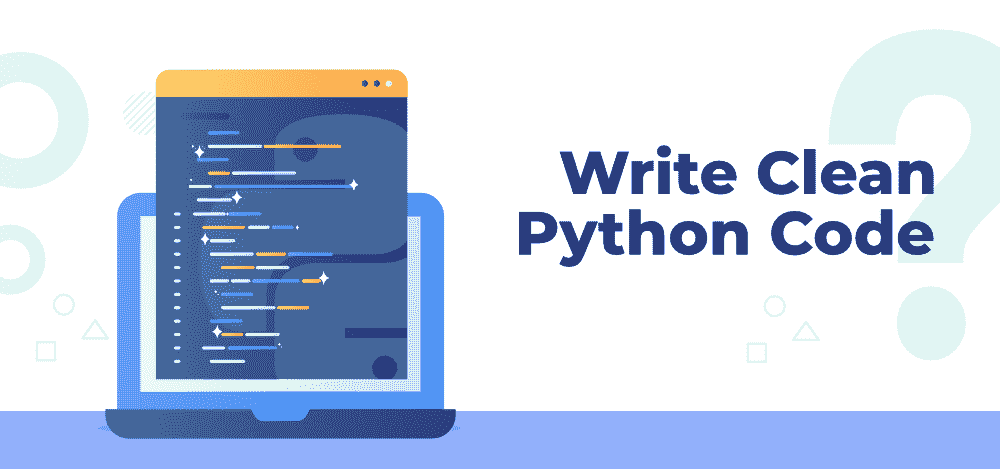

# 编写干净 Python 代码的最佳实践

> 原文:[https://www . geesforgeks . org/最佳实践-编写-清理-python-code/](https://www.geeksforgeeks.org/best-practices-to-write-clean-python-code/)

Python 是当今最受欢迎的编程语言之一。令人震惊的是，Python 在顶级编程语言列表中已经超过了 Java，现在是研究最多的语言！它是仅次于 JavaScript 的使用频率第二高的语言，正在慢慢击败竞争对手，登上榜首。它广泛应用于各种领域，如通过流行框架进行的网络开发，如 Django 和 Flask、网络抓取、自动化、系统管理、DevOps、测试、网络编程、数据分析、数据科学、机器学习和人工智能。事实上，当谈论数据相关技术时，人们首先想到的语言是 Python！



除了由于其易学性而被初学者大量使用之外，它还有庞大的社区支持和大量的文档。但是很多人在从其他语言(如 Java、C、C++、JavaScript 等)切换时，会发现遵循用 Python 编写干净代码应该采用的最佳实践有些困难。干净的代码更容易阅读和理解，调试和优雅。所以今天我们将详细讨论它们，因此你会对它们有更好的了解。让我们开始吧！

### 良好的文档

总是建议在代码中加入可读的注释。这使得程序易于理解。即使是一个复杂的程序也可以被分解成几个部分，并因为注释而被理解。Python 中有两种类型的注释:

1.  **单行注释:**这些类型的注释跨越单行文本。它们以一个*散列符号(#)* 开始，并在该行结束时自动终止。
2.  **多行注释:**它们跨越多行文本(两行或更多行)，在解释一段代码时非常理想。这些类型的注释以*三重引号(“”)*开始和结束。它更像一个文本常量，也可以用来将字符串赋给变量。在少数情况下，这可能会导致错误，因此，如果注释有多行，应该对每一行注释使用哈希。

要了解更多关于注释的信息，必须阅读:[Python 中的注释](https://www.geeksforgeeks.org/comments-in-python/)

### 清洁缩进

不像其他语言像 C++，Java 等。Python 依赖于空格或制表符缩进，而不是大括号指定的代码块。Python 中的每个语句前面都有一个空格、双空格或制表符。您不能在一个地方使用制表符，在另一个地方使用空格，因为缩进需要在整个代码中保持一致。这告诉 Python 您正在开始一个新的代码块。下面提供了一些 Python 缩进的示例:

```py
# an example of if-else with tab indentation
if (condition 1):
    # executed when condition is True
else:
    # executed when condition is False
```

```py
# an example of for loop with nested if-else and double space indentation
for i in sequence:
  if (condidition 1):
    # execute outer if block code
    if (condition 2):
      # execute nested if code
  else:
      # execute outer else block code
```

要了解更多关于缩进的知识，必须阅读:[Python 中的缩进](https://www.geeksforgeeks.org/indentation-in-python/)

### 使用虚拟环境

Python 中的虚拟环境是项目的一种沙箱区域。在这种环境中，无论您将安装什么库和包，都将与安装在环境之外的库和包明确隔离开来，比如操作系统或其他虚拟环境。一个时间点可以有多个虚拟环境，建议每次处理不同或新的项目时都使用这些环境。这有助于分离依赖关系，并有助于轻松共享代码。下次有人想运行你的软件，而不是让他们一个接一个地安装库，你可以发送需求文件(包含该特定项目的所有已安装的包和库)。这可以使用*冻结*命令来完成，如下所示:

```py
pip freeze > requirements.txt
```

该命令列出所有已安装的软件包，并将它们输出到 requirements.txt 文本文件中。下次有人安装它时，他们可以运行以下命令:

```py
pip install -r requirements.txt
```

它递归地安装依赖项，而无需逐个手动键入它们来安装。

要了解更多关于虚拟环境的信息，必须阅读:[Python 中的虚拟环境](https://www.geeksforgeeks.org/python-virtual-environment/)

### 模块化代码

Python 开发人员严格遵循 DRY 原则，即不要重复自己。这意味着如果您想多次完成一项任务，而不是编写冗余代码。这不仅意味着编写函数来执行重复的任务，而是制作模块。模块更像是一个代码库，通常是一个包含您想要在 Python 程序中实现的代码的文件。Python 社区非常庞大，许多开发人员已经实现了涉及频繁使用的代码的模块。您可以制作自己的模块来执行特定的任务！因此，您可以简单地导入模块并使用其功能，而不是重新发明轮子并从头开始编写代码。这是通过使用*导入*关键字来完成的:

```py
# importing regular expression package
import re

# using it in your code
regex = re.compile(r'pattern')

# importing tensorflow with an alias that makes
# the usage concise
import tensorflow as tf
```

要了解更多关于模块的信息，请访问:Python 中的[模块](https://www.geeksforgeeks.org/python-modules/)

### 有意义的变量和函数名

在命名变量和函数时，Python 语言遵循 snake 规则。因此，在遵循骆驼案例命名惯例的任何其他语言中被命名为 *FooBar* 的变量在 Python 中被命名为 *foo_bar* 。如果您使用 camel cases 或 flatcase，Python 不会抛出错误，但这不是所期望的。除了变量名，python 中的函数名也遵循 snake case 命名约定。

### “皮托尼克”代码

在 Python 中有很多独特的方法来实现特定的任务。这些简洁的方法有助于缩短代码并使其看起来优雅。让我们一个一个来看。

1.  列表理解:在一行中创建列表是一种复杂的方法。我们可以在方括号内创建一个列表，并在其中定义循环，而不是在循环中显式使用赋值。要阅读更多列表理解，必须阅读:[Python 中的列表理解](https://www.geeksforgeeks.org/python-list-comprehension/)。
2.  交换变量:在 python 中交换变量时，可以在一行代码中完成，而不是使用临时变量和其他奇怪的方式(添加或划分变量)。例如，要交换两个变量，a 和 b: **a，b = b，a** 。这是 Python 交换变量的方式！
3.  切片:用于切出列表或字符串的特定部分。当您需要从较大的列表或字符串中提取较小的列表或字符串时，它非常有用，并且可以使用冒号作为初始变量和最终变量之间的分隔符来实现。您甚至可以保留起始值或结束值。要阅读更多关于切片的内容，必须阅读:Python 中的[切片。](https://www.geeksforgeeks.org/string-slicing-in-python/)

我们已经讨论了您可以在 Python 代码中采用的大多数方法，以使它看起来优雅而简洁。这些还有助于轻松调试您的代码，并使其更易读。