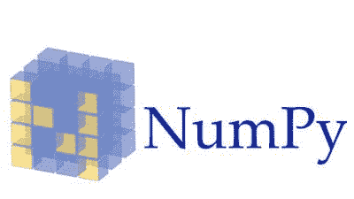

# 机器学习最佳 Python 库

> 原文:[https://www . geesforgeks . org/best-python-libraries-for-machine-learning/](https://www.geeksforgeeks.org/best-python-libraries-for-machine-learning/)

顾名思义，机器学习是对计算机进行编程的科学，通过编程，他们能够从不同种类的数据中学习。亚瑟·塞缪尔给出的一个更一般的定义是——“机器学习是一个研究领域，它让计算机能够在没有明确编程的情况下学习。”它们通常用于解决各种类型的生活问题。
在过去，人们习惯于通过手动编码所有的算法和数学统计公式来执行机器学习任务。这使得该过程耗时、繁琐且效率低下。但是在现代，通过各种 python 库、框架和模块，与过去相比，它变得非常容易和高效。如今，Python 是完成这一任务最流行的编程语言之一，它已经取代了行业中的许多语言，其中一个原因是它拥有大量的库。机器学习中使用的 Python 库有:

*   数字
*   我的天啊
*   科学学习
*   提亚诺
*   TensorFlow
*   硬
*   PyTorch
*   熊猫
*   Matplotlib

#### 数字



NumPy 是一个非常流行的 python 库，用于大型多维数组和矩阵处理，借助于大量高级数学函数的集合。它对于机器学习中的基础科学计算非常有用。它对于线性代数、傅立叶变换和随机数功能特别有用。像张量流这样的高端库在内部使用 NumPy 来操纵张量。

## 蟒蛇 3

```py
# Python program using NumPy
# for some basic mathematical
# operations

import numpy as np

# Creating two arrays of rank 2
x = np.array([[1, 2], [3, 4]])
y = np.array([[5, 6], [7, 8]])

# Creating two arrays of rank 1
v = np.array([9, 10])
w = np.array([11, 12])

# Inner product of vectors
print(np.dot(v, w), "\n")

# Matrix and Vector product
print(np.dot(x, v), "\n")

# Matrix and matrix product
print(np.dot(x, y))
```

**输出:**

```py
219 

[29 67] 

[[19 22]
 [43 50]]
```

更多详情请参考 [Numpy](https://www.geeksforgeeks.org/python-numpy/) 。
T3】

#### 我的天啊


SciPy 是一个非常受机器学习爱好者欢迎的库，因为它包含不同的优化、线性代数、集成和统计模块。SciPy 库和 SciPy 堆栈是有区别的。SciPy 是组成 SciPy 堆栈的核心包之一。SciPy 对于图像处理也非常有用。

## 蟒蛇 3

```py
# Python script using Scipy
# for image manipulation

from scipy.misc import imread, imsave, imresize

# Read a JPEG image into a numpy array
img = imread('D:/Programs / cat.jpg') # path of the image
print(img.dtype, img.shape)

# Tinting the image
img_tint = img * [1, 0.45, 0.3]

# Saving the tinted image
imsave('D:/Programs / cat_tinted.jpg', img_tint)

# Resizing the tinted image to be 300 x 300 pixels
img_tint_resize = imresize(img_tint, (300, 300))

# Saving the resized tinted image
imsave('D:/Programs / cat_tinted_resized.jpg', img_tint_resize)
```