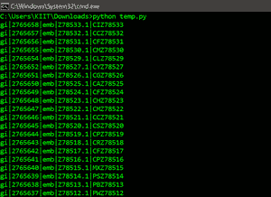
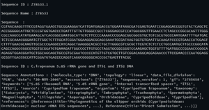

# 生物节律–序列文件格式

> 原文:[https://www . geesforgeks . org/bio Tyson-sequence-file-formats/](https://www.geeksforgeeks.org/biopython-sequence-file-formats/)

*生物。Biopython 的 SeqIO* 模块提供了广泛的简单统一的接口来输入和输出所需的文件格式。该文件格式只能将序列作为*电子病历*对象进行处理。指定文件格式时使用小写字符串。*生物也支持同样的格式。AlignIO* 模块。文件格式列表如下:

<figure class="table">

| **文件格式** | **描述** |
| --- | --- |
| abi | 它是应用生物系统的测序跟踪格式，读取桑格毛细管序列，包括基础调用的 *PHRED* 质量分数。每个文件只包含一个序列，因此没有必要对文件进行索引。 |
| 三者兼而有之 | 与 *abi* 格式相同，但使用莫特算法进行了质量微调。 |
| 杰出的/一流的 | 从 *ACE* 装配文件中读取重叠或连续的序列。 |
| CIF-原子 | 用于根据原子坐标按结构计算部分蛋白质序列 |
| cif-绑架案 | 通过读取由 *_pdbx_poly_seq_scheme* 记录定义的大分子晶体信息文件(也称为 *mmCIF* )来确定完整的蛋白质序列。 |
| embl | EMBL(蛋白质和脱氧核糖核酸序列文件格式)平面文件格式，使用*生物。GenBank* 内部。 |
| 固定 | 一种通用的序列文件格式，每条记录以一行 *>* 字符开始，后面跟着其他序列行。 |
| 2 线固定 | 通过无换行(即每条记录使用两行)严格解释 *FASTA* 文件格式。 |
| fastq 反骨 | 带有*桑格*的 *FASTA* 变体，用于存储 *PHRED* 序列质量值，ASCII 偏移量为 33。 |
| fasto 反骨的人 | *FASTA* 别名，与 *BioPerl* 和*浮雕*一致 |
| fastq 太阳能电池板 | 原文 *Solexa/Illumnia* 解释 *FASTA* 格式，用于编码 *solexa* 质量分数，ASCII 偏移量为 64。 |
| fastq-照明 | *Solexa/Illumnia* 1.3 到 1.7 版本的 *FASTA* 格式用于编码 *PHRED* 质量分数，ASCII 偏移量为 64。 |
| gck | 基因构建工具包使用的本地格式。 |
| genbank | *GenBank* 或 *GenPept* 平面文件格式。 |
| 千兆字节 | *genbank* 别名，与 NCBI *Entrez* 公用事业一致。 |
| 互联网门户 | *智能遗传学*文件格式，似乎与 *MASE* 对齐格式相同。 |
| img it(多边贸易体系) | *EMBL* 来自 *IMGT* 的变体格式，其中特征表有意允许较长的特征类型。 |
| 削尖 | *核苷酸的 UCSC nib* 文件格式使用 4 位(1-半字节)表示一个核苷酸(2 个核苷酸需要 1 个字节)。 |
| 关系 | *NEXUS* 多重对齐格式，也叫 *PAUP* 格式。 |
| pdb-seqres | 读取 *PDB* (蛋白质数据库)文件，通过表头确定完整的数据序列。 |
| 原子总量 | 基于文件的原子坐标部分通过结构确定部分蛋白质序列。 |
| 博士 | 这些文件输出到 *PHRED* ，由*phrp*和 *CONSED* 输入。 |
| 圣人 | *FASTA* 变体由 *NBRF* (国家生物医学研究基金会)为蛋白质信息资源数据库(PIR)创建，目前是 *UniProt* 的艺术。 |
| sqlxml | 简单的 XML 文件格式。 |
| 自毁破片 | 罗氏 454 和离子修正/离子质子测序仪创建的标准流图格式二进制文件。 |
| SFF-装饰 | 标准流图格式(SFF)将修剪应用于列出的文件。 |
| snapgene | *SnapGene* 使用的本地格式。 |
| 瑞士的 | 纯文本 Swiss-Pro 也称为 *UniProt* 格式。 |
| 标签 | 简单的两列制表符分隔的序列文件，每行存储记录标识符和序列。 |
| 质量 | *FASTA* 变异体，具有来自测序 DNA 的 *PHRED* 质量值。 |
| uniprot-xml | *UniProt* XML 格式替换*swisssprot*纯文本格式。 |
| xdna！xdna | 克里斯蒂安·马克使用的脱氧核糖核酸 *Strider* 和 *SerialCloner* 的本地格式。 |

</figure>

下面的实现解释了如何解析两种最流行的序列文件格式，即 *FASTA* 和 *GenBank* 。

### **快速：**

它是存储序列数据最基本的文件格式。最初 *FASTA* 是在生物信息学早期进化过程中创建的一个软件包，用于蛋白质和 DNA 的序列比对，主要用于搜索相似性。下面是解析 *FASTA* 文件格式的简单示例:

**示例:**

要获取所使用的输入文件，请点击这里的。

## 蟒蛇 3

```
# Import libraries
from Bio.SeqIO import parse

# file path/location
file = open('is_orchid.fasta') 

# Parsing the FASTA file
for record in parse(file, "fasta"): 
    print(record.id)
```

**输出:**



### **基因银行:**

更丰富的基因序列格式，包括各种注释。解析 *GenBank* 格式就像在*biotyson*解析方法中更改格式选项一样简单。下面是解析 *GenBank* 文件格式的简单示例:

**示例:**

要获取所使用的输入文件，请点击这里的。

## 蟒蛇 3

```
# Import libraries
from Bio import SeqIO
from Bio.SeqIO import parse

# Parsing Sequence
seq_record = next(parse(open('is_orchid.gbk'), 'genbank'))

# Sequence ID
print("\nSequence ID :", seq_record.id)

# Sequence Name
print("\nSequence Name :", seq_record.name)

# Sequence
print("\nSequence  :", seq_record.seq)

# Sequence Description
print("\nSequence ID :", seq_record.description)

# Sequence Annotations
print("\nSequence Annotations :", seq_record.annotations)
```

**输出:**

