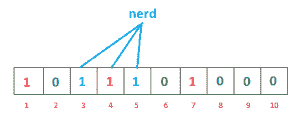
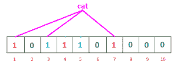

# 布隆过滤器–介绍和实施

> 原文:[https://www . geesforgeks . org/bloom-filters-introduction-and-python-implementation/](https://www.geeksforgeeks.org/bloom-filters-introduction-and-python-implementation/)

假设你正在极客书上创建一个帐户，你想输入一个很酷的用户名，你输入了它，然后得到一条消息，“用户名已经被占用了”。你添加了你的出生日期和用户名，仍然没有运气。现在你也添加了你的大学学号，还得到“用户名已被占用”。真的很令人沮丧，不是吗？
但是你有没有想过极客图书通过搜索数百万注册的用户名来检查用户名可用性的速度有多快。有很多方法可以完成这项工作–

*   [**线性搜索**](https://www.geeksforgeeks.org/linear-search/) :馊主意！
*   [**【二分搜索法】**](https://www.geeksforgeeks.org/binary-search/) :将所有用户名按字母顺序存储，并将输入的用户名与列表中的中间用户名进行比较，如果匹配，则获取用户名，否则计算出输入的用户名是在中间用户名之前还是之后，如果在中间用户名之后，则忽略中间用户名之前(含)的所有用户名。现在搜索中间的一个，重复这个过程，直到找到匹配的或者搜索结束没有匹配的。这种技术更好，前景更好，但仍然需要多个步骤。
    但是，一定有更好的！！

**Bloom Filter** 是可以做这个工作的数据结构。
要理解布隆过滤器，你必须知道什么是[哈希](https://www.geeksforgeeks.org/hashing-set-1-introduction/)。散列函数接受输入并输出固定长度的唯一标识符，用于标识输入。

**什么是布隆过滤器？**

布隆过滤器是一种**空间高效的概率**数据结构，用于测试元素是否是集合的成员。例如，检查用户名的可用性是集合成员资格问题，其中集合是所有注册用户名的列表。我们为效率付出的代价是概率性的，这意味着可能会有一些假阳性结果。**假阳性的意思是**，它可能会告诉给定的用户名已经被使用，但实际上并没有。
**布隆过滤器的有趣属性**

*   与标准散列表不同，固定大小的布隆过滤器可以表示具有任意大量元素的集合。
*   添加元素永远不会失败。但是，随着元素的添加，假阳性率稳步增加，直到过滤器中的所有位都设置为 1，此时所有查询都会产生阳性结果。
*   Bloom filters 从不生成**假阴性**结果，即告诉你一个用户名实际存在时并不存在。
*   从筛选器中删除元素是不可能的，因为如果我们通过清除 k 个哈希函数生成的索引中的位来删除单个元素，可能会导致删除很少的其他元素。示例–如果我们通过清除 1、4 和 7 位来删除“极客”(在下面给出的示例中)，我们可能会删除“书呆子”，因为索引 4 的位变为 0，bloom filter 声称“书呆子”不存在。

**大方坯过滤器的工作**

一个空的布隆过滤器是一个由 **m** 位组成的**位数组**，全部设置为零，就像这样–


我们需要 **k** 个**散列函数**来计算给定输入的散列。当我们想要在过滤器中添加一个项目时，设置 k 个索引 h1(x)、h2(x)、… hk(x)的位，其中索引是使用散列函数计算的。
示例–假设我们想在过滤器中输入“极客”，我们使用 3 个散列函数和长度为 10 的位数组，最初都设置为 0。首先，我们将按如下方式计算哈希值:

```py
h1(“geeks”) % 10 = 1
h2(“geeks”) % 10 = 4
h3(“geeks”) % 10 = 7
```

**注:**这些输出是随机的，仅供解释。
现在我们将索引 1、4 和 7 的位设置为 1


同样，我们想输入“书呆子”，同样，我们将计算散列

```py
h1(“nerd”) % 10 = 3
h2(“nerd”) % 10 = 5
h3(“nerd”) % 10 = 4
```

将索引 3、5 和 4 的位设置为 1



现在如果我们想检查“极客”是否存在于过滤器中。我们将做同样的过程，但这次是以相反的顺序。我们使用 h1、h2 和 h3 计算各自的哈希，并检查位数组中所有这些索引是否都设置为 1。如果所有的位都设置好了，那么我们可以说“极客”很可能是**现在的**。如果这些指数中的任何一位为 0，那么“极客”就是**绝对不存在**。

**布隆过滤器中的假阳性**

问题是为什么我们说**“大概存在”**，为什么会出现这种不确定性。让我们用一个例子来理解这一点。假设我们要检查“猫”是否存在。我们将使用 h1、h2 和 h3 计算哈希值

```py
h1(“cat”) % 10 = 1
h2(“cat”) % 10 = 3
h3(“cat”) % 10 = 7
```

如果我们检查位数组，这些索引处的位被设置为 1，但我们知道“cat”从未添加到过滤器中。索引 1 和 7 的位是在我们添加“极客”时设置的，位 3 是在我们添加“书呆子”时设置的。



因此，由于计算出的索引处的位已经由某个其他项目设置，bloom filter 错误地声称“cat”存在，并产生假阳性结果。根据应用程序的不同，它可能有很大的缺点，或者相对来说还可以。
我们可以通过控制布隆过滤器的大小来控制得到假阳性的概率。更大的空间意味着更少的误报。如果我们想降低假阳性结果的概率，我们必须使用更多的散列函数和更大的位数组。除了项目和检查成员身份之外，这还会增加延迟。
**布隆过滤器支持的操作**

*   插入(x):在布隆过滤器中插入一个元素。
*   lookup(x):检查一个元素是否已经以肯定的假概率出现在 Bloom Filter 中。

注意:我们不能删除布隆过滤器中的元素。
**假阳性概率:**设 **m** 为位数组的大小，k 为散列函数的个数， **n** 为期望插入过滤器的元素个数，则假阳性概率 **p** 可计算为:

![P=\left ( 1-\left [ 1- \frac {1}{m} \right ]^{kn} \right )^k    ](img/110ae019fd382696fa757134975e9366.png "Rendered by QuickLaTeX.com")

**位阵列的大小:**如果元素的预期数量 **n** 是已知的并且期望的假阳性概率是 **p** ，那么位阵列的大小 **m** 可以计算为:


**散列函数的最佳数目:**散列函数的数目 **k** 必须是正整数。如果 **m** 是位数组的大小， **n** 是要插入的元素数量，那么 k 可以计算为:


**空间效率**

如果我们想要在一个集合中存储大量的项目列表以达到集合成员的目的，我们可以将其存储在[散列表](https://www.geeksforgeeks.org/hashmap-treemap-java/)、[尝试](https://www.geeksforgeeks.org/trie-insert-and-search/)或简单的[数组](https://www.geeksforgeeks.org/array/)或[链表](https://www.geeksforgeeks.org/data-structures/linked-list/)中。所有这些方法都需要存储项目本身，这不是很有内存效率。例如，如果我们想在 hashmap 中存储“极客”，我们必须将实际的字符串“极客”存储为键值对{some_key:“极客”}。
布隆过滤器根本不存储数据项。正如我们所看到的，它们使用允许哈希冲突的位数组。没有哈希冲突，它就不会紧凑。

**散列函数的选择**

布隆过滤器中使用的散列函数应该是独立且均匀分布的。他们应该尽可能快。足够独立的快速简单非加密散列包括[杂音](https://en.wikipedia.org/wiki/MurmurHash)、FNV 散列函数系列和[詹金斯](https://en.wikipedia.org/wiki/Jenkins_hash_function)散列。
产生散列是布隆过滤器的主要操作。密码散列函数提供了稳定性和保证，但计算成本很高。随着散列函数 k 的增加，布隆过滤器变得缓慢。尽管非加密散列函数不能提供保证，但却提供了重大的性能改进。

Python3 中布隆过滤器类的基本实现。保存为 **bloomfilter.py**

## 计算机编程语言

```py
# Python 3 program to build Bloom Filter
# Install mmh3 and bitarray 3rd party module first
# pip install mmh3
# pip install bitarray
import math
import mmh3
from bitarray import bitarray

class BloomFilter(object):

    '''
    Class for Bloom filter, using murmur3 hash function
    '''

    def __init__(self, items_count, fp_prob):
        '''
        items_count : int
            Number of items expected to be stored in bloom filter
        fp_prob : float
            False Positive probability in decimal
        '''
        # False possible probability in decimal
        self.fp_prob = fp_prob

        # Size of bit array to use
        self.size = self.get_size(items_count, fp_prob)

        # number of hash functions to use
        self.hash_count = self.get_hash_count(self.size, items_count)

        # Bit array of given size
        self.bit_array = bitarray(self.size)

        # initialize all bits as 0
        self.bit_array.setall(0)

    def add(self, item):
        '''
        Add an item in the filter
        '''
        digests = []
        for i in range(self.hash_count):

            # create digest for given item.
            # i work as seed to mmh3.hash() function
            # With different seed, digest created is different
            digest = mmh3.hash(item, i) % self.size
            digests.append(digest)

            # set the bit True in bit_array
            self.bit_array[digest] = True

    def check(self, item):
        '''
        Check for existence of an item in filter
        '''
        for i in range(self.hash_count):
            digest = mmh3.hash(item, i) % self.size
            if self.bit_array[digest] == False:

                # if any of bit is False then,its not present
                # in filter
                # else there is probability that it exist
                return False
        return True

    @classmethod
    def get_size(self, n, p):
        '''
        Return the size of bit array(m) to used using
        following formula
        m = -(n * lg(p)) / (lg(2)^2)
        n : int
            number of items expected to be stored in filter
        p : float
            False Positive probability in decimal
        '''
        m = -(n * math.log(p))/(math.log(2)**2)
        return int(m)

    @classmethod
    def get_hash_count(self, m, n):
        '''
        Return the hash function(k) to be used using
        following formula
        k = (m/n) * lg(2)

        m : int
            size of bit array
        n : int
            number of items expected to be stored in filter
        '''
        k = (m/n) * math.log(2)
        return int(k)
```

让我们测试布隆过滤器。将此文件保存为 **bloom_test.py**

## 计算机编程语言

```py
from bloomfilter import BloomFilter
from random import shuffle

n = 20 #no of items to add
p = 0.05 #false positive probability

bloomf = BloomFilter(n,p)
print("Size of bit array:{}".format(bloomf.size))
print("False positive Probability:{}".format(bloomf.fp_prob))
print("Number of hash functions:{}".format(bloomf.hash_count))

# words to be added
word_present = ['abound','abounds','abundance','abundant','accessable',
                'bloom','blossom','bolster','bonny','bonus','bonuses',
                'coherent','cohesive','colorful','comely','comfort',
                'gems','generosity','generous','generously','genial']

# word not added
word_absent = ['bluff','cheater','hate','war','humanity',
               'racism','hurt','nuke','gloomy','facebook',
               'geeksforgeeks','twitter']

for item in word_present:
    bloomf.add(item)

shuffle(word_present)
shuffle(word_absent)

test_words = word_present[:10] + word_absent
shuffle(test_words)
for word in test_words:
    if bloomf.check(word):
        if word in word_absent:
            print("'{}' is a false positive!".format(word))
        else:
            print("'{}' is probably present!".format(word))
    else:
        print("'{}' is definitely not present!".format(word))
```

**输出**

```py
Size of bit array:124
False positive Probability:0.05
Number of hash functions:4
'war' is definitely not present!
'gloomy' is definitely not present!
'humanity' is definitely not present!
'abundant' is probably present!
'bloom' is probably present!
'coherent' is probably present!
'cohesive' is probably present!
'bluff' is definitely not present!
'bolster' is probably present!
'hate' is definitely not present!
'racism' is definitely not present!
'bonus' is probably present!
'abounds' is probably present!
'genial' is probably present!
'geeksforgeeks' is definitely not present!
'nuke' is definitely not present!
'hurt' is definitely not present!
'twitter' is a false positive!
'cheater' is definitely not present!
'generosity' is probably present!
'facebook' is definitely not present!
'abundance' is probably present!
```

#### C++实现

下面是一个示例 Bloom Filters 的实现，它有 4 个示例散列函数(k = 4)，位数组的大小是 100。

## C++

```py
#include <bits/stdc++.h>
#define ll long long
using namespace std;

// hash 1
int h1(string s, int arrSize)
{
    ll int hash = 0;
    for (int i = 0; i < s.size(); i++)
    {
        hash = (hash + ((int)s[i]));
        hash = hash % arrSize;
    }
    return hash;
}

// hash 2
int h2(string s, int arrSize)
{
    ll int hash = 1;
    for (int i = 0; i < s.size(); i++)
    {
        hash = hash + pow(19, i) * s[i];
        hash = hash % arrSize;
    }
    return hash % arrSize;
}

// hash 3
int h3(string s, int arrSize)
{
    ll int hash = 7;
    for (int i = 0; i < s.size(); i++)
    {
        hash = (hash * 31 + s[i]) % arrSize;
    }
    return hash % arrSize;
}

// hash 4
int h4(string s, int arrSize)
{
    ll int hash = 3;
    int p = 7;
    for (int i = 0; i < s.size(); i++) {
        hash += hash * 7 + s[0] * pow(p, i);
        hash = hash % arrSize;
    }
    return hash;
}

// loookup operation
bool lookup(bool* bitarray, int arrSize, string s)
{
    int a = h1(s, arrSize);
    int b = h2(s, arrSize);
    int c = h3(s, arrSize);
    int d = h4(s, arrSize);

    if (bitarray[a] && bitarray[b] && bitarray
        && bitarray[d])
        return true;
    else
        return false;
}

// insert operation
void insert(bool* bitarray, int arrSize, string s)
{
    // check if the element in already present or not
    if (lookup(bitarray, arrSize, s))
        cout << s << " is Probably already present" << endl;
    else
    {
        int a = h1(s, arrSize);
        int b = h2(s, arrSize);
        int c = h3(s, arrSize);
        int d = h4(s, arrSize);

        bitarray[a] = true;
        bitarray[b] = true;
        bitarray = true;
        bitarray[d] = true;

        cout << s << " inserted" << endl;
    }
}

// Driver Code
int main()
{
    bool bitarray[100] = { false };
    int arrSize = 100;
    string sarray[33]
        = { "abound",   "abounds",       "abundance",
            "abundant", "accessable",    "bloom",
            "blossom",  "bolster",       "bonny",
            "bonus",    "bonuses",       "coherent",
            "cohesive", "colorful",      "comely",
            "comfort",  "gems",          "generosity",
            "generous", "generously",    "genial",
            "bluff",    "cheater",       "hate",
            "war",      "humanity",      "racism",
            "hurt",     "nuke",          "gloomy",
            "facebook", "geeksforgeeks", "twitter" };
    for (int i = 0; i < 33; i++) {
        insert(bitarray, arrSize, sarray[i]);
    }
    return 0;
}
```

**Output**

```py
abound inserted
abounds inserted
abundance inserted
abundant inserted
accessable inserted
bloom inserted
blossom inserted
bolster inserted
bonny inserted
bonus inserted
bonuses inserted
coherent inserted
cohesive inserted
colorful inserted
comely inserted
comfort inserted
gems inserted
generosity inserted
generous inserted
generously inserted
genial inserted
bluff is Probably already present
cheater inserted
hate inserted
war is Probably already present
humanity inserted
racism inserted
hurt inserted
nuke is Probably already present
gloomy is Probably already present
facebook inserted
geeksforgeeks inserted
twitter inserted
```

**布隆过滤器的应用**

*   Medium 使用布隆过滤器通过过滤用户已经看到的帖子来向用户推荐帖子。
*   Quora 在 feed 后端实现了一个共享的 bloom 过滤器，过滤掉人们以前看过的故事。
*   谷歌浏览器曾经使用布隆过滤器来识别恶意网址
*   Google BigTable、Apache HBase 和 Apache Cassandra 以及 Postgresql 使用 Bloom 过滤器来减少对不存在的行或列的磁盘查找

**参考文献**

*   [https://en . Wikipedia . org/wiki/bloom _ filter](https://en.wikipedia.org/wiki/Bloom_filter)
*   [https://blog.medium.com/what-are-bloom-filters-1ec2a50c68ff](https://blog.medium.com/what-are-bloom-filters-1ec2a50c68ff)
*   [最佳应用布隆过滤器](https://www.quora.com/What-are-the-best-applications-of-Bloom-filters)

本文由 [**阿图尔·库马尔**](https://www.facebook.com/atul.kr.007) 投稿，由 [**马诺杰·库马尔**](https://auth.geeksforgeeks.org/user/manoj_26/profile) 改进。如果你喜欢 GeeksforGeeks 并想投稿，你也可以用[write.geeksforgeeks.org](https://write.geeksforgeeks.org)写一篇文章或者把你的文章邮寄到 review-team@geeksforgeeks.org。看到你的文章出现在极客博客主页上，帮助其他极客。
如果发现有不正确的地方，或者想分享更多关于上述话题的信息，请写评论。