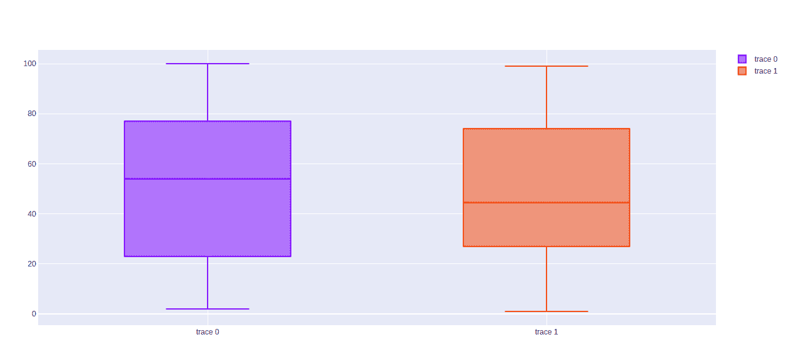

# 使用 graph_objects 类在 plot 中绘制方框图

> 原文:[https://www . geesforgeks . org/box-plot-in-plot-use-graph _ objects-class/](https://www.geeksforgeeks.org/box-plot-in-plotly-using-graph_objects-class/)

[**Plotly**](https://www.geeksforgeeks.org/getting-started-with-plotly-python/) 是一个 Python 库，用来设计图形，尤其是交互图形。它可以绘制各种图形和图表，如直方图、条形图、箱线图、展开图等。它主要用于数据分析以及财务分析。plotly 是一个交互式可视化库。

## 使用图形对象类的方框图

如果 Plotly Express 没有一个好的起点，那么也可以使用更通用的 go。plotly.graph_objects 中的 Box 类。箱线图是一种一致的数据分布方式，基于如下所示的五个主要组成部分:

*   **最小值:**排除任何异常值的最低数据点。
*   **最大值:**排除任何异常值的最大数据点。
*   **中位数(Q2 /第 50 百分位):**数据集的中间值。
*   **第一个四分位数(Q1 /第 25 百分位):**也称为下四分位数 qn(0.25)，是数据集下半部分的中位数。
*   **第三个四分位数(Q3/75 百分位):**也称为上四分位数 qn(0.75)，是数据集上半部分的中位数。

> **语法:【plotly.graph _ objects 类。Box(arg=None，alignmentgroup=None，boxmean=None，boxpoints=None，customdata=None，customdatasrc =None，dx=None，dy=None，fillcolor=None，气垫 info=None，气垫 label=None，气垫 on=None，气垫 template=None，气垫 text=None，气垫 textsrc=None，ids=None，idssrc=None，抖动= None，legendgroup=None，line=None，lowerfence=None，lower**
> 
> **参数:**
> **x:** 设置 x 样本数据或坐标。有关更多信息，请参见概述。
> **y:** 设置 y 样本数据或坐标。有关更多信息，请参见概述。
> **悬停信息:**确定悬停时出现哪些轨迹信息。
> **标记:**具有相容属性的实例或字典。
> **平均值:**设置平均值。
> **中值:**设置中值。

**示例:**

## 蟒蛇 3

```py
import plotly.graph_objects as px
import numpy as np

# creating random data through randomint
# function of numpy.random
np.random.seed(42)

random_y1= np.random.randint(1,101,100)
random_y2= np.random.randint(1,101,100)

x = ['A', 'B', 'C', 'D']

plot = px.Figure()

plot.add_trace(px.Box(y=random_y1))
plot.add_trace(px.Box(y=random_y2))

plot.show()
```

**输出:**



## 水平方框图

水平箱线图是一个箱线图，其中 x 变量和 y 值在图表中水平显示。它可以通过传递方块图的 x 参数来创建。

**示例:**对水平图使用 x 参数

## 蟒蛇 3

```py
import plotly.graph_objects as px
import numpy as np

# creating random data through randomint
# function of numpy.random
np.random.seed(42)

random_x1= np.random.randint(1,101,100)
random_x2= np.random.randint(1,101,100)

x = ['A', 'B', 'C', 'D']

plot = px.Figure()

plot.add_trace(px.Box(x=random_x1))
plot.add_trace(px.Box(x=random_x2))

plot.show()
```