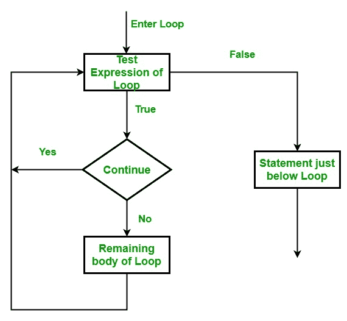

# 用 Python 中断、继续、传递

> 原文:[https://www . geesforgeks . org/break-continue-pass-in-python/](https://www.geeksforgeeks.org/break-continue-and-pass-in-python/)

在 Python 中使用循环以高效的方式自动化和重复任务。但是有时，可能会出现这样一种情况，您想要完全退出循环，跳过一次迭代或者忽略该情况。这些可以通过**循环控制语句**来完成。循环控制语句改变其正常顺序的执行。当执行离开一个范围时，在该范围内创建的所有自动对象都将被销毁。Python 支持以下控制语句。

*   [中断声明](#break)
*   [继续陈述](#continue)
*   [通过声明](#pass)

## break 语句

`break` 语句用于终止它所在的循环或语句。之后，控件将传递给 break 语句之后的语句(如果可用)。如果 break 语句出现在嵌套循环中，那么它只终止那些包含`break` 语句的循环。

**语法:**

```py
break

```


**示例:**
考虑一种情况，您想要迭代一个字符串，并想要打印所有字符，直到遇到字母“e”或“s”。指定您必须使用循环来执行此操作，并且只允许使用一个循环。
下面是`break` 语句的用法。我们可以做的是使用`while` 循环或`for` 循环迭代一个字符串，每次我们都要将迭代器的值与“e”或“s”进行比较。如果是“e”或“s”，我们将使用 break 语句退出循环。

下面是实现。

```py
# Python program to demonstrate
# break statement

# Python program to 
# demonstrate break statement 

s = 'geeksforgeeks'
# Using for loop 
for letter in s: 

    print(letter) 
    # break the loop as soon it sees 'e' 
    # or 's' 
    if letter == 'e' or letter == 's': 
        break

print("Out of for loop") 
print() 

i = 0

# Using while loop 
while True: 
    print(s[i]) 

    # break the loop as soon it sees 'e' 
    # or 's' 
    if s[i] == 'e' or s[i] == 's': 
        break
    i += 1

print("Out of while loop")
```

**输出:**

```py
g
e
Out of for loop

g
e
Out of while loop

```

## 连续语句

`Continue` 和 break 语句一样，也是一个循环控制语句。`continue` 语句与 break 语句相反，它不是终止循环，而是强制执行循环的下一次迭代。
顾名思义，continue 语句强制循环继续或执行下一次迭代。当 continue 语句在循环中执行时，将跳过 continue 语句后面的循环中的代码，并开始循环的下一次迭代。

**语法:**

```py
continue

```



**例:**
考虑一下需要写一个程序打印 1 到 10 的数字但不打印 6 的情况。指定您必须使用循环来执行此操作，并且只允许使用一个循环。
下面是`continue` 语句的用法。我们在这里可以做的是，我们可以运行一个从 1 到 10 的循环，每次我们都必须将迭代器的值与 6 进行比较。如果它等于 6，我们将使用 continue 语句继续下一次迭代，而不打印任何内容，否则我们将打印该值。

下面是上述想法的实现:

```py
# Python program to 
# demonstrate continue 
# statement 

# loop from 1 to 10 
for i in range(1, 11): 

    # If i is equals to 6,   
    # continue to next iteration   
    # without printing  
    if i == 6: 
        continue
    else: 
        # otherwise print the value 
        # of i 
        print(i, end = " ")
```

**输出:**

```py
1 2 3 4 5 7 8 9 10 

```

## 传递语句

顾名思义，pass 语句根本不做任何事情。当语句在语法上是必需的，但是您不希望执行任何命令或代码时，使用 Python 中的 pass 语句。就像`null` 操作，执行了就不会发生什么。`Pass` 语句也可以用于写空循环。Pass 也用于空的控制语句、函数和类。

**语法:**

```py
pass

```

**示例:**

```py
# Python program to demonstrate
# pass statement

s = "geeks"

# Empty loop
for i in s:
    # No error will be raised
    pass

# Empty function
def fun():
    pass

# No error will be raised
fun()

# Pass statement
for i in s:
    if i == 'k':
        print('Pass executed')
        pass
    print(i)
```

**输出:**

```py
g
e
e
Pass executed
k
s

```

在上面的例子中，当 I 的值等于' k '时，pass 语句什么也不做，因此字母' k '也被打印出来。