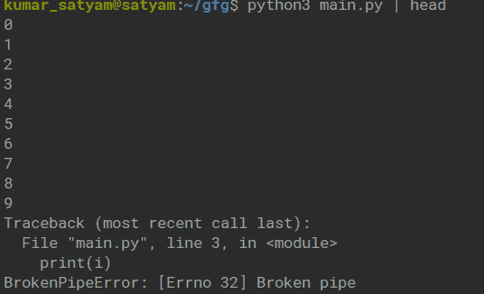

# Python 中的断管错误

> 原文:[https://www.geeksforgeeks.org/broken-pipe-error-in-python/](https://www.geeksforgeeks.org/broken-pipe-error-in-python/)

在本文中，我们将讨论 python 中的管道错误，从 python 中错误是如何发生的开始，以及纠正 python 中错误所需遵循的解决方案类型。所以，让我们进入这篇文章来理解这个概念。

随着信息技术领域新兴技术的进步，编程语言的使用正发挥着至关重要的作用。因此，适当的语言被认为是快速执行的功能。在这种情况下，Python 成为了满足当前问题执行需求的最重要的语言，因为它简单并且可以使用各种库。但是随着执行的进行，执行过程中的错误也随之产生，程序员很难纠正错误来处理问题。

## **断管错误的出现**

中断管道错误通常是输入/输出错误，发生在 Linux 系统级别。错误发生在文件的读写过程中，主要发生在文件的操作过程中。在 Linux 系统中发生的同样的错误是 EPIPE，但是每个返回其错误代码的库函数也会产生一个名为 SIGPIPE 的信号，这个信号用于在程序没有被处理或阻塞时终止程序。因此，一个程序将永远无法看到 EPIPE 错误，除非它已经处理或阻止了 SIGPIPE。

默认情况下，Python 解释器没有足够的能力忽略 SIGPIPE，相反，它会将此信号转换为异常，并引发一个称为 IOError(输入/输出错误)的错误，也称为“错误 32”或“断管错误”。

## **Python 终端断管错误**

> 蟒蛇<filename>。py | head</filename>

上面编写的管道代码将创建一个向上游发送数据的进程和一个向下游读取数据的进程。但是当下游进程无法读取上游的数据时，它会通过向上游进程发送 SIGPIPE 信号来引发异常。因此，python 问题中的上游进程会产生错误，如 **IOError:将出现断管错误。**

**示例:**

## 蟒蛇 3

```
for i in range(4000):
    print(i)
```

**当我们从 unix 命令运行这个文件时:**

```
python3 main.py | head -n3000
```



## **避免断管错误的程序**

**方法 1:** 为了避免错误，我们需要让终端高效地运行代码，而不捕获 SIGPIPE 信号，因此对于这些，我们可以在 python 程序的顶部添加下面的代码。

```
from signal import signal, SIGPIPE, SIG_DFL  
signal(SIGPIPE,SIG_DFL) 
```

## 蟒蛇 3

```
from signal import signal, SIGPIPE, SIG_DFL  
signal(SIGPIPE,SIG_DFL)

for i in range(4000):
    print(i)
```

**输出:**

```
0
1
20
1
2
3
4
5
6
7
8
9
3
4
5
6
7
8
9
```

**说明:**

上面放在 python 代码顶部的代码用于将 SIGPIPE 信号重定向到默认的 SIG_DFL 信号，系统通常会忽略这个信号，这样代码的其余部分就可以无缝执行。但是方法 11 并不有效，因为在关于信号库的 Python 手册中，提到应该避免这种类型的信号处理，并且不应该在代码的任何部分中实践。因此，出于这个原因，我们将采用第二种方法。

**方法 2:** 我们可以通过使用 try/catch 块的功能来处理这种类型的错误，该功能已经得到 python 手册的批准，建议按照这样的程序来处理错误。

```
import sys, errno  
try:  
   # INPUT/OUTPUT operation #
except IOError as e:  
   if e.errno == errno.EPIPE:  
       # Handling of the error  
```

**示例:**

## 蟒蛇 3

```
import sys
import errno

try:
    for i in range(4000):
        print(i)
except IOError as e:
    if e.errno == errno.EPIPE:
      pass
       # Handling of the error
```

**输出:**

```
0
1
2
3
4
5
6
7
8
9
```

**说明:**

在上面这段代码中，我们使用了内置的 python 库，即 Sys 和 Errno 模块，并使用 try/catch 块来捕获引发的 SIGPIPE 异常，并在它停止程序执行之前处理它。