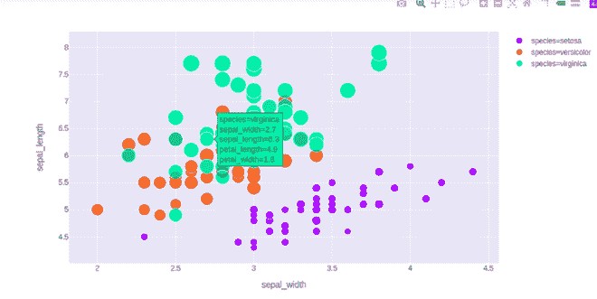
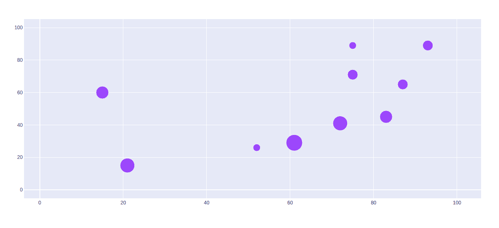
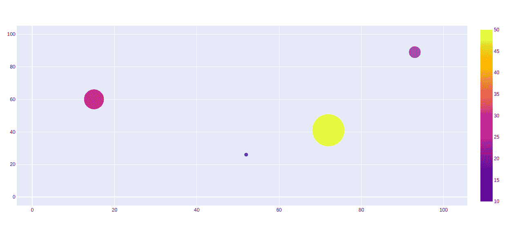

# Python 中使用 Plotly 的气泡图

> 原文:[https://www . geeksforgeeks . org/bubble-chart-use-plotly-in-python/](https://www.geeksforgeeks.org/bubble-chart-using-plotly-in-python/)

**Plotly** 是一个 Python 库，用来设计图形，尤其是交互图形。它可以绘制各种图形和图表，如直方图、条形图、箱线图、展开图等。它主要用于数据分析以及财务分析。Plotly 是一个交互式可视化库。

## 泡泡图

Plotly 中的气泡图是使用散点图创建的。可以使用`plotly.express`的**散射()**方法创建。气泡图是一种数据可视化，它有助于在二维图中显示多个圆(气泡)，就像散点图一样。气泡图主要用于描述和显示数值变量之间的关系。

**示例:**

## 蟒蛇 3

```
import plotly.express as px

df = px.data.iris()

fig = px.scatter(df, x="sepal_width", y="sepal_length",
                 color="species",
                 size='petal_length', 
                 hover_data=['petal_width'])

fig.show()
```

**输出:**



## 设置标记大小

标记大小和颜色用于控制标记的整体大小。标记大小有助于保持图形中气泡内部的颜色。散射用于根据数据实际缩放标记大小和颜色。

**示例:**

## 蟒蛇 3

```
import plotly.graph_objects as px
import numpy as np

# creating random data through randomint 
# function of numpy.random 
np.random.seed(42)

random_x= np.random.randint(1,101,100) 
random_y= np.random.randint(1,101,100)

plot = px.Figure(data=[px.Scatter(
    x = random_x,
    y = random_y,
    mode = 'markers',
    marker_size = [115, 20, 30])
])

plot.show()
```

**输出:**


## 缩放气泡图的大小

要缩放气泡尺寸，请使用参数 **sizeref** 。要计算 sizeref 的值，请使用:

> sizeref = 2。*最大值(大小值数组)/(所需的最大标记大小** 2)

**示例:**

## 蟒蛇 3

```
import plotly.graph_objects as px
import numpy as np

# creating random data through randomint 
# function of numpy.random 
np.random.seed(42)

random_x= np.random.randint(1,101,100) 
random_y= np.random.randint(1,101,100)

size = [20, 40, 60, 80, 100, 80, 60, 40, 20, 40]

plot = px.Figure(data=[px.Scatter(
    x = random_x,
    y = random_y,
    mode = 'markers',
    marker=dict(
        size=size,
        sizemode='area',
        sizeref=2.*max(size)/(40.**2),
        sizemin=4
    )
)])

plot.show()
```

**输出:**



## 显示色阶

色标是一种专门的标签，有助于显示带有色标的颜色映射，色标用于显示调色板及其用于颜色映射的数字色标。

**示例:**

## 蟒蛇 3

```
import plotly.graph_objects as px
import numpy as np

# creating random data through randomint 
# function of numpy.random 
np.random.seed(42)

random_x= np.random.randint(1,101,100) 
random_y= np.random.randint(1,101,100)

plot = px.Figure(data=[px.Scatter(
    x = random_x,
    y = random_y,
    mode = 'markers',
     marker=dict(
       color = [10, 20, 30, 50], 
       size = [10, 30, 50, 80],
       showscale=True
     )
)])

plot.show()
```

**输出:**

