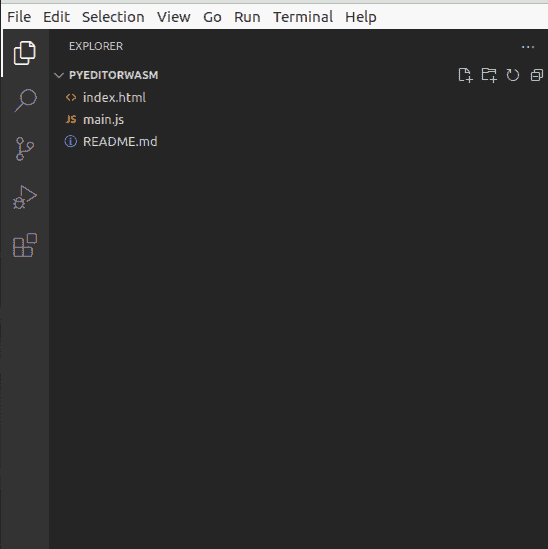
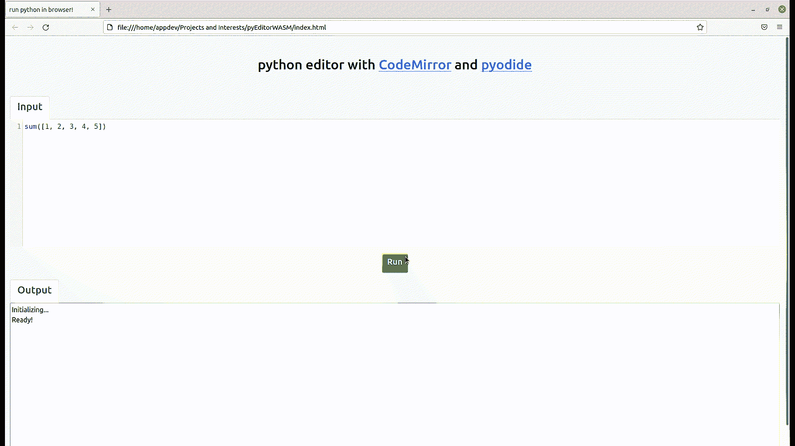

# 使用 CodeMirror 和 pyodide 构建 Python 代码编辑器

> 原文:[https://www . geesforgeks . org/build-python-code-editor-using-codemirror-and-pyodide/](https://www.geeksforgeeks.org/build-python-code-editor-using-codemirror-and-pyodide/)

在本文中，我们将学习开发一个可以在您的网络浏览器中运行 Python 代码的应用程序。

为了实现这一点，我们将使用 pyodide.org，它由编译成网络程序集的 CPython 解释器组成，允许 Python 在浏览器中运行。我们将使用 Python 模式的 codemirror.net 作为代码编辑器组件。您可以在本文末尾找到 API 参考和源代码链接。

**让我们快速看一下我们的项目结构:**



项目结构

我们这里基本上有两个文件，一个用于用户界面的 HTML 文件和一个用于设置 pyodide 和 CodeMirror 的 javascript 文件。

#### 让我们从用户界面组件开始，index.html 文件:

首先，我们使用 CDN 服务 [cdnjs](https://cdnjs.com/) 链接一些外部 CSS 资源，以及 pyodide 和 CodeMirror 的 JavaScript 文件。我们还将自己的脚本文件 main.js 包含在我们的 body 标签中，因为我们将使用它来编写页面内容。作为 UI 组件，我们有一个简单的头，一个用于代码输入的 textarea，id 为“code”，CodeMirror 将使用它来设置 python 代码编辑器，还有一个用于输出的 textarea，id 为“output”，pyodide 将使用它来显示执行的 python 代码的输出。

## 超文本标记语言

```py
<!DOCTYPE html>
<html>
<head>
    <meta charset='utf-8'>
    <meta http-equiv='X-UA-Compatible' content='IE=edge'>
    <title>run python in browser!</title>
    <meta name='viewport' content='width=device-width, initial-scale=1'>
    <link href="https://cdn.jsdelivr.net/npm/bootstrap@5.1.3/dist/css/bootstrap.min.css" rel="stylesheet"
        integrity="sha384-1BmE4kWBq78iYhFldvKuhfTAU6auU8tT94WrHftjDbrCEXSU1oBoqyl2QvZ6jIW3" crossorigin="anonymous">
    <link rel="stylesheet" href="https://cdnjs.cloudflare.com/ajax/libs/codemirror/5.48.4/codemirror.min.css" />
    <script src="https://cdn.jsdelivr.net/pyodide/v0.18.1/full/pyodide.js"></script>
</head>

<body>
    <div class="container-fluid bg-light">
        <section class="header text-center p-5">
            <h2 class="text-dark">python editor with <a href="https://codemirror.net/" target="_blank">CodeMirror</a>
                and
                <a href="https://pyodide.org/en/stable/index.html" target="_blank">pyodide</a>
            </h2>
        </section>
        <div class="d-flex flex-column">
            <section class="input">
                <ul class="nav nav-tabs">
                    <li class="nav-item">
                        <a class="nav-link active" aria-current="page">
                            <h4>Input</h4>
                        </a>
                    </li>
                </ul>
                <div><textarea id="code" name="code">
                </textarea>
                </div>
            </section>
            <div class="align-self-center m-3">
                <button type="button" class="btn btn-success" onclick="evaluatePython()">
                    <h5>Run</h5>
                </button>
            </div>
            <section class="output">
                <ul class="nav nav-tabs">
                    <li class="nav-item">
                        <a class="nav-link active" aria-current="page">
                            <h4>Output</h4>
                        </a>
                    </li>
                </ul>
                <div>
                    <textarea id="output" name="output" class="w-100" rows="15">
                    </textarea>
                </div>
            </section>
        </div>

    </div>
    <script src="https://cdnjs.cloudflare.com/ajax/libs/codemirror/5.63.3/codemirror.min.js"
        integrity="sha512-XMlgZzPyVXf1I/wbGnofk1Hfdx+zAWyZjh6c21yGo/k1zNC4Ve6xcQnTDTCHrjFGsOrVicJsBURLYktVEu/8vQ=="
        crossorigin="anonymous" referrerpolicy="no-referrer"></script>
    <script src="https://cdnjs.cloudflare.com/ajax/libs/codemirror/5.63.3/mode/python/python.min.js"
        integrity="sha512-/mavDpedrvPG/0Grj2Ughxte/fsm42ZmZWWpHz1jCbzd5ECv8CB7PomGtw0NAnhHmE/lkDFkRMupjoohbKNA1Q=="
        crossorigin="anonymous" referrerpolicy="no-referrer"></script>
    <script src='main.js'></script>
</body>

</html>
```

好了，现在让我们继续我们的 JavaScript 文件，其中包含代码镜像和 pyodide 设置的代码。

**main.js:**

我们使用 document.getElementById 来定义我们的输出元素，它代表 id 为“output”的 TextArea 元素。为了初始化编辑器，我们使用 CodeMirror 提供的 fromTextArea 方法，该方法用 CodeMirror 实例替换 textarea。text 区域中的文本将为编辑器提供内容，稍后我们将使用 editor.getValue()访问该编辑器。为了设置 pyodide，我们定义了一个异步函数 main()，它调用 loadPyodide 方法，indexURL 作为 Pyodide 的最新版本，由 CDN 服务提供。它建立了 Python 环境，并作为承诺返回了 Pyodide 顶级命名空间。现在，彼得已经准备好了。

## java 描述语言

```py
const output = document.getElementById("output");

const editor = CodeMirror.fromTextArea(document.getElementById("code"), {
    mode: {
        name: "python",
        version: 3,
        singleLineStringErrors: false
    },
    lineNumbers: true,
    indentUnit: 4,
    matchBrackets: true
});

editor.setValue(`sum([1, 2, 3, 4, 5])`);
output.value = "Initializing...\n";

async function main() {
    let pyodide = await loadPyodide({ indexURL: "https://cdn.jsdelivr.net/pyodide/v0.18.1/full/" });
    // Pyodide ready
    output.value += "Ready!\n";
    return pyodide;
};

let pyodideReadyPromise = main();

function addToOutput(s) {
    output.value += ">>>" + s + "\n";
}

async function evaluatePython() {
    let pyodide = await pyodideReadyPromise;
    try {
        console.log(editor.getValue())
        let output = pyodide.runPython(editor.getValue());
        addToOutput(output);
    } catch (err) {
        addToOutput(err);
    }
}
```

为了执行代码，我们定义了一个方法 evaluatePython()，它本质上调用了 pyodide 提供的 runPython 方法。它以字符串的形式将 python 代码作为输入，并执行它，然后返回表达式的结果，转换为 JavaScript 字符串。我们使用 addtoOutput()方法将这个字符串追加到我们的输出中。这个输出代表最终输出，它是执行 python 代码的结果。

仅此而已，我们已经构建了一个简单的代码编辑器，可以在浏览器中执行 python 代码！作为一个有趣的小活动，您可以尝试构建另一个组件，调试输出，它将显示代码中所有打印语句的结果，默认情况下，结果显示在控制台中。

**要运行这个应用程序，只需在浏览器中打开 index.html:**

