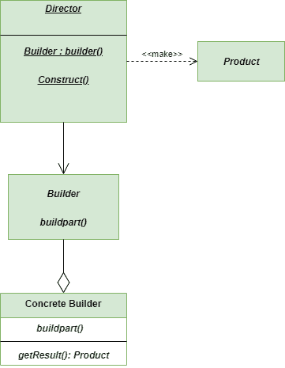
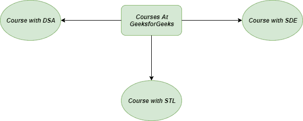
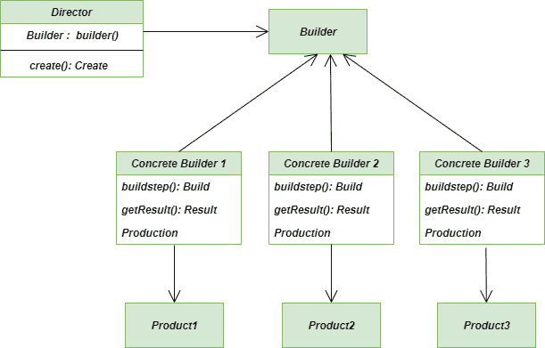

# 构建器方法–Python 设计模式

> 原文:[https://www . geesforgeks . org/builder-method-python-design-patterns/](https://www.geeksforgeeks.org/builder-method-python-design-patterns/)

Builder Method 是一种[创建设计模式](https://www.geeksforgeeks.org/software-design-patterns/)，旨在“将复杂对象的构建与其表示分离，以便相同的构建过程可以创建不同的表示。”它允许您一步一步地构建复杂的对象。这里使用相同的构造代码，我们可以很容易地生成不同类型和表示的对象。

它的基本设计是为面向对象编程中各种对象创建问题的解决方案提供灵活性。

### 构建器设计模式的 UML 图



构建器方法

## 不使用生成器方法时出现问题:

想象一下你想加入一批精英[极客](geeksforgeeks.org)。所以，你会去那里询问费用结构，可用的时间，以及你想参加的课程的批次。在查看系统后，他们会告诉你课程、费用结构、可用时间和批次。就这样！(不！我们还没有完成，因为我们是优秀的开发人员)。

我们的主要目的是设计灵活、可靠、有组织和润滑的系统。没有经验的开发人员会做的是，他们会为 **GeeksforGeeks** 提供的每一门课程创建一个单独且独特的类。然后他们将为每个类创建单独的对象实例化，虽然这不是每次都需要的。当 GeeksforGeeks 开始新的课程，开发人员也必须添加新的类时，主要的问题就会出现，因为他们的代码不太灵活。



问题生成器-方法

**注意:**以下代码是在不使用 Builder 方法的情况下编写的。

```py
# concrete course
class DSA():

    """Class for Data Structures and Algorithms"""

    def Fee(self):
        self.fee = 8000

    def available_batches(self):
        self.batches = 5

    def __str__(self):
        return "DSA"

# concrete course
class SDE():

    """Class for Software development Engineer"""

    def Fee(self):
        self.fee = 10000

    def available_batches(self):
        self.batches = 4

    def __str__(self):
        return "SDE"

# concrete course
class STL():

    """class for Standard Template Library of C++"""

    def Fee(self):
        self.fee = 5000

    def available_batches(self):
        self.batches = 7

    def __str__(self):
        return "STL"

# main method
if __name__ == "__main__":

    sde = SDE()   # object for SDE
    dsa = DSA()   # object for DSA
    stl = STL()   # object for STL

    print(f'Name of Course: {sde} and its Fee: {sde.fee}')
    print(f'Name of Course: {stl} and its Fee: {stl.fee}')
    print(f'Name of Course: {dsa} and its Fee: {dsa.fee}')
```

## 构建器方法解决方案:

我们的最终产品应该是 GeeksforGeeks 的任何课程。可能是 SDE，STL 或者 DSA。在选择一门特定的课程之前，我们必须经历许多步骤，比如找到关于课程、教学大纲、费用结构、时间安排和批次的细节。在这里，使用相同的过程，我们可以在 **GeeksforGeeks** 选择不同的课程。这就是使用**建造者模式的好处。**


解决方案生成器方法

```py
# Abstract course
class Course:

    def __init__(self):
        self.Fee()
        self.available_batches()

    def Fee(self):
        raise NotImplementedError

    def available_batches(self):
        raise NotImplementedError

    def __repr__(self):
        return 'Fee : {0.fee} | Batches Available : {0.batches}'.format(self)

# concrete course
class DSA(Course):

    """Class for Data Structures and Algorithms"""

    def Fee(self):
        self.fee = 8000

    def available_batches(self):
        self.batches = 5

    def __str__(self):
        return "DSA"

# concrete course
class SDE(Course):

    """Class for Software Development Engineer"""

    def Fee(self):
        self.fee = 10000

    def available_batches(self):
        self.batches = 4

    def __str__(self):
        return "SDE"

# concrete course
class STL(Course):

    """Class for Standard Template Library"""

    def Fee(self):
        self.fee = 5000

    def available_batches(self):
        self.batches = 7

    def __str__(self):
        return "STL"

# Complex Course
class ComplexCourse:

    def __repr__(self):
        return 'Fee : {0.fee} | available_batches: {0.batches}'.format(self)

# Complex course
class Complexcourse(ComplexCourse):

    def Fee(self):
        self.fee = 7000

    def available_batches(self):
        self.batches = 6

# construct course
def construct_course(cls):

    course = cls()
    course.Fee()
    course.available_batches()

    return course    # return the course object

# main method
if __name__ == "__main__":

    dsa = DSA()  # object for DSA course
    sde = SDE()  # object for SDE course
    stl = STL()  # object for STL course

    complex_course = construct_course(Complexcourse)
    print(complex_course)
```

## 生成器模式方法的一般类图:



生成器方法的通用类图

## 使用生成器方法的优势:

1.  **可重用性:**在对产品进行各种表示时，我们也可以对其他表示使用相同的构造代码。
2.  **单一责任原则:**我们既可以将业务逻辑分离出来，也可以将复杂的构造代码分离出来。
3.  **对象的构造:**这里我们一步一步地构造我们的对象，推迟构造步骤或者递归地运行步骤。

## 使用生成器方法的缺点:

1.  **代码复杂度增加:**我们的代码复杂度增加，因为构建器模式需要创建多个新类。
2.  **可变性:**它要求构建器类是可变的
3.  **初始化:**类的数据成员不保证初始化。

## 适用性:

1.  **构建复杂对象:**构建器方法允许您一步一步地构建产品。甚至，我们可以在不破坏最终产品的情况下推迟某些步骤的执行。要创建对象树，递归调用这些步骤是很方便的。它防止客户端代码获取不完整的数据，因为它不允许暴露未完成的对象。
2.  **表示不同:**当产品的各种表示的构建涉及仅在细节上不同的类似步骤时，构建器模式适用。基础构建器接口用于定义所有的构建步骤，而这些步骤由具体的构建器实现。

**进一步阅读:**[c++中的 Builder 设计方法](https://www.geeksforgeeks.org/builder-design-pattern/)