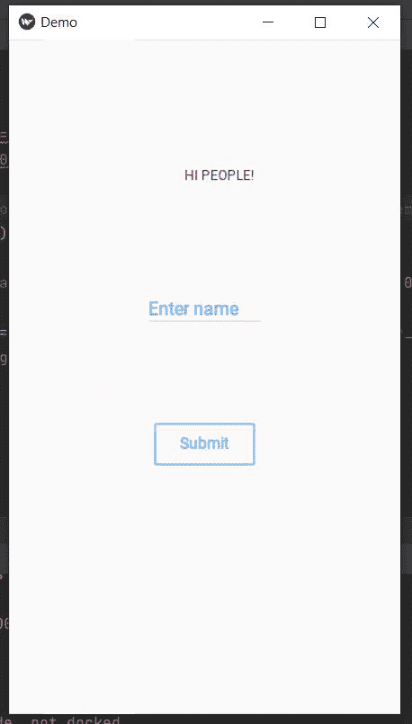

# 使用 Python 中的 KivyMD 构建一个简单的应用程序

> 原文:[https://www . geesforgeks . org/building-a-simple-application-use-kivymd-in-python/](https://www.geeksforgeeks.org/building-a-simple-application-using-kivymd-in-python/)

**KivyMD** 是 Kivy 框架的扩展。KivyMD 是一个材料设计小部件的集合，用于制作移动应用程序的图形用户界面框架 Kivy。它类似于 Kivy 框架，但提供了更具吸引力的 GUI。在本文中，我们将看到如何使用屏幕、标签、文本字段输入和按钮在 KivyMDusing 中制作一个简单的应用程序。

### **安装:**

为了启动 KivyMD，您必须首先在计算机上安装 Kivy 框架。可以使用以下命令安装:

```py
pip install kivymd
```

### 使用的小部件:

我们需要使用 kivyMD.uix 库导入以下小部件:

*   **MDLabel():** 此小部件在 KivyMD 应用程序中用于添加标签或将文本显示为标签。

> MDLabel(文本、标题、主题、文本颜色、文本颜色、字体样式)
> 
> **参数:**
> 
> *   **文字-** 我们要放在标签上的文字。
> *   **halign-** 我们要放置标签的位置。
> *   **主题 _ 文本 _ 颜色-** 文本颜色的主题，如自定义、主要、次要、提示或错误。
> *   **text_color-** 如果 theme_text_color 是自定义的，我们可以为一个 RGB 元组分配文本颜色。
> *   **font_style-** 喜欢标题，标题。

*   **MDTextField():** 此小部件用于在 KivyMD 窗口中添加按钮。

> MDTextField（文本，pos_hint）
> 
> *   **文本-** 我们要放入 TextField 的文本。
> *   **pos_hint-** 具有相对于 x 轴和 y 轴的位置的字典。

*   **mdrectangleflattutton():**这个小部件用于向 KivyMD 应用程序添加矩形按钮。

> MDRectangleFlatButton(文本，位置提示，打开释放)
> 
> *   **文字-** 我们要放在按钮上的文字。
> *   **pos_hint-** 具有相对于 x 轴和 y 轴的位置的字典。
> *   **on_release-** 它是一个函数，具有我们点击按钮时想要调用的属性。

让我们看看使用上述小部件创建简单应用程序的代码，然后我们将详细讨论代码。

## 蟒蛇 3

```py
# importing all necessary modules
# like MDApp, MDLabel Screen, MDTextField
# and MDRectangleFlatButton
from kivymd.app import MDApp
from kivymd.uix.label import MDLabel
from kivymd.uix.screen import Screen
from kivymd.uix.textfield import MDTextField
from kivymd.uix.button import MDRectangleFlatButton

# creating Demo Class(base class)
class Demo(MDApp):

    def build(self):
        screen = Screen()

        # defining label with all the parameters
        l = MDLabel(text="HI PEOPLE!", halign='center',
                    theme_text_color="Custom",
                    text_color=(0.5, 0, 0.5, 1),
                    font_style='Caption')

        # defining Text field with all the parameters
        name = MDTextField(text="Enter name", pos_hint={
                           'center_x': 0.8, 'center_y': 0.8},
                           size_hint_x=None, width=100)

        # defining Button with all the parameters
        btn = MDRectangleFlatButton(text="Submit", pos_hint={
                                    'center_x': 0.5, 'center_y': 0.3},
                                    on_release=self.btnfunc)
        # adding widgets to screen
        screen.add_widget(name)
        screen.add_widget(btn)
        screen.add_widget(l)
        # returning the screen
        return screen

    # defining a btnfun() for the button to
    # call when clicked on it
    def btnfunc(self, obj):
        print("button is pressed!!")

if __name__ == "__main__":
    Demo().run()
```

**输出:**



按下按钮后，它会在命令提示符下显示以下输出:


**说明:**

*   这个**类演示**来源于 **kivymd.app** 的 App()类。这个类是创建 kivyMD 应用程序的基类。它基本上是 kivyMD 运行循环的主要入口点。
*   这里 **build()** 方法“初始化应用程序；它只会被调用一次。如果此方法返回一个小部件(树)，它将被用作根小部件并添加到窗口中。
*   在构建方法中，我们首先为要在上面显示的小部件定义一个屏幕。然后我们一个接一个地添加小部件
    *   页面标题的标签。
    *   用户输入的文本字段。您可以添加更多文本字段。
    *   用于提交或执行任何功能的按钮。点击提交按钮，控制台上会显示一条消息。我们已经为其创建了 btnfunc()函数。
*   **Demo.run()** 是 run()方法，它以独立模式启动应用程序，并调用返回屏幕的类 Demo。