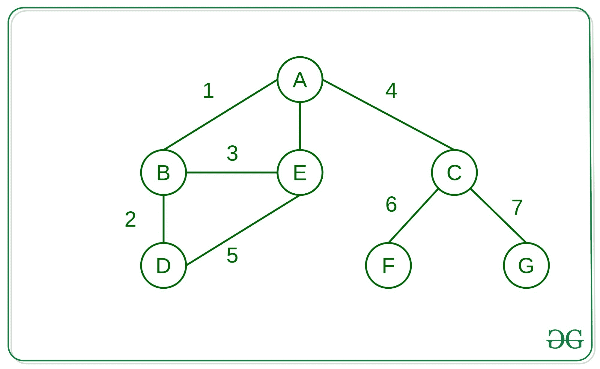

# 使用 Python 中的字典构建无向图并寻找最短路径

> 原文:[https://www . geesforgeks . org/building-an-an-directed-graph-and-find-最短路径-使用 python 字典/](https://www.geeksforgeeks.org/building-an-undirected-graph-and-finding-shortest-path-using-dictionaries-in-python/)

**先决条件:**

*   [图中的 BFS](https://www.geeksforgeeks.org/breadth-first-search-or-bfs-for-a-graph/)
*   [Python 中的字典](https://www.geeksforgeeks.org/python-dictionary/)

在本文中，我们将研究如何构建一个无向图，然后使用 Python 语言中的字典轻松找到该图的两个节点/顶点之间的最短路径。

### 使用字典构建图形



**方法:**想法是将邻接表存储到字典中，这有助于以任何格式存储图形，而不仅仅是以整数的形式。在这里，我们使用字符作为这些地方的参考，任何自定义对象也可以使用。

下面是上述方法的实现:

## 蟒蛇 3

```
# Python3 implementation to build a
# graph using Dictionaries

from collections import defaultdict

# Function to build the graph
def build_graph():
    edges = [
        ["A", "B"], ["A", "E"],
        ["A", "C"], ["B", "D"],
        ["B", "E"], ["C", "F"],
        ["C", "G"], ["D", "E"]
    ]
    graph = defaultdict(list)

    # Loop to iterate over every
    # edge of the graph
    for edge in edges:
        a, b = edge[0], edge[1]

        # Creating the graph
        # as adjacency list
        graph[a].append(b)
        graph[b].append(a)
    return graph

if __name__ == "__main__":
    graph = build_graph()

    print(graph)
```

**Output:** 

```
{
   'G': ['C'], 
   'F': ['C'], 
   'E': ['A', 'B', 'D'], 
   'A': ['B', 'E', 'C'], 
   'B': ['A', 'D', 'E'], 
   'D': ['B', 'E'], 
   'C': ['A', 'F', 'G']
}
```

### 图的两个节点之间的最短路径

**方法:**思路是使用[队列](https://www.geeksforgeeks.org/queue-data-structure/)以[广度优先搜索](https://www.geeksforgeeks.org/breadth-first-search-or-bfs-for-a-graph/)的方式访问遍历图的起始节点的每个相邻节点，找到图的两个节点之间的最短路径。

下面是上述方法的实现:

## 蟒蛇 3

```
# Python implementation to find the
# shortest path in the graph using
# dictionaries

# Function to find the shortest
# path between two nodes of a graph
def BFS_SP(graph, start, goal):
    explored = []

    # Queue for traversing the
    # graph in the BFS
    queue = [[start]]

    # If the desired node is
    # reached
    if start == goal:
        print("Same Node")
        return

    # Loop to traverse the graph
    # with the help of the queue
    while queue:
        path = queue.pop(0)
        node = path[-1]

        # Condition to check if the
        # current node is not visited
        if node not in explored:
            neighbours = graph[node]

            # Loop to iterate over the
            # neighbours of the node
            for neighbour in neighbours:
                new_path = list(path)
                new_path.append(neighbour)
                queue.append(new_path)

                # Condition to check if the
                # neighbour node is the goal
                if neighbour == goal:
                    print("Shortest path = ", *new_path)
                    return
            explored.append(node)

    # Condition when the nodes
    # are not connected
    print("So sorry, but a connecting"\
                "path doesn't exist :(")
    return

# Driver Code
if __name__ == "__main__":

    # Graph using dictionaries
    graph = {'A': ['B', 'E', 'C'],
            'B': ['A', 'D', 'E'],
            'C': ['A', 'F', 'G'],
            'D': ['B', 'E'],
            'E': ['A', 'B', 'D'],
            'F': ['C'],
            'G': ['C']}

    # Function Call
    BFS_SP(graph, 'A', 'D')
```

**Output:** 

```
Shortest path =  A B D
```