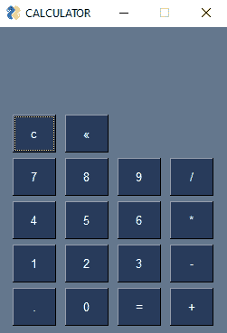

# 使用 PySimpleGUI–Python 的计算器

> 原文:[https://www . geesforgeks . org/calculator-use-pysimplegui-python/](https://www.geeksforgeeks.org/calculator-using-pysimplegui-python/)

**先决条件:**T2【PySimpleGUI】[评估](https://www.geeksforgeeks.org/eval-in-python/)

PySimpleGUI 是一个 Python 包，可以让各个级别的 Python 程序员创建 GUI。您可以使用包含小部件的“布局”来指定您的图形用户界面窗口(它们在 PySimpleGUI 中被称为“元素”)。在本文中，我们将学习如何使用 Python 中的 PySimpleGUI 制作计算器。

在开始之前，我们需要安装此软件包:

```
pip install PySimpleGUI
```

**进场:**

*   导入简单图形用户界面模块
*   创建图形用户界面布局和窗口
*   向主窗口添加任意数量的小部件
*   在小部件上应用事件触发器。

**下面是 GUI 的样子:**



让我们使用 Python PySimpleGUI 模块创建一个基于 GUI 的简单计算器，它可以执行基本算术运算的加法、减法、乘法和除法。

**我们来了解一下分步实施:-**

**步骤 1:** 创建文本框、按钮

对于创建文本框，我们将使用 **Txt()** 方法。

> **语法:** Txt(输入文本，*attr)

这里将使用读取按钮使用 **ReadFormButton()** 方法。

> **语法:** ReadFormButton(输入按钮文本，*attr)

**步骤 2:** 创建无限循环，读取按钮值并执行操作。

## 蟒蛇 3

```
# Result Value
Result = ''

# Make Infinite Loop
while True:
    # Button Values
    button, value = form.Read()

    # Check Press Button Values
    if button=='c':
        Result = ''
        form.FindElement('input').Update(Result)
    elif button=='«':
        Result = Result[:-1]
        form.FindElement('input').Update(Result)
    elif len(Result) == 16 :
        pass

   # Results
    elif button=='=':
        Answer = eval(Result)
        Answer = str(round(float(Answer),3))
        form.FindElement('input').Update(Answer)
        Result = Answer
    # close the window
    elif button=='Quit'  or button==None:
        break
    else:
        Result += button
        form.FindElement('input').Update(Result)
```

**以下是完整实现:**

## 蟒蛇 3

```
# Import Module
from PySimpleGUI import *

# GUI Layout
layout = [[Txt(''  * 10)],
          [Text('', size = (15, 1), font = ('Helvetica', 18),
                text_color = 'black', key = 'input')],
          [Txt(''  * 10)],
          [ReadFormButton('c'), ReadFormButton('«')],
          [ReadFormButton('7'), ReadFormButton('8'), ReadFormButton('9'), ReadFormButton('/')],
          [ReadFormButton('4'), ReadFormButton('5'), ReadFormButton('6'), ReadFormButton('*')],
          [ReadFormButton('1'), ReadFormButton('2'), ReadFormButton('3'), ReadFormButton('-')],
          [ReadFormButton('.'), ReadFormButton('0'), ReadFormButton('='), ReadFormButton('+')],
          ]

# Set PySimpleGUI
form = FlexForm('CALCULATOR', default_button_element_size = (5, 2),
                auto_size_buttons = False, grab_anywhere = False)
form.Layout(layout)

# Result Value
Result = ''

# Make Infinite Loop
while True:
    # Button Values
    button, value = form.Read()

    # Check Press Button Values
    if button == 'c':
        Result = ''
        form.FindElement('input').Update(Result)
    elif button=='«':
        Result = Result[:-1]
        form.FindElement('input').Update(Result)
    elif len(Result) == 16 :
        pass

   # Results
    elif button == '=':
        Answer = eval(Result)
        Answer = str(round(float(Answer),3))
        form.FindElement('input').Update(Answer)
        Result = Answer

    # close the window
    elif button == 'Quit'  or button == None:
        break
    else:
        Result += button
        form.FindElement('input').Update(Result)
```

**输出:**

<video class="wp-video-shortcode" id="video-558271-1" width="640" height="360" preload="metadata" controls=""><source type="video/mp4" src="https://media.geeksforgeeks.org/wp-content/uploads/20210213140551/FreeOnlineScreenRecorderProject11.mp4?_=1">[https://media.geeksforgeeks.org/wp-content/uploads/20210213140551/FreeOnlineScreenRecorderProject11.mp4](https://media.geeksforgeeks.org/wp-content/uploads/20210213140551/FreeOnlineScreenRecorderProject11.mp4)</video>