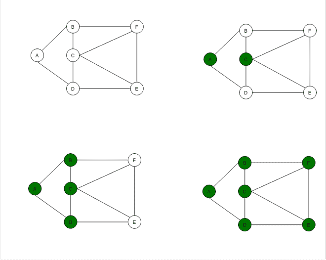
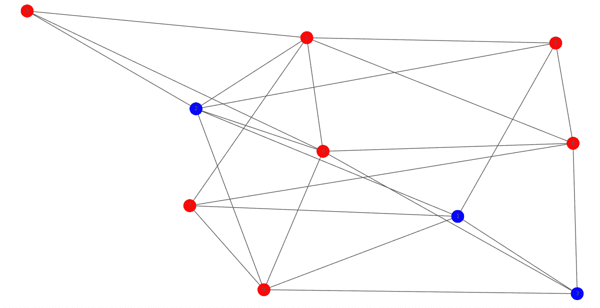
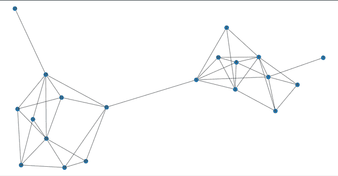

# 社交网络中的级联行为

> 原文:[https://www . geeksforgeeks . org/级联-社交网络中的行为/](https://www.geeksforgeeks.org/cascading-behavior-in-social-networks/)

**先决条件:** [社交网络入门](https://www.geeksforgeeks.org/introduction-to-social-networks-using-networkx-in-python/)[Python 基础知识](https://www.geeksforgeeks.org/python-basics/)

当人们通过网络相互联系在一起时，他们可以影响彼此的行为和决定。这被称为网络中的级联行为。

让我们考虑一个例子，假设一个社会中的所有人都采用了一种趋势 x，现在出现了新的趋势 Y，一个小群体接受了这种新的趋势，在这之后，他们的邻居也接受了这种趋势 Y，以此类推。



级联行为示例(a=2，b=3，p=2/5)

**所以，级联行为主要有 4 个思路:**

1.  增加收益。
2.  关键人物。
3.  社区对瀑布的影响。
4.  级联和集群。

下面是每个想法的代码。

**1。增加收益。**

## 蟒蛇 3

```
# cascade pay off
import networkx as nx
import matplotlib.pyplot as plt

def set_all_B(G):
    for i in G.nodes():
        G.nodes[i]['action'] = 'B'
    return G

def set_A(G, list1):
    for i in list1:
        G.nodes[i]['action'] = 'A'
    return G

def get_colors(G):
    color = []
    for i in G.nodes():
        if (G.nodes[i]['action'] == 'B'):
            color.append('red')
        else:
            color.append('blue')
    return color

def recalculate(G):
    dict1 = {}

    # payoff(A)=a=4
    # payoff(B)=b=3
    a = 15
    b = 5

    for i in G.nodes():
        neigh = G.neighbors(i)
        count_A = 0
        count_B = 0

        for j in neigh:
            if (G.nodes[j]['action'] == 'A'):
                count_A += 1
            else:
                count_B += 1
        payoff_A = a * count_A
        payoff_B = b * count_B

        if (payoff_A >= payoff_B):
            dict1[i] = 'A'
        else:
            dict1[i] = 'B'
    return dict1

def reset_node_attributes(G, action_dict):
    for i in action_dict:
        G.nodes[i]['action'] = action_dict[i]
    return G

def Calculate(G):
    terminate = True
    count = 0
    c = 0

    while (terminate and count < 10):
        count += 1

        # action_dict will hold a dictionary
        action_dict = recalculate(G)
        G = reset_node_attributes(G, action_dict)
        colors = get_colors(G)

        if (colors.count('red') == len(colors) or colors.count('green') == len(colors)):
            terminate = False
            if (colors.count('green') == len(colors)):
                c = 1
        nx.draw(G, with_labels=1, node_color=colors, node_size=800)
        plt.show()
    if (c == 1):
        print('cascade complete')
    else:
        print('cascade incomplete')

G = nx.erdos_renyi_graph(10, 0.5)
nx.write_gml(G, "erdos_graph.gml")

G = nx.read_gml('erdos_graph.gml')
print(G.nodes())

G = set_all_B(G)

# initial adopters
list1 = ['2', '1', '3']
G = set_A(G, list1)
colors = get_colors(G)

nx.draw(G, with_labels=1, node_color=colors, node_size=800)
plt.show()

Calculate(G)
```

**输出:**

```
['0', '1', '2', '3', '4', '5', '6', '7', '8', '9']
cascade complete

```



**2。关键人物。**

## 蟒蛇 3

```
# cascade key people
import networkx as nx
import matplotlib.pyplot as plt

G = nx.erdos_renyi_graph(10, 0.5)
nx.write_gml(G, "erdos_graph.gml")

def set_all_B(G):
    for i in G.nodes():
        G.nodes[i]['action'] = 'B'
    return G

def set_A(G, list1):
    for i in list1:
        G.nodes[i]['action'] = 'A'
    return G

def get_colors(G):
    color = []
    for i in G.nodes():
        if (G.nodes[i]['action'] == 'B'):
            color.append('red')
        else:
            color.append('green')
    return color

def recalculate(G):
    dict1 = {}

    # payoff(A)=a=4
    # payoff(B)=b=3
    a = 10
    b = 5
    for i in G.nodes():
        neigh = G.neighbors(i)
        count_A = 0
        count_B = 0

        for j in neigh:
            if (G.nodes[j]['action'] == 'A'):
                count_A += 1
            else:
                count_B += 1

        payoff_A = a * count_A
        payoff_B = b * count_B

        if (payoff_A >= payoff_B):
            dict1[i] = 'A'
        else:
            dict1[i] = 'B'

    return dict1

def reset_node_attributes(G, action_dict):

    for i in action_dict:
        G.nodes[i]['action'] = action_dict[i]
    return G

def Calculate(G):
    continuee = True
    count = 0
    c = 0

    while (continuee and count < 100):
        count += 1

        # action_dict will hold a dictionary
        action_dict = recalculate(G)
        G = reset_node_attributes(G, action_dict)
        colors = get_colors(G)

        if (colors.count('red') == len(colors) or colors.count('green') == len(colors)):
            continuee = False
            if (colors.count('green') == len(colors)):
                c = 1

    if (c == 1):
        print('cascade complete')
    else:
        print('cascade incomplete')

G = nx.read_gml('erdos_graph.gml')

for i in G.nodes():
    for j in G.nodes():
        if (i < j):
            list1 = []
            list1.append(i)
            list1.append(j)
            print(list1, ':', end="")

            G = set_all_B(G)
            G = set_A(G, list1)
            colors = get_colors(G)
            Calculate(G)
```

**输出:**

```
['0', '1'] :cascade complete
['0', '2'] :cascade incomplete
['0', '3'] :cascade complete
['0', '4'] :cascade complete
['0', '5'] :cascade incomplete
['0', '6'] :cascade complete
['0', '7'] :cascade complete
['0', '8'] :cascade complete
['0', '9'] :cascade complete
['1', '2'] :cascade complete
['1', '3'] :cascade complete
['1', '4'] :cascade complete
['1', '5'] :cascade complete
['1', '6'] :cascade complete
['1', '7'] :cascade complete
['1', '8'] :cascade complete
['1', '9'] :cascade complete
['2', '3'] :cascade incomplete
['2', '4'] :cascade incomplete
['2', '5'] :cascade incomplete
['2', '6'] :cascade incomplete
['2', '7'] :cascade incomplete
['2', '8'] :cascade incomplete
['2', '9'] :cascade complete
['3', '4'] :cascade complete
['3', '5'] :cascade incomplete
['3', '6'] :cascade complete
['3', '7'] :cascade complete
['3', '8'] :cascade complete
['3', '9'] :cascade complete
['4', '5'] :cascade incomplete
['4', '6'] :cascade complete
['4', '7'] :cascade complete
['4', '8'] :cascade complete
['4', '9'] :cascade incomplete
['5', '6'] :cascade incomplete
['5', '7'] :cascade incomplete
['5', '8'] :cascade incomplete
['5', '9'] :cascade complete
['6', '7'] :cascade complete
['6', '8'] :cascade complete
['6', '9'] :cascade complete
['7', '8'] :cascade complete
['7', '9'] :cascade complete
['8', '9'] :cascade complete

```

**3。社区对瀑布的影响。**

## 蟒蛇 3

```
import networkx as nx
import random
import matplotlib.pyplot as plt

def first_community(G):
    for i in range(1, 11):
        G.add_node(i)
    for i in range(1, 11):
        for j in range(1, 11):
            if (i < j):
                r = random.random()
                if (r < 0.5):
                    G.add_edge(i, j)
    return G

def second_community(G):
    for i in range(11, 21):
        G.add_node(i)
    for i in range(11, 21):
        for j in range(11, 21):
            if (i < j):
                r = random.random()
                if (r < 0.5):
                    G.add_edge(i, j)
    return G

G = nx.Graph()
G = first_community(G)
G = second_community(G)
G.add_edge(5, 15)

nx.draw(G, with_labels=1)
plt.show()

nx.write_gml(G, "community.gml")
```

**输出:**



对集群的影响

**4。群集上的级联。**

## 蟒蛇 3

```
import networkx as nx
import matplotlib.pyplot as plt

def set_all_B(G):
    for i in G.nodes():
        G.nodes[i]['action'] = 'B'
    return G

def set_A(G, list1):
    for i in list1:
        G.nodes[i]['action'] = 'A'
    return G

def get_colors(G):
    color = []
    for i in G.nodes():
        if (G.nodes[i]['action'] == 'B'):
            color.append('red')
        else:
            color.append('green')
    return color

def recalculate(G):
    dict1 = {}
    a = 3
    b = 2
    for i in G.nodes():
        neigh = G.neighbors(i)
        count_A = 0
        count_B = 0

        for j in neigh:
            if (G.nodes[j]['action'] == 'A'):
                count_A += 1
            else:
                count_B += 1
        payoff_A = a * count_A
        payoff_B = b * count_B

        if (payoff_A >= payoff_B):
            dict1[i] = 'A'
        else:
            dict1[i] = 'B'
    return dict1

def reset_node_attributes(G, action_dict):
    for i in action_dict:
        G.nodes[i]['action'] = action_dict[i]
    return G

def Calculate(G):
    terminate = True
    count = 0
    c = 0
    while (terminate and count < 100):
        count += 1

        # action_dict will hold a dictionary
        action_dict = recalculate(G)
        G = reset_node_attributes(G, action_dict)
        colors = get_colors(G)

        if (colors.count('red') == len(colors) or colors.count('green') == len(colors)):
            terminate = False
            if (colors.count('green') == len(colors)):
                c = 1

    if (c == 1):
        print('cascade complete')
    else:
        print('cascade incomplete')
    nx.draw(G, with_labels=1, node_color=colors, node_size=800)
    plt.show()

G = nx.Graph()
G.add_nodes_from(range(13))
G.add_edges_from(
    [(0, 1), (0, 6), (1, 2), (1, 8), (1, 12),
     (2, 9), (2, 12), (3, 4), (3, 9), (3, 12),
     (4, 5), (4, 12), (5, 6), (5, 10), (6, 8), 
     (7, 8), (7, 9), (7, 10), (7, 11), (8, 9), 
     (8, 10), (8, 11), (9, 10), (9, 11), (10, 11)])

list2 = [[0, 1, 2, 3], [0, 2, 3, 4], [1, 2, 3, 4],
         [2, 3, 4, 5], [3, 4, 5, 6], [4, 5, 6, 12],
         [2, 3, 4, 12], [0, 1, 2, 3, 4, 5], 
         [0, 1, 2, 3, 4, 5, 6, 12]]

for list1 in list2:
    print(list1)
    G = set_all_B(G)

    G = set_A(G, list1)
    colors = get_colors(G)
    nx.draw(G, with_labels=1, node_color=colors, node_size=800)
    plt.show()

    Calculate(G)
```

**输出:**

```
[0, 1, 2, 3]
cascade incomplete
[0, 2, 3, 4]
cascade incomplete
[1, 2, 3, 4]
cascade incomplete
[2, 3, 4, 5]
cascade incomplete
[3, 4, 5, 6]
cascade incomplete
[4, 5, 6, 12]
cascade incomplete
[2, 3, 4, 12]
cascade incomplete
[0, 1, 2, 3, 4, 5]
cascade incomplete
[0, 1, 2, 3, 4, 5, 6, 12]
cascade complete

```