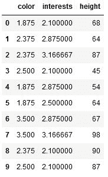

# 使用 CatBoost 编码器进行分类编码

> 原文:[https://www . geeksforgeeks . org/classic-encoding-with-catboost-encoder/](https://www.geeksforgeeks.org/categorical-encoding-with-catboost-encoder/)

许多机器学习算法要求数据是数字的。因此，在训练模型之前，我们需要将分类数据转换成数字形式。有各种分类编码方法可用。Catboost 就是其中之一。Catboost 是一个基于目标的分类编码器。它是一个监督编码器，根据目标值对分类列进行编码。它支持二项式和连续目标。

目标编码是用于分类编码的流行技术。它用训练数据集中与该类别相对应的目标平均值以及整个数据集中的目标概率来替换分类特征。但是这引入了目标泄漏，因为目标用于预测目标。这种模型往往过度，在看不见的情况下不能很好地概括。

CatBoost 编码器类似于目标编码，但也涉及排序原则，以克服目标泄漏的问题。它使用类似于时间序列数据验证的原理。目标统计值依赖于观察到的历史，即当前特征的目标概率仅从它之前的行(观察值)计算。

分类特征值使用以下公式编码:

<center></center>

***【目标计数】*** **:** 特定分类特征的目标值之和(直到当前特征)。

***previous*****:**是由(整个数据集中目标值之和)/(数据集中观测值(即行)总数)确定的常数值

***特征计数*** **:** 到当前特征为止观察到的与当前特征具有相同值的分类特征总数。

使用这种方法，数据集中的前几个观测值总是具有比后续观测值高得多的方差的目标统计值。为了减少这种影响，使用相同数据的许多随机排列来计算目标统计数据，并通过对这些排列进行平均来计算最终编码。因此，如果置换的数量足够大，最终的编码值遵循以下等式:

<center> </center>

***【目标计数】*** **:** 整个数据集中特定分类特征的目标值之和。

***previous*****:**是由(整个数据集中目标值之和)/(数据集中观测值(即行)总数)确定的常数值

***特征计数*** **:** 在整个数据集中观察到的与当前数据集具有相同值的分类特征总数。

例如，如果我们有带值的分类要素列

color=[“红色”、“蓝色”、“蓝色”、“绿色”、“红色”、“红色”、“黑色”、“黑色”、“蓝色”、“绿色”]和带有值的目标列，target=[1、2、3、2、3、1、4、4、2、3]

那么，在先的将是 *25/10 = 2.5*

对于“红色”类别，目标计数将为 1+3+1 = 5，特征计数= 3

因此，“红色”的编码值将是(5+2.5) /(3+1)=1.875

**语法:**

```
*category_encoders.cat_boost.CatBoostEncoder(verbose=0,* 
*cols=None, drop_invariant=False, return_df=True,* 
*handle_unknown='value', handle_missing='value',* 
*random_state=None, sigma=None, a=1)*
```

**参数:**

*   **详细**:输出的详细程度，即是否在屏幕上打印处理输出。0 表示不打印，正值表示打印中间处理输出。
*   **列**:待编码特征(列)列表。默认情况下，它是*无*，表示具有*对象*数据类型的所有列都将被编码。
*   **drop _ 不变量** : *True* 表示零方差的 drop 列(每行相同的值)。默认情况下为 False。
*   **return_df** : True 从转换中返回熊猫数据帧，False 将返回 numpy 数组。默认情况下为真。
*   **处理缺失**:处理缺失(未填充)值的方式。*错误*生成缺失值错误， *return_nan* 返回 nan，*值*返回目标平均值。默认为*值。*
*   **处理 _ 未知**:处理未知(未定义)值的方式。选项与*手柄 _ 缺失*参数相同。
*   **σ**:用于减少过拟合。训练数据加上正态分布噪声，而测试数据保持不变。西格玛是正态分布的标准偏差。
*   **a** :加性平滑的浮点值。当属性或数据点不存在于训练数据集中，但可能存在于测试数据集中时，需要使用它。默认情况下，它设置为 1。如果不是 1，则包含该平滑参数后的编码方程采用以下形式:

编码器在**分类编码**库中作为 CatBoostEncoder 提供。该编码器的工作原理类似于带*的 scikit-learn 变压器。fit_transform()* ，*。配合()*和*。transform()* 方法。

**示例:**

## 蟒蛇 3

```
# import libraries
import category_encoders as ce
import pandas as pd

# Make dataset
train = pd.DataFrame({
    'color': ["red", "blue", "blue", "green", "red",
              "red", "black", "black", "blue", "green"],

    'interests': ["sketching", "painting", "instruments",
                  "sketching", "painting", "video games",
                  "painting", "instruments", "sketching",
                  "sketching"],

    'height': [68, 64, 87, 45, 54, 64, 67, 98, 90, 87],

    'grade': [1, 2, 3, 2, 3, 1, 4, 4, 2, 3], })

# Define train and target
target = train[['grade']]
train = train.drop('grade', axis = 1)

# Define catboost encoder
cbe_encoder = ce.cat_boost.CatBoostEncoder()

# Fit encoder and transform the features
cbe_encoder.fit(train, target)
train_cbe = cbe_encoder.transform(train)

# We can use fit_transform() instead of fit()
# and transform() separately as follows:
# train_cbe = cbe_encoder.fit_transform(train,target)
```

**输出:**

<center>


Catboost 编码后的数据集(train_cbe)

</center>