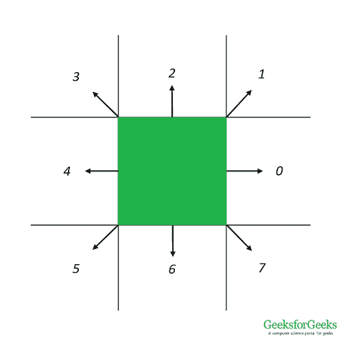
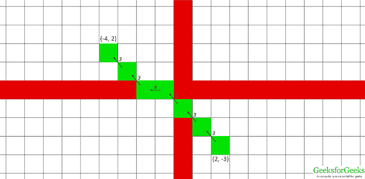

# 2D 线链码

> 原文:[https://www.geeksforgeeks.org/chain-code-for-2d-line/](https://www.geeksforgeeks.org/chain-code-for-2d-line/)

[链码](https://en.wikipedia.org/wiki/Chain_code)是一种无损压缩技术，用于在图像中表示对象。物体任何连续边界的坐标都可以表示为一串数字，其中每个数字代表一个特定的方向，连线上的下一个点就在这个方向上。一个点作为参考/起点，在绘制由链生成的点时，可以重新绘制原始图形。

本文描述了如何生成二维直线的 8 邻域链码。在矩形网格中，一个点最多可以有 8 个周围的点，如下所示。线上的下一个点必须是这 8 个周围点之一。每个方向都分配了一个代码。使用这个代码，我们可以找到下一个应该绘制的周围点。



链码可以通过对每个方向使用条件语句来生成，但是对于具有大量方向的系统(三维网格可以有多达 26 个方向)来描述变得非常乏味。相反，我们使用散列函数。计算并散列两个连续点的 X( )和 Y( )坐标之差，以生成这两个点之间的链码的密钥。

链码列表:![[5, 6, 7, 4, -1, 0, 3, 2, 1]](img/f9f4d5e271c179cdab39c013669eb3f6.png "Rendered by QuickLaTeX.com")

哈希函数:

散列表:-

<figure class="table">

|  |  |  | ![chainCode[C]](img/f094e3ca2f98b24c8e14a2aaf796e040.png "Rendered by QuickLaTeX.com") |
| --- | --- | --- | --- |
| one | Zero | five | Zero |
| one | one | eight | one |
| Zero | one | seven | Two |
| -1 | one | six | three |
| -1 | Zero | three | four |
| -1 | -1 | Zero | five |
| Zero | -1 | one | six |
| one | -1 | Two | seven |

</figure>

该函数不生成值 4，因此会在其中存储一个伪值。

示例:

```
Input : (2, -3), (-4, 2)
Output : Chain code for the straight line from (2, -3) to (-4, 2) is 333433
```



```

Input : (-7, -4), (9, 3)
Output : Chain code for the straight line from (-7, -4) to (9, 3) is 0101010100101010
```


## 蟒蛇 3

```
# Python3 code for generating 8-neighbourhood chain
# code for a 2-D line

codeList = [5, 6, 7, 4, -1, 0, 3, 2, 1]

# This function generates the chaincode
# for transition between two neighbour points
def getChainCode(x1, y1, x2, y2):
    dx = x2 - x1
    dy = y2 - y1
    hashKey = 3 * dy + dx + 4
    return codeList[hashKey]

'''This function generates the list of
chaincodes for given list of points'''
def generateChainCode(ListOfPoints):
    chainCode = []
    for i in range(len(ListOfPoints) - 1):
        a = ListOfPoints[i]
        b = ListOfPoints[i + 1]
        chainCode.append(getChainCode(a[0], a[1], b[0], b[1]))
    return chainCode

'''This function generates the list of points for
a straight line using Bresenham's Algorithm'''
def Bresenham2D(x1, y1, x2, y2):
    ListOfPoints = []
    ListOfPoints.append([x1, y1])
    xdif = x2 - x1
    ydif = y2 - y1
    dx = abs(xdif)
    dy = abs(ydif)
    if(xdif > 0):
        xs = 1
    else:
        xs = -1
    if (ydif > 0):
        ys = 1
    else:
        ys = -1
    if (dx > dy):

        # Driving axis is the X-axis
        p = 2 * dy - dx
        while (x1 != x2):
            x1 += xs
            if (p >= 0):
                y1 += ys
                p -= 2 * dx
            p += 2 * dy
            ListOfPoints.append([x1, y1])
    else:

        # Driving axis is the Y-axis
        p = 2 * dx-dy
        while(y1 != y2):
            y1 += ys
            if (p >= 0):
                x1 += xs
                p -= 2 * dy
            p += 2 * dx
            ListOfPoints.append([x1, y1])
    return ListOfPoints

def DriverFunction():
    (x1, y1) = (-9, -3)
    (x2, y2) = (10, 1)
    ListOfPoints = Bresenham2D(x1, y1, x2, y2)
    chainCode = generateChainCode(ListOfPoints)
    chainCodeString = "".join(str(e) for e in chainCode)
    print ('Chain code for the straight line from', (x1, y1),
            'to', (x2, y2), 'is', chainCodeString)

DriverFunction()
```

**Output:** 

```
Chain code for the straight line from (-9, -3) to (10, 1) is 0010000100010000100
```