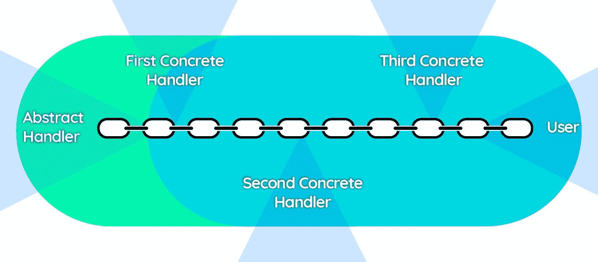
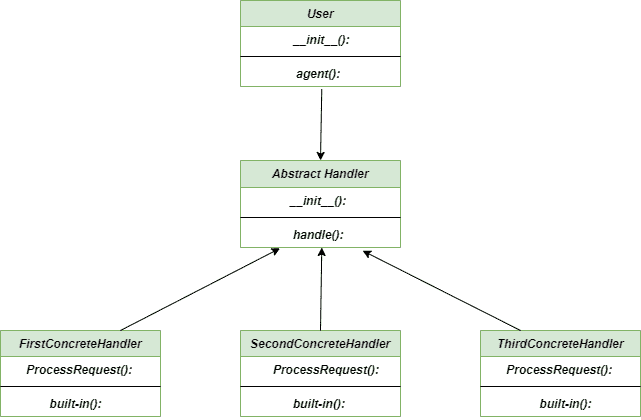

# 责任链–Python 设计模式

> 原文:[https://www . geesforgeks . org/责任链-python-设计-模式/](https://www.geeksforgeeks.org/chain-of-responsibility-python-design-patterns/)

**责任链**方法是 [**行为设计模式**](https://www.geeksforgeeks.org/design-patterns-set-1-introduction/) ，它是 **if … elif … elif … else** 的面向对象版本，使我们能够在运行时动态地重新排列条件动作块。它允许我们沿着处理程序链传递请求。处理很简单，无论何时任何处理程序收到请求，它都有两个选择，要么处理它，要么将它传递给链中的下一个处理程序。
这种模式旨在通过允许请求在链式接收器中移动直到被处理，来将请求的发送者与其接收者分离。



责任链方法

### 不使用责任链方法的问题

假设您正在构建一个简单的网站，该网站接受输入字符串并讲述字符串的各种属性，例如字符串是否是回文？字符串大写吗？字符串是小写的吗？和许多其他属性。在完成规划后，您决定对输入字符串的这些检查应该按顺序执行。因此，对于开发人员来说，问题出现了，他/她必须实现这样一个应用程序，它可以在运行时决定下一步应该执行什么操作。

### 使用责任链方法的解决方案

责任链方法为上述问题提供了解决方案。它创建了一个单独的**抽象处理程序**，用于处理应该动态执行的顺序操作。例如，我们创建了四个名为**第一个具体处理程序、第二个具体处理程序、第三个具体处理程序**和**默认处理程序**的处理程序，并从用户类中依次调用它们。

## 蟒蛇 3

```
class AbstractHandler(object):

    """Parent class of all concrete handlers"""

    def __init__(self, nxt):

        """change or increase the local variable using nxt"""

        self._nxt = nxt

    def handle(self, request):

        """It calls the processRequest through given request"""

        handled = self.processRequest(request)

        """case when it is not handled"""

        if not handled:
            self._nxt.handle(request)

    def processRequest(self, request):

        """throws a NotImplementedError"""

        raise NotImplementedError('First implement it !')

class FirstConcreteHandler(AbstractHandler):

    """Concrete Handler # 1: Child class of AbstractHandler"""

    def processRequest(self, request):

        '''return True if request is handled '''

        if 'a' < request <= 'e':
            print("This is {} handling request '{}'".format(self.__class__.__name__, request))
            return True

class SecondConcreteHandler(AbstractHandler):

    """Concrete Handler # 2: Child class of AbstractHandler"""

    def processRequest(self, request):

        '''return True if the request is handled'''

        if 'e' < request <= 'l':
            print("This is {} handling request '{}'".format(self.__class__.__name__, request))
            return True

class ThirdConcreteHandler(AbstractHandler):

    """Concrete Handler # 3: Child class of AbstractHandler"""

    def processRequest(self, request):

        '''return True if the request is handled'''

        if 'l' < request <= 'z':
            print("This is {} handling request '{}'".format(self.__class__.__name__, request))
            return True

class DefaultHandler(AbstractHandler):

    """Default Handler: child class from AbstractHandler"""

    def processRequest(self, request):

        """Gives the message that th request is not handled and returns true"""

        print("This is {} telling you that request '{}' has no handler right now.".format(self.__class__.__name__,
                                                                                          request))
        return True

class User:

    """User Class"""

    def __init__(self):

        """Provides the sequence of handles for the users"""

        initial = None

        self.handler = FirstConcreteHandler(SecondConcreteHandler(ThirdConcreteHandler(DefaultHandler(initial))))

    def agent(self, user_request):

        """Iterates over each request and sends them to specific handles"""

        for request in user_request:
            self.handler.handle(request)

"""main method"""

if __name__ == "__main__":

    """Create a client object"""
    user = User()

    """Create requests to be processed"""

    string = "GeeksforGeeks"
    requests = list(string)

    """Send the requests one by one, to handlers as per the sequence of handlers defined in the Client class"""
    user.agent(requests)
```

### 输出

```
This is DefaultHandler telling you that request 'G' has no handler right now.
This is FirstConcreteHandler handling request 'e'
This is FirstConcreteHandler handling request 'e'
This is SecondConcreteHandler handling request 'k'
This is ThirdConcreteHandler handling request 's'
This is SecondConcreteHandler handling request 'f'
This is ThirdConcreteHandler handling request 'o'
This is ThirdConcreteHandler handling request 'r'
This is DefaultHandler telling you that request 'G' has no handler right now.
This is FirstConcreteHandler handling request 'e'
This is FirstConcreteHandler handling request 'e'
This is SecondConcreteHandler handling request 'k'
This is ThirdConcreteHandler handling request 's'
```

### 类图

责任链方法类图



责任链分类图

### 优势

*   **单一责任原则:**这里调用操作的类和执行操作的类很容易解耦。
*   **开放/封闭原则:**我们可以在不破坏现有客户端代码的情况下引入新的代码类。
*   **增加灵活性:**在赋予对象职责的同时，增加了代码的灵活性。

### 不足之处

*   **未确定的请求:**这种方法不能保证对象是否会被接收。
*   **发现特征:**由于调试，观察操作的特征成为一项困难的任务。
*   **系统性能下降:**由于连续的循环调用，可能会影响系统性能

### 适应性

*   **按顺序处理几个处理程序:**当需要按特定顺序处理几个处理程序时，责任链方法非常有用，因为链接可以按任何顺序进行
*   **解耦请求:**当您想要解耦请求的发送方和接收方时，通常会使用这种方法。
*   **未指定的处理程序:**当您不想在代码中指定处理程序时，总是首选使用**责任链**。

**进一步阅读–**[**爪哇岛的责任链**](https://www.geeksforgeeks.org/chain-responsibility-design-pattern/)