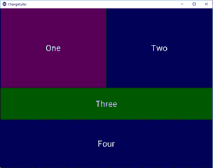

# 在 Kivy

中更改按钮颜色

> 原文:[https://www.geeksforgeeks.org/change-button-color-in-kivy/](https://www.geeksforgeeks.org/change-button-color-in-kivy/)

Kivy 是 Python 中独立于平台的 GUI 工具。因为它可以在安卓、IOS、Linux 和视窗等平台上运行。它基本上是用来开发安卓应用程序的，但并不意味着它不能在桌面应用程序上使用。

在本文中，我们将学习如何在 kivy 中更改按钮颜色。kivy python 中有一个名为 **background_color** 的属性，用来改变按钮的颜色。

> **background _ color–**background-color kivy 属性设置元素的背景颜色。它被指定为单一颜色值。
> 
> **语法:**背景 _ 颜色:1，0，0，1

**注意:**默认情况下，按钮的颜色是黑色(小灰色)如果你想改变它，那么我们使用这个属性。它只取 0 到 1 之间的值。任何其他给定的值都会导致程序的错误行为。

> 更改按钮颜色时要遵循的基本方法:
> 1)导入 kivy
> 2)导入 kivyApp
> 3)导入所有需要的
> 4)设置最低版本(可选)
> 5)添加小部件
> 6)在设置颜色时添加按钮
> 6)扩展类
> 7)返回布局
> 8)运行类的实例

> [Kivy 教程——用例子学习 Kivy。](https://www.geeksforgeeks.org/kivy-tutorial/)

下面是如何改变按钮颜色的代码:

**代码 1#**

```py
def build(self): 
        # use a (r, g, b, a) tuple 
        btn = Button(text ="Push Me !", 
        font_size ="20sp", 

                # Here you can give the color
                # The value must be between 0 to 1 
                # greyish black color
                background_color =(1, 1, 1, 1),  

                size =(32, 32), 
                size_hint =(.2, .2), 
                pos =(300, 250)) 

        return btn 
```

**代码#2**

```py
## Sample Python application demonstrating the 
## How to change button color in Kivy.
################################################### 

# import kivy module 
import kivy 

# to choose the colors randomly 
# every time you run it shows different color 
import random 

# this restricts the kivy version i.e 
# below this kivy version you cannot 
# use the app or software 
kivy.require("1.9.1") 

# base Class of your App inherits from the App class. 
# app:always refers to the instance of your application 
from kivy.app import App 

# creates the button in kivy 
# if not imported shows the error 
from kivy.uix.button import Button 

# BoxLayout arranges children in a vertical or horizontal box. 
# or help to put the children at the desired location. 
from kivy.uix.boxlayout import BoxLayout 

# declaring the colours you can use directly also 
red = [1, 0, 0, 1] 
green = [0, 1, 0, 1] 
blue = [0, 0, 1, 1] 
purple = [1, 0, 1, 1] 

# class in which we are creating the button 
class ChangeColorApp(App): 

    def build(self): 
        superBox = BoxLayout(orientation ='vertical') 

        HB = BoxLayout(orientation ='horizontal') 

        # creating the list of defined colors
        colors = [red, green, blue, purple] 

        # Changing the color of buttons
        # here you can see how you can change the color
        btn1 = Button(text ="One",
                    # Color of button is changed not default
                    background_color = random.choice(colors), 
                    font_size = 32, 
                    size_hint =(0.7, 1)) 

        btn2 = Button(text ="Two", 
                    background_color = random.choice(colors), 
                    font_size = 32, 
                    size_hint =(0.7, 1)) 

        HB.add_widget(btn1) 
        HB.add_widget(btn2) 

        VB = BoxLayout(orientation ='vertical') 

        btn3 = Button(text ="Three", 
                    background_color = random.choice(colors), 
                    font_size = 32, 
                    size_hint =(1, 10)) 

        btn4 = Button(text ="Four", 
                    background_color = random.choice(colors), 
                    font_size = 32, 
                    size_hint =(1, 15)) 

        VB.add_widget(btn3) 
        VB.add_widget(btn4) 

        superBox.add_widget(HB) 
        superBox.add_widget(VB) 

        return superBox 

# creating the object root for App class 
root = ChangeColorApp() 

# run function runs the whole program 
# i.e run() method which calls the 
# target function passed to the constructor. 
root.run() 
```

**输出:**
