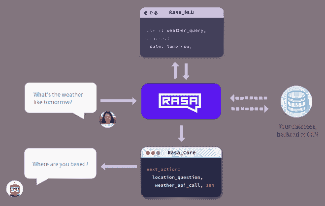
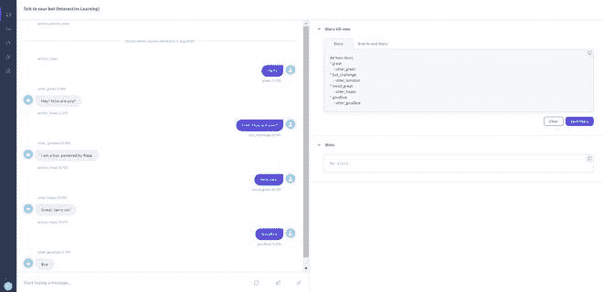
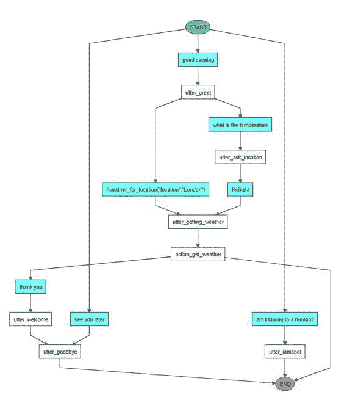

# 使用 Python 和 Rasa 的聊天机器人

> 原文:[https://www . geesforgeks . org/chat bots-using-python-and-rasa/](https://www.geeksforgeeks.org/chatbots-using-python-and-rasa/)

Rasa 是一个使用 Python 和自然语言理解构建定制 AI 聊天机器人的工具(NLU)。Rasa 为开发使用自然语言理解的人工智能聊天机器人提供了一个框架(NLU)。它还允许用户训练模型并添加自定义操作。使用 Rasa 构建的聊天机器人部署在多个平台上，如 FB messenger、微软机器人和 slack 等。

**架构:**

<center>

拉萨建筑

</center>

Rasa 有两个主要组件:

*   **Rasa NLU(自然语言理解):** Rasa NLU 是一个开源的自然语言处理工具，用于意图分类(决定用户在问什么)，以结构化数据的形式从机器人中提取实体，并帮助聊天机器人理解用户在说什么。
*   **Rasa Core** :一个带有基于机器学习的对话管理的 chatbot 框架，它采用来自 NLU 的结构化输入，并使用像 LSTM 神经网络这样的概率模型而不是 if/else 语句来预测下一个最佳动作。在引擎盖下面，它还使用强化学习来提高对下一个最佳动作的预测。

换句话说，Rasa NLU 的工作是解释用户以结构化数据的形式提供的输入，Rasa Core 的工作是决定聊天机器人执行的下一组动作。Rasa Core 和 Rasa NLU 相互独立，可以单独使用。

**如何安装 Rasa** :

*   强烈建议在安装 RASA 之前使用虚拟环境。为了创建虚拟环境，anaconda 中的命令是:

```py
conda create -n rasa
activate rasa

```

*   现在，我们将在我们的环境中安装 Rasa，我们将使用 pip install 进行安装。我们还需要在我们的环境中安装 TensorFlow(默认情况下将由 Rasa 安装)。安装 rasa 需要一些时间。

```py
pip install rasa

```

*   现在，我们将使用 rasa init 初始化机器人。这将为 chatbot 创建 stating 项目文件，并训练初始模型。

```py
rasa init

```

```py
o get started quickly, an initial project will be created.
If you need some help, check out the documentation at https://rasa.com/docs/rasa.
Now let's start! ????????

? Please enter a path where the project will be created [default: current directory] ./sample_bot
? Path './sample_bot' does not exist ????. Create path?  Yes
Created project directory at 'C:\Users\Pawan\Desktop\chatbots\sample_bot'.
Finished creating project structure.
? Do you want to train an initial model? ????????  Yes
Training an initial model...
Training Core model...
Processed Story Blocks: 100%|??????????????????????????????????????????????????????| 5/5 [00:00<?, ?it/s, # trackers=1]
Processed Story Blocks: 100%|????????????????????????????????????????????| 5/5 [00:00<00:00, 1252.55it/s, # trackers=5]
Processed Story Blocks: 100%|????????????????????????????????????????????| 5/5 [00:00<00:00, 250.35it/s, # trackers=20]
Processed Story Blocks: 100%|????????????????????????????????????????????| 5/5 [00:00<00:00, 178.79it/s, # trackers=24]
Processed trackers: 100%|????????????????????????????????????????????????| 5/5 [00:00<00:00, 1252.03it/s, # actions=16]
Processed actions: 16it [00:00, 667.56it/s, # examples=16]
Processed trackers: 100%|????????????????????????????????????????????| 231/231 [00:00<00:00, 284.86it/s, # actions=126]
Epochs:   0%|                                                                                  | 0/100 [00:00<?, ?it/s]c:\users\Pawan\anaconda3\envs\rasa\lib\site-packages\rasa\utils\tensorflow\model_data.py:386: VisibleDeprecationWarning: Creating an ndarray from ragged nested sequences (which is a list-or-tuple of lists-or-tuples-or ndarrays with different lengths or shapes) is deprecated. If you meant to do this, you must specify 'dtype=object' when creating the ndarray
  final_data[k].append(np.concatenate(np.array(v)))
Epochs: 100%|???????????????????????????????????| 100/100 [00:31<00:00,  3.15it/s, t_loss=0.202, loss=0.131, acc=1.000]
2020-07-31 22:55:59 INFO     rasa.utils.tensorflow.models  - Finished training.
2020-07-31 22:56:02 INFO     rasa.core.agent  - Persisted model to 'C:\Users\Pawan\AppData\Local\Temp\tmpk26900vo\core'
Core model training completed.
Training NLU model...
2020-07-31 22:56:03 INFO     rasa.nlu.training_data.training_data  - Training data stats:
2020-07-31 22:56:03 INFO     rasa.nlu.training_data.training_data  - Number of intent examples: 43 (7 distinct intents)
2020-07-31 22:56:03 INFO     rasa.nlu.training_data.training_data  -   Found intents: 'bot_challenge', 'mood_unhappy', 'mood_great', 'greet', 'affirm', 'goodbye', 'deny'
2020-07-31 22:56:03 INFO     rasa.nlu.training_data.training_data  - Number of response examples: 0 (0 distinct responses)
2020-07-31 22:56:03 INFO     rasa.nlu.training_data.training_data  - Number of entity examples: 0 (0 distinct entities)
2020-07-31 22:56:03 INFO     rasa.nlu.model  - Starting to train component WhitespaceTokenizer
2020-07-31 22:56:03 INFO     rasa.nlu.model  - Finished training component.
2020-07-31 22:56:03 INFO     rasa.nlu.model  - Starting to train component RegexFeaturizer
2020-07-31 22:56:03 INFO     rasa.nlu.model  - Finished training component.
2020-07-31 22:56:03 INFO     rasa.nlu.model  - Starting to train component LexicalSyntacticFeaturizer
2020-07-31 22:56:03 INFO     rasa.nlu.model  - Finished training component.
2020-07-31 22:56:03 INFO     rasa.nlu.model  - Starting to train component CountVectorsFeaturizer
2020-07-31 22:56:03 INFO     rasa.nlu.model  - Finished training component.
2020-07-31 22:56:03 INFO     rasa.nlu.model  - Starting to train component CountVectorsFeaturizer
2020-07-31 22:56:03 INFO     rasa.nlu.model  - Finished training component.
2020-07-31 22:56:03 INFO     rasa.nlu.model  - Starting to train component DIETClassifier
co get started quickly, an initial project will be created.
If you need some help, check out the documentation at https://rasa.com/docs/rasa.
Now let's start! ????????

? Please enter a path where the project will be created [default: current directory] ./sample_bot
? Path './sample_bot' does not exist ????. Create path?  Yes
Created project directory at 'C:\Users\Pawan\Desktop\chatbots\sample_bot'.
Finished creating project structure.
? Do you want to train an initial model? ????????  Yes
Training an initial model...
Training Core model...
Processed Story Blocks: 100%|??????????????????????????????????????????????????????| 5/5 [00:00<?, ?it/s, # trackers=1]
Processed Story Blocks: 100%|????????????????????????????????????????????| 5/5 [00:00<00:00, 1252.55it/s, # trackers=5]
Processed Story Blocks: 100%|????????????????????????????????????????????| 5/5 [00:00<00:00, 250.35it/s, # trackers=20]
Processed Story Blocks: 100%|????????????????????????????????????????????| 5/5 [00:00<00:00, 178.79it/s, # trackers=24]
Processed trackers: 100%|????????????????????????????????????????????????| 5/5 [00:00<00:00, 1252.03it/s, # actions=16]
Processed actions: 16it [00:00, 667.56it/s, # examples=16]
Processed trackers: 100%|????????????????????????????????????????????| 231/231 [00:00<00:00, 284.86it/s, # actions=126]
Epochs:   0%|                                                                                  | 0/100 [00:00<?, ?it/s]c:\users\Pawan\anaconda3\envs\rasa\lib\site-packages\rasa\utils\tensorflow\model_data.py:386: VisibleDeprecationWarning: Creating an ndarray from ragged nested sequences (which is a list-or-tuple of lists-or-tuples-or ndarrays with different lengths or shapes) is deprecated. If you meant to do this, you must specify 'dtype=object' when creating the ndarray
  final_data[k].append(np.concatenate(np.array(v)))
Epochs: 100%|???????????????????????????????????| 100/100 [00:31<00:00,  3.15it/s, t_loss=0.202, loss=0.131, acc=1.000]
2020-07-31 22:55:59 INFO     rasa.utils.tensorflow.models  - Finished training.
2020-07-31 22:56:02 INFO     rasa.core.agent  - Persisted model to 'C:\Users\Pawan\AppData\Local\Temp\tmpk26900vo\core'
Core model training completed.
Training NLU model...
2020-07-31 22:56:03 INFO     rasa.nlu.training_data.training_data  - Training data stats:
2020-07-31 22:56:03 INFO     rasa.nlu.training_data.training_data  - Number of intent examples: 43 (7 distinct intents)
2020-07-31 22:56:03 INFO     rasa.nlu.training_data.training_data  -   Found intents: 'bot_challenge', 'mood_unhappy', 'mood_great', 'greet', 'affirm', 'goodbye', 'deny'
2020-07-31 22:56:03 INFO     rasa.nlu.training_data.training_data  - Number of response examples: 0 (0 distinct responses)
2020-07-31 22:56:03 INFO     rasa.nlu.training_data.training_data  - Number of entity examples: 0 (0 distinct entities)
2020-07-31 22:56:03 INFO     rasa.nlu.model  - Starting to train component WhitespaceTokenizer
2020-07-31 22:56:03 INFO     rasa.nlu.model  - Finished training component.
2020-07-31 22:56:03 INFO     rasa.nlu.model  - Starting to train component RegexFeaturizer
2020-07-31 22:56:03 INFO     rasa.nlu.model  - Finished training component.
2020-07-31 22:56:03 INFO     rasa.nlu.model  - Starting to train component LexicalSyntacticFeaturizer
2020-07-31 22:56:03 INFO     rasa.nlu.model  - Finished training component.
2020-07-31 22:56:03 INFO     rasa.nlu.model  - Starting to train component CountVectorsFeaturizer
2020-07-31 22:56:03 INFO     rasa.nlu.model  - Finished training component.
2020-07-31 22:56:03 INFO     rasa.nlu.model  - Starting to train component CountVectorsFeaturizer
2020-07-31 22:56:03 INFO     rasa.nlu.model  - Finished training component.
2020-07-31 22:56:03 INFO     rasa.nlu.model  - Starting to train component DIETClassifier
....

```

**入门:**

上面的命令将在目录 sample_bot 中创建初始项目文件。让我们看看这些文件:


*   **__init__。py:** 一个空文件，帮助 python 定位你的动作。
*   这个文件用于创建自定义操作。如果您想调用外部服务器或获取外部应用编程接口数据，您可以在这里定义您的操作。
*   **config.yml** :该文件定义了 NLU 和核心模型的配置。如果您使用 NLU 模型之外的任何模型，您必须在此定义管道。
*   **credentials.yml** :该文件用于存储连接 Facebook Messenger、Slack 等外部服务的凭据
*   **data/nlu.md** :在这个文件中，我们定义了我们的意图(用户可以要求机器人做什么？).这些意图然后被用于训练 NLU 模型。
*   **data/stories.md** : Stories 是用户和机器人之间以意图、响应和动作的形式进行的示例对话。Rasa 故事是一种培训数据形式，用于培训 Rasa 的对话管理模型。
*   **domain.yml** :这个文件列出了不同的意图(你期望从用户那里得到的东西)以及机器人的响应和它可以执行的动作。
*   **endpoints.yml** :定义了连接 Slack、FB messenger 等通道的细节。用于将聊天数据存储在 Redis 等在线数据库中。
*   **模型/ <时间戳> .tar.gz** :初始模型，所有训练好的模型都存储在 models 文件夹中。为了重新训练模型，我们使用 *rasa train* 命令。

为了启动本地环境，我们使用 *rasa x* 命令。它始于某件事

```py
Starting Rasa X in local mode... ????
wow
wow

The server is running at http://localhost:5002/login?username=me&password=s23dafd5436d

2020-08-01 00:27:24 WARNING  sanic.root  - Sanic tried to use loop.add_signal_handler but it is not implemented on this platform.
2020-08-01 00:27:24 WARNING  sanic.root  - Sanic tried to use loop.add_signal_handler but it is not implemented on this platform.

```

*   现在，导航到 rasa 服务器提供的地址，我们将看到浏览器窗口，其中打开了一个聊天窗口，我们可以使用它与助手聊天。



**在 Rasa 创建天气机器人:**

*   在本教程中，我们将创建一个机器人，它可以告诉我们任何城市的天气，我们还将在本教程中使用开放天气应用编程接口。
*   我们将首先使用以下命令初始化项目:

```py
rasa init --no-prompt

```

*   这将创建我们上面看到的初始项目结构。对于这个项目，我们只需要对以下文件进行更改:
    *   data/nlu.md
    *   data/stories.md
    *   域. yml
    *   端点. yml
    *   actions.py
*   让我们保留的所有文件保持不变。
*   首先，我们将定义故事(注意:故事是我们用来训练模型的示例对话)。这些故事是以减价语言的形式来定义的。我们删除了一些预先定义的故事，并用那些与我们的机器人相关的对话来代替它们。

```py
## say goodbye
* goodbye
  - utter_goodbye

## bot challenge
* bot_challenge
  - utter_iamabot

## weather long
* greet
  - utter_greet
* weather
  - utter_ask_location
* city_info
  - utter_getting_weather
  - action_get_weather
* thanks
  - utter_welcome
  - utter_goodbye

## weather short
* greet
  - utter_greet
* weather_for_location
  - utter_getting_weather
  - action_get_weather
* thanks
  - utter_welcome
  - utter_goodbye

## New Story

* greet
    - utter_greet
* weather_for_location{"location":"London"}
    - utter_getting_weather
    - action_get_weather

```

*   Rasa nlu.md 包含意图列表及其可能的示例文本。此外，在这个示例中，我们将分别映射我们的实体。这些意图被用来训练我们的 NLU 模型。

```py
## intent:greet
- hey
- hello
- hi
- good morning
- good evening
- hey there

## intent:goodbye
- bye
- goodbye
- see you around
- see you later

## intent:bot_challenge
- are you a bot?
- are you a human?
- am I talking to a bot?
- am I talking to a human?

## intent:weather
- what's the weather
- what is the temperature today
- what is the temperature
- i want to know the temperature
- i want to know the weather of today
- tell me the weather forecast
- hows the weather today

## intent:weather_for_location
- what is the weather in [Noida](location)
- what is the weather in [New Delhi](location)
- weather of [Mumbai] (location)
- Today's weather in [Bangalore](location)
- [Kolkata](location) weather
- Tell me weather of [Hyderabad](location)
- Can you tell me weather of [London](location)

## intent:city_info
- [New Delhi](location)
- [India](location)
- [Mumbai](location)
- [Noida](location)
- [Kolkata](location)
- [Bangalore](location)
- [London](location)

##intent: thanks
- thanks
- thank you
- OK

```

*   domain.yml 文件列出了所有意图、机器人的响应及其文本，以及机器人可以执行的操作。请注意，我们定义的任何行动或响应(在 nlu.md/故事. md)都必须在 domain.yml 中列出

```py
session_config:
  session_expiration_time: 60
  carry_over_slots_to_new_session: true

intents:
- greet
- goodbye
- bot_challenge
- weather
- weather_for_location
- city_info
- thanks
entities:
- location
slots:
  location:
    type: text
responses:
  utter_greet:
  - text: Hey! 
  utter_goodbye:
  - text: Bye
  - text: Good Bye
  utter_ask_location:
  - text: of where?
  - text: In what city?
  utter_getting_weather:
  - text: Ok, getting weather of [location] ...
  utter_welcome:
  - text: Welcome
  utter_iamabot:
  - text: I am a bot, powered by Rasa.
actions:
- action_get_weather

```

*   现在，我们在 actions.py 文件中定义了“action_get_weather”函数。该函数从实体中获取城市名称，并借助 OpenWeatherMap API 获取城市的天气。

```py
from typing import Any, Text, Dict, List

from rasa_sdk import Action, Tracker
from rasa_sdk.events import SlotSet
from rasa_sdk.executor import CollectingDispatcher
import requests

class ActionCheckWeather(Action):

    def name(self)-> Text:
        return "action_get_weather"

    def run(self, dispatcher, tracker, domain):
        api_key = 'Your API Key'
        loc = tracker.get_slot('location')
        current = requests.get('http://api.openweathermap.org/data/2.5/weather?q={}&appid={}'.format(loc, api_key)).json()
        print(current)
        country = current['sys']['country']
        city = current['name']
        condition = current['weather'][0]['main'    ]
        temperature_c = current['main']['temp']
        humidity = current['main']['humidity']
        wind_mph = current['wind']['speed']
        response = """It is currently {} in {} at the moment. The temperature is {} degrees, the humidity is {}% and the wind speed is {} mph.""".format(condition, city, temperature_c, humidity, wind_mph)
        dispatcher.utter_message(response)
        return [SlotSet('location', loc)]

```

*   现在，我们使用 ***rasa train*** 命令训练我们的模型。这将训练我们的 NLU 模型。
*   为了检查我们的模型是否正常工作，我们使用以下命令:

```py
rasa shell nlu

```

```py
NLU model loaded. Type a message and press enter to parse it.
Next message:
weather in Noida
{
  "intent": {
    "name": "weather_for_location",
    "confidence": 0.9999433755874634
  },
  "entities": [
    {
      "entity": "location",
      "start": 11,
      "end": 16,
      "value": "Noida",
      "extractor": "DIETClassifier"
    }
  ],
  "intent_ranking": [
    {
      "name": "weather_for_location",
      "confidence": 0.9999433755874634
    },
    {
      "name": "city_info",
      "confidence": 5.397644417826086e-05
    },
    {
      "name": "greet",
      "confidence": 1.0934791134786792e-06
    },
    {
      "name": "goodbye",
      "confidence": 1.0303868975825026e-06
    },
    {
      "name": "thanks",
      "confidence": 2.715441951295361e-07
    },
    {
      "name": "weather",
      "confidence": 2.5835913675109623e-07
    },
    {
      "name": "bot_challenge",
      "confidence": 4.761825422860966e-08
    }
  ],
  "response_selector": {
    "default": {
      "response": {
        "name": null,
        "confidence": 0.0
      },
      "ranking": [],
      "full_retrieval_intent": null
    }
  },
  "text": "weather in Noida"
}
Next message:
delhi weather
{
  "intent": {
    "name": "weather_for_location",
    "confidence": 0.9984486103057861
  },
  "entities": [
    {
      "entity": "location",
      "start": 0,
      "end": 5,
      "value": "delhi",
      "extractor": "DIETClassifier"
    }
  ],
  "intent_ranking": [
    {
      "name": "weather_for_location",
      "confidence": 0.9984486103057861
    },
    {
      "name": "weather",
      "confidence": 0.0012639579363167286
    },
    {
      "name": "thanks",
      "confidence": 9.82139608822763e-05
    },
    {
      "name": "goodbye",
      "confidence": 8.915668877307326e-05
    },
    {
      "name": "greet",
      "confidence": 6.841398135293275e-05
    },
    {
      "name": "city_info",
      "confidence": 2.7903372028958984e-05
    },
    {
      "name": "bot_challenge",
      "confidence": 3.7094062008691253e-06
    }
  ],
  "response_selector": {
    "default": {
      "response": {
        "name": null,
        "confidence": 0.0
      },
      "ranking": [],
      "full_retrieval_intent": null
    }
  },
  "text": "delhi weather"
}
Next message:
whats the weather
{
  "intent": {
    "name": "weather",
    "confidence": 0.9636867642402649
  },
  "entities": [],
  "intent_ranking": [
    {
      "name": "weather",
      "confidence": 0.9636867642402649
    },
    {
      "name": "weather_for_location",
      "confidence": 0.03303918614983559
    },
    {
      "name": "thanks",
      "confidence": 0.0017935443902388215
    },
    {
      "name": "goodbye",
      "confidence": 0.0011113830842077732
    },
    {
      "name": "bot_challenge",
      "confidence": 0.00020741281332448125
    },
    {
      "name": "greet",
      "confidence": 0.0001540367811685428
    },
    {
      "name": "city_info",
      "confidence": 7.643929166079033e-06
    }
  ],
  "response_selector": {
    "default": {
      "response": {
        "name": null,
        "confidence": 0.0
      },
      "ranking": [],
      "full_retrieval_intent": null
    }
  },
  "text": "whats the weather"
}

```

*   正如我们所注意到的，上面训练的 NLU 模型以高精度正确地分类了意图。现在，转到 *endpoints.yml* 文件，添加或取消注释以下行:

```py
action_endpoint:
  url: "http://localhost:5055/webhook"
```

*   现在打开两个命令提示符窗口，在一个窗口中使用以下命令运行操作:

```py
rasa run actions
```

在另一个窗口中，使用以下命令运行 rasa shell:

```py
rasa shell
```

<center>
</center>

*   我们还可以可视化机器人对话的序列图:

```py
rasa visualize
```

<center></center>

**参考文献:**

*   [Rasa 文档](https://rasa.com/docs/rasa/user-guide/rasa-tutorial/)