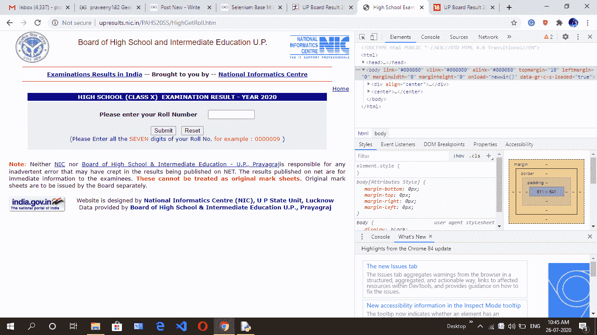
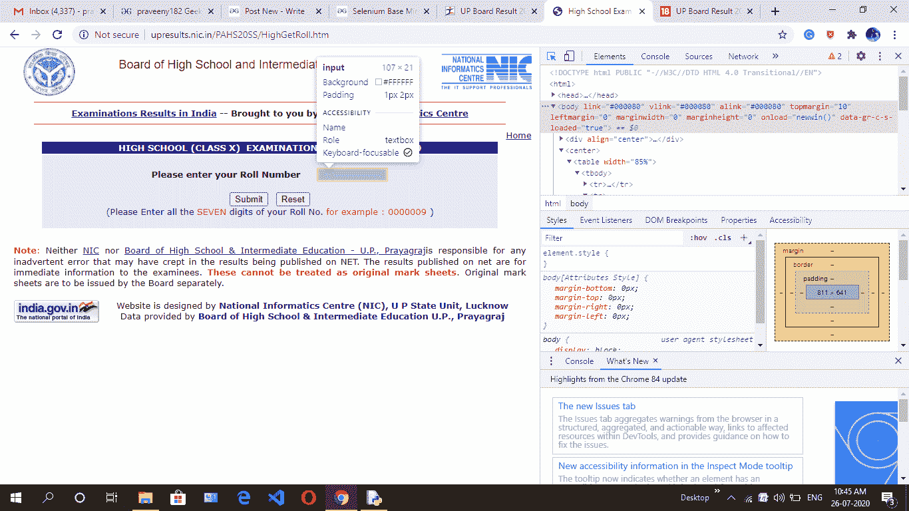
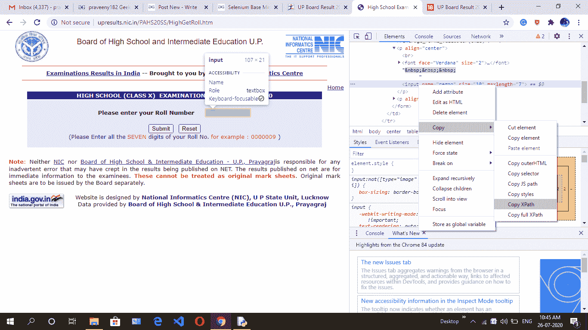
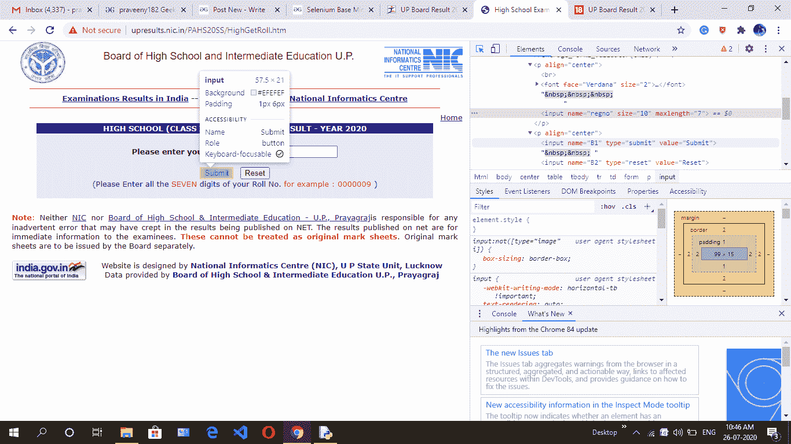
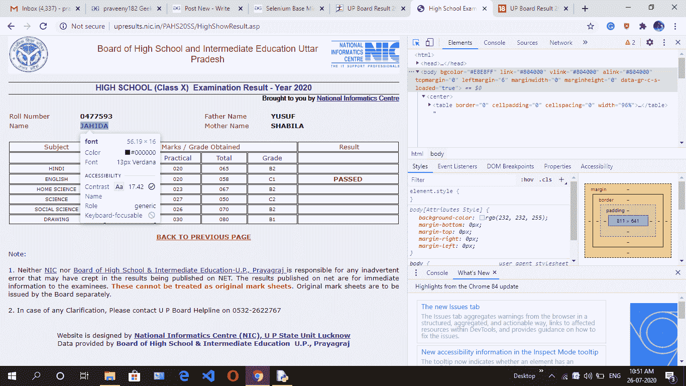
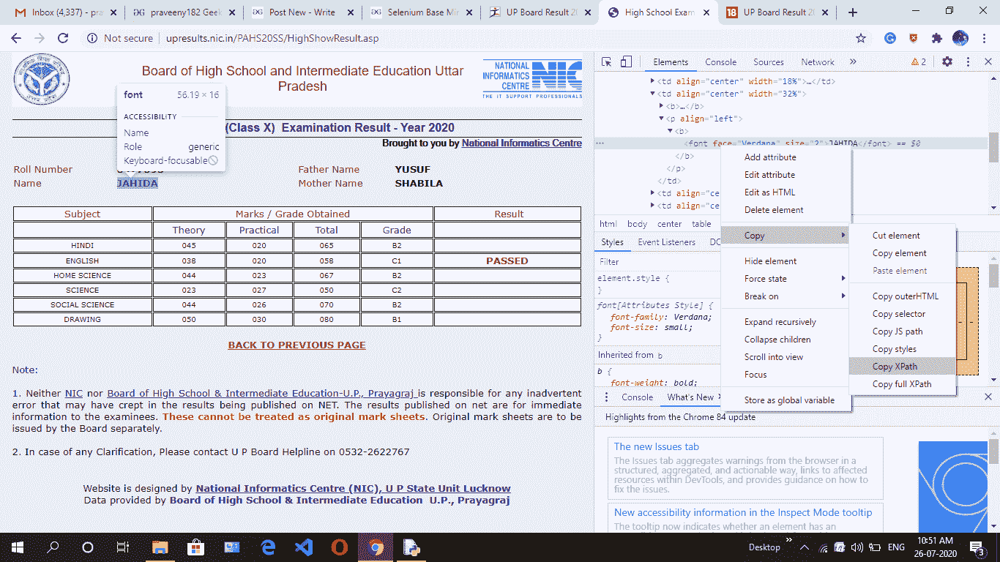
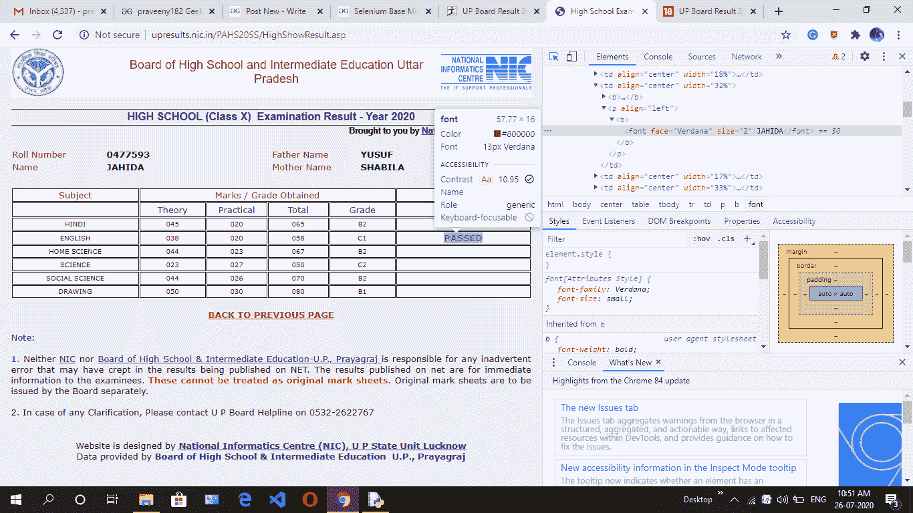
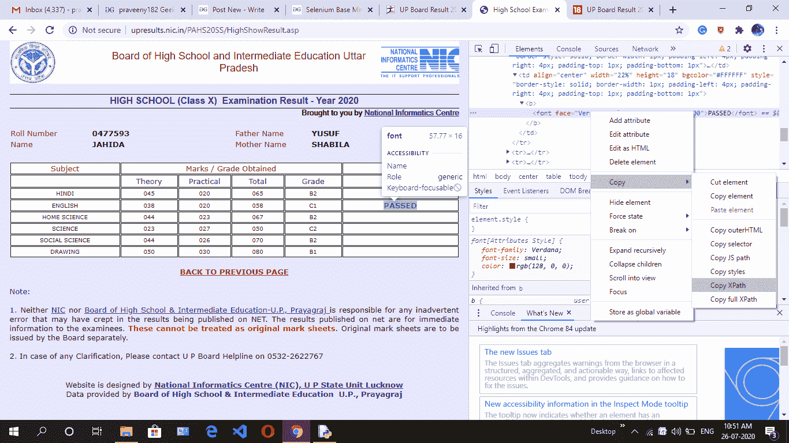

# 用 Python 中的硒查看高中成绩

> 原文:[https://www . geesforgeks . org/check-high-school-result-use-selenium-in-python/](https://www.geeksforgeeks.org/check-high-school-result-using-selenium-in-python/)

我们要用硒来学习检查高中成绩状态是及格还是不及格。这对学校来说非常有用，因为当他们检查有多少学生及格-不及格，一个不及格的学生叫什么名字时。如果学生人数是 10 人并且少于 10 人，那么很容易通过手动检查，如果学生人数是 400 到 1000 人，那么通过手动检查状态是非常困难和耗时的过程，那么我们正在做聪明的工作来检查结果。使用硒检查结果并存储在 CSV 文件中。

我们要用硒检查高中成绩的状况。这可能对学校当局非常有帮助，帮助他们根据及格和不及格的情况组织数据。他们可以得到及格和不及格学生的人数，后面跟着他们的名字。只有当学生人数较少时，如 10 或 20 人左右，才最好手动检查状态。但是对于众多的学生来说，进行手工检查并不可取，也不方便，因为这需要更多的时间和工作。

在这里，我们想出了一个解决方案，通过自动化这个过程使用硒。我们可以对结果状态进行智能检查，并将数据存储在 CSV 文件中

**要求:**

你需要安装 chrome 驱动程序并设置路径。[点击此处](https://sites.google.com/a/chromium.org/chromedriver/downloads)下载。更多信息请点击[链接](https://www.geeksforgeeks.org/how-to-install-selenium-in-python/)。

**下面是** **步骤:**

1.  先去高中网站跟着这个[链接](http://upresults.nic.in/PAHS20SS/HighGetRoll.htm)(这是为了升板高中成绩)。
2.  然后通过紧急 ctrl + shift + i 或进入浏览器设置并手动点击调查细节来点击调查元素。
3.  然后导航到填充辊号的框，然后复制 x_path。
4.  然后导航提交按钮，然后复制 x_path。
5.  我想将结果存储在 CSV 文件中，然后浏览学生姓名和状态。然后通过脚本自动填充卷号，转到下一页，找到名称和状态的 x_path。

**借助截图按部就班，复制元素的 x_path 放入代码:**

**第一步:**



**第二步:**



**第三步:**



**第四步:**



**第五步:**


**第六步:**



**第七步:**



**第八步:**



**第九步:**



下面是实现:

## 蟒蛇 3

```py
# import required libraries
from selenium import webdriver
from selenium.webdriver.common.keys import Keys
from selenium.webdriver.support.ui import Select
from selenium.common.exceptions import NoSuchElementException
import csv 
import time

# give name of csv file
filename = "result.csv"

# open file in write mode
f = open(filename, 'w')

# create header
header = "name,status\n"

# write into the file
f.write(header)

# put rollnumber without zero like
# your number 0477593 then
# put 477593 upto XXXXX.
start_roll_no = 477593
end_roll_no = 477599

for i in range(start_roll_no, end_roll_no + 1):

    # exception handling
    try:
        # create instance of Chrome webdriver
        driver = webdriver.Chrome()

        # paste the link upboard website
        driver.get("http://upresults.nic.in/PAHS20SS/HighGetRoll.htm")

        # roll number start with zero then change into string
        tv= '0'+str(i)

        # find the element where we have to
        # enter the xpath target rollnumber box 
        # and put rollnumber value who store in t. 
        driver.find_element_by_xpath("/html/body/center/table/tbody/tr[2]/td/form/p[1]/input").send_keys(t)

        # paste the xpath of submit button 
        driver.find_element_by_xpath("/html/body/center/table/tbody/tr[2]/td/form/p[2]/input[1]").click()

        # name of student's x_path copy and get text of element
        name=driver.find_element_by_xpath('/html/body/center/table[2]/tbody/tr[2]/td[2]/p/b/font').text

        # result of student's x_path copy and get text of element
        status=driver.find_element_by_xpath('/html/body/center/table[3]/tbody/tr[5]/td[6]/b/font').text

        # write in the file
        f.write(name + "," + status + "\n")

        # close the web driver
        driver.close()

    # using exception when rollnumber is wrong and
    # not show result on this roll number
    except NoSuchElementException as exception:
        continue

# close and save the file
f.close()
```

**输出:**

