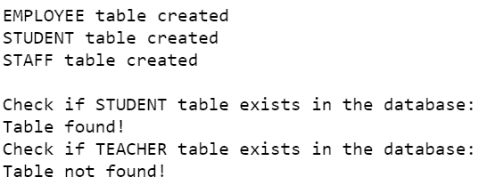

# 使用 Python 检查 SQLite 中是否存在表

> 原文:[https://www . geesforgeks . org/check-if-table-exists-in-SQLite-use-python/](https://www.geeksforgeeks.org/check-if-table-exists-in-sqlite-using-python/)

在本文中，我们将讨论如何使用 Python 的 **sqlite3** 模块检查 SQLite 数据库中是否存在表。

在 SQLite 数据库中，所有表的名称都登记在 sqlite_master 表中。因此，为了检查一个表是否存在，我们需要检查特定表的名称是否在 sqlite_master 表中。

为了执行这个任务，执行下面的查询并将其存储在一个变量中。

> 从 sqlite_master 中选择表名，其中类型=“表”和表名=“学生”；

然后对该变量使用 **fetchall()** 方法来生成包含找到的名称的表列表。如果列表为空，则数据库中不存在该表。

**示例:**首先，让我们连接到 g4gdata.db SQLite 数据库，然后创建一个游标对象。现在使用游标对象，我们执行一些查询来创建多个表:EMPLOYEE、STUDENT、STAFF。然后我们检查 STUDENT 和 TEACHER 表是否存在于 g4gdata.db 数据库中。

## 蟒蛇 3

```
# import required module
import sqlite3

# connect to database
con = sqlite3.connect('g4gdata.db')

# create cursor object
cur = con.cursor()

# create tables
cur.execute(
  """CREATE TABLE EMPLOYEE(FIRST_NAME VARCHAR(255),
  LAST_NAME VARCHAR(255),AGE int, SEX CHAR(1), INCOME int);""")
print('EMPLOYEE table created')

cur.execute(
  """CREATE TABLE STUDENT(NAME VARCHAR(255),AGE int, SEX CHAR(1));""")
print('STUDENT table created')

cur.execute(
  """CREATE TABLE STAFF(NAME VARCHAR(255), INCOME int);""")
print('STAFF table created')
print()

# check if table exists
print('Check if STUDENT table exists in the database:')
listOfTables = cur.execute(
  """SELECT tableName FROM sqlite_master WHERE type='table'
  AND tableName='STUDENT'; """).fetchall()

if listOfTables == []:
    print('Table not found!')
else:
    print('Table found!')

# check if table exists
print('Check if TEACHER table exists in the database:')
listOfTables = cur.execute(
  """SELECT name FROM sqlite_master WHERE type='table'
  AND name='TEACHER'; """).fetchall()

if listOfTables == []:
    print('Table not found!')
else:
    print('Table found!')

# commit changes
con.commit()

# terminate the connection
con.close()
```

**输出:**

