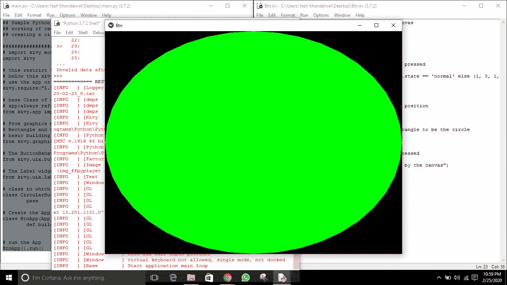
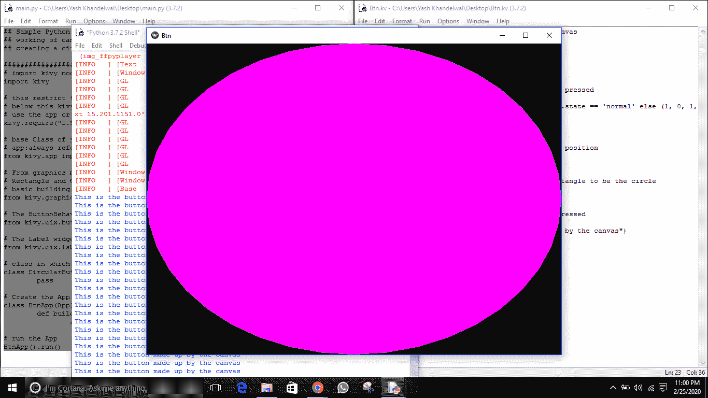

# 圆形(类似椭圆形)按钮使用画布中的 kivy(使用。kv 档)

> 原文:[https://www . geesforgeks . org/circular-oval-like-button-use-canvas-in-kivy-use-kv-file/](https://www.geeksforgeeks.org/circular-oval-like-button-using-canvas-in-kivy-using-kv-file/)

Kivy 是 Python 中独立于平台的 GUI 工具。因为它可以在安卓、IOS、linux 和 Windows 等平台上运行。它基本上是用来开发安卓应用程序的，但并不意味着它不能在桌面应用程序上使用。

在这篇文章中，我们将学习如何使用 canvas 在 kivy 中创建圆形或圆形按钮。你必须对画布、按钮和它们的属性有一个非常清晰的概念，才能学习如何制作这样的按钮。正如我们所知，画布是小部件用来绘图的根对象。默认情况下，Kivy 中的每个小部件都已经有一个画布。创建小部件时，可以创建绘图所需的所有说明。

**要使用画布，您必须导入文件中的图形。**

```py
from kivy.graphics import Rectangle, Color
```

> **本文中使用的一些重要属性–**
> 
> **边框:**
> 1)边框用于边框图形指令。与 background_normal 和 background_down 一起使用。可用于自定义背景。
> 2)必须是四个值的列表:(下、右、上、左)。
> 3)边框为列表属性，默认为(16，16，16，16)
> 
> **按钮行为:**
> 1)按钮行为混合类提供按钮行为。
> 2)您可以将该类与其他小部件(如图像)相结合，以提供保留 Kivy 按钮行为的替代按钮。

```py
Basic Approach -
-> import kivy
-> import kivy App
-> import widget
-> import Canvas i.e.:
      from kivy.graphics import Rectangle, Color
-> set minimum version(optional)
-> Extend the Widget class
-> Create the App Class
-> create the .kv file:
    -> create the button using the canvas
    -> Use border property to give them a circular shape.
    -> Add action/callback if needeed
-> return a Widget
-> Run an instance of the class
```

> [Kivy 教程–通过示例学习 Kivy](https://www.geeksforgeeks.org/kivy-tutorial/)

**实施方法**

**main.py**

```py
## Sample Python application demonstrating the 
## working of canvas with buttonbehaviour i.e
## creating a circular button in Kivy using .kv file 

################################################### 
# import kivy module 
import kivy 

# this restrict the kivy version i.e 
# below this kivy version you cannot 
# use the app or software 
kivy.require("1.9.1") 

# base Class of your App inherits from the App class. 
# app:always refers to the instance of your application 
from kivy.app import App 

# From graphics module we are importing 
# Rectangle and Color as they are 
# basic building of canvas. 
from kivy.graphics import Rectangle, Color 

# The ButtonBehavior mixin class provides Button behavior. 
from kivy.uix.button import ButtonBehavior 

# The Label widget is for rendering text. 
from kivy.uix.label import Label 

# class in which we are creating the canvas 
class CircularButton(ButtonBehavior, Label): 
    pass

# Create the App Class 
class BtnApp(App): 
    def build(self): 
        return CircularButton() 

# run the App 
BtnApp().run() 
```

**。kv 文件**

```py
# .kv file of creating a circular button using canvas

<CircularButton>: 

    # Creating Circular button 
    canvas: 

        # Color is different if button is pressed
        Color: 
            rgb: (0, 1, 0, 1) if self.state == 'normal' else (1, 0, 1, 1) 

        # Rounded rectangle canvas 
        RoundedRectangle:

                        # Giving the size and the position 
            size: (self.size) 
            pos: (self.pos) 

            # This will force the rectangle to be the circle 
            radius: [400, ]

    # Print the text when touched or button pressed     
    on_release: 
        print("This is the button made up by the canvas") 
```

**输出:**




**注意:**小部件仍然是矩形。这意味着，即使你点击圆角，按钮仍然接收事件。