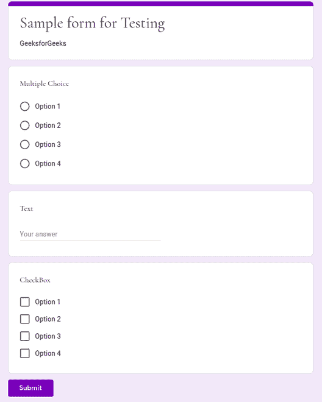

# 在 Python 和 BrowserStack 中使用 Selenium 的基于云的自动化

> 原文:[https://www . geesforgeks . org/基于云的自动化-使用 python 中的硒-和-browserstack/](https://www.geeksforgeeks.org/cloud-based-automation-using-selenium-in-python-and-browserstack/)

**Selenium** 是一个支持 web 浏览器自动化的库。它最常用于测试 web 应用程序。硒的核心是*硒网络驱动程序*。*网络驱动*使用浏览器自动化 API 来控制浏览器和运行测试。这意味着浏览器的工作方式与真实用户使用时的方式相同。您可以使用这些功能在线自动处理大部分无聊的事情，例如，在 *LinkedIn* 和 *AngelList* 上申请多个工作。

本文是关于使用 Selenium (Python)来自动化表单填充过程，即多次填充表单。之后，我们通过使用 **BrowserStack** 将这个自动化过程带到云中，从而将事情更上一层楼。**浏览器追踪**是一个云网络和移动测试平台，允许开发人员根据他们的测试需求按需访问浏览器。

基于云的自动化和测试有几个好处。它提供了更好的协作、更快、更经济的测试、无限的可用性以及一些主要优势，如定制化、并行化和对敏捷工作流的支持。

在本文中，我们将使用一个示例谷歌[表单。](https://forms.gle/TPEZU34eVapj7CmGA)

第一步也是最明显的一步是在您的系统上安装 Selenium，方法是在您的终端中使用以下命令:

```py
sudo pip3 install selenium

```

下一步是创建一个浏览器跟踪账户(如果你已经有了，那就太好了)。通过 [Github 学生开发者包](https://education.github.com/pack)，BrowserStack 的 1 个平行和 1 个用户 1 年自动移动计划对学生免费。

然后，您需要前往 BrowserStack 网站上的[页面](https://www.browserstack.com/automate/python)。在这里，您可以选择自己喜欢的浏览器和操作系统组合。选择首选项后，您需要创建一个新的。代码编辑器中的 py 文件。假设，您希望在 Mac OS X 卡特琳娜上的 *Chrome 84 浏览器上执行我的测试。所以你应该在你的。py 文件:*

```py
from selenium import webdriver
from selenium.webdriver.common.keys import Keys
from selenium.webdriver.common.desired_capabilities import DesiredCapabilities
import time

desired_cap = {
 'browser': 'Chrome',
 'browser_version': '84.0 beta',
 'os': 'OS X',
 'os_version': 'Catalina',
 'resolution': '1024x768',
 'name': 'Bstack-[Python] Sample Test'
}

driver = webdriver.Remote(
    command_executor ='Your unique BrowserStack Access Key link',
    desired_capabilities = desired_cap)
```

代码的前四行指定导入的库。时间库将在项目后期使用。所需的 cap 字典指定了要使用的操作系统和浏览器的规格。下一个语句( *webdriver。Remote()* )将程序连接到浏览器的系统。当您选择浏览器和操作系统首选项时，将传递到*命令执行器*参数的唯一字符串可以在此[页面](https://www.browserstack.com/automate/python)中找到。访问键对于每个浏览器确认用户是唯一的，链接也是唯一的。

之后，您需要将以下 python 代码添加到。py 文件。

```py
driver.get('https://forms.gle/zX5NEumdXW4Z7SrC6')
```

*driver.get()* 语句将打开浏览器中提供的链接。表格截图附后。



本文使用的示例表单。

现在，您的下一步是为每个问题/字段选择正确的选项。有几种方法可以做到这一点，但是假设您使用 XPath 来选择您想要的选项。为此，您需要将鼠标悬停在您选择的选项上，并在单选按钮/复选框上按鼠标右键。然后你需要选择*检查*选项。当您右键单击右侧新窗格中突出显示的元素时，您将能够复制 XPath，如下图所示。


正在复制 XPath

这适用于多选、文本和复选框字段。现在您可以将 XPath 粘贴到。py 文件的格式如下所示。您还需要*提交*按钮和*提交另一个响应*(重新提交)按钮的 XPath。重新提交按钮使自动化更加容易。

```py
radioOption3 ='//*[@id ="mG61Hd"]/div[2]/div / div[2]/div[1]/div / div / div[2]/div[1]/div / span / div / div[3]/label / div / div[1]/div / div[3]'
checkBox2 = '//*[@id ="mG61Hd"]/div[2]/div/div[2]/div[3]/div/div/div[2]/div[1]/div[2]/label/div/div[1]/div[2]'
checkBox3 = '//*[@id ="mG61Hd"]/div[2]/div/div[2]/div[3]/div/div/div[2]/div[1]/div[3]/label/div/div[1]/div[2]'
text = '//*[@id ="mG61Hd"]/div[2]/div/div[2]/div[2]/div/div/div[2]/div/div[1]/div/div[1]/input'
submit = '//*[@id ="mG61Hd"]/div[2]/div/div[3]/div[1]/div/div/span/span'

resubmit = '/html / body / div[1]/div[2]/div[1]/div / div[4]/a'
```

现在，剩下最后一步，实现自动化的循环。假设你想把表格填 100 遍。所以你运行一个*而*循环 100 次，每次递增变量 *i* 。在*而*循环中，您使用 *find_element_by_xpath* 和 *click()* 属性来实现您的功能，对于文本字段， *send_keys* 方法完成任务。 *time.sleep(1)* 在提交表单后等待 1 秒钟，以避免任何不必要的错误。以下代码使用*尝试*和*，除了*出于相同的目的(作为预防措施)。如果没有错误，该工具将继续在同一窗口中提交另一个响应。如果产生错误，它将关闭该窗口，并开始一个新的窗口。结尾的 *driver.quit()* 语句停止/完成自动化过程。

```py
i = 0
while i<100:
    driver.find_element_by_xpath(radioOption3).click()
    driver.find_element_by_xpath(checkBox2).click()
    driver.find_element_by_xpath(checkBox3).click()
    text_box = driver.find_element_by_xpath(text)
    text_box.send_keys("The text I need")
    driver.find_element_by_xpath(submit).click()
    i = i + 1
    time.sleep(1)
    try:
        driver.find_element_by_xpath(resubmit).click()
    except:
        driver.close()
        driver = webdriver.Remote(command_executor ='Your unique BrowserStack link', desired_capabilities = desired_cap)
        driver.get('https://forms.gle / xX5NEumdXW4Z7SrC6')
driver.quit()
```

现在你所需要做的就是转到你的终端，使用下面的命令运行程序。

```py
python3 filename.py

```

现在，您可以移动到您的浏览器跟踪仪表板，并看到您的程序填写表单 100 次。

硒是一种强大的工具，可以用于各种目的。代码易于实现，并且使测试和自动化变得更加容易。BrowserStack 提供了一个易于使用的强大界面，这使得基于云的测试变得更加容易。