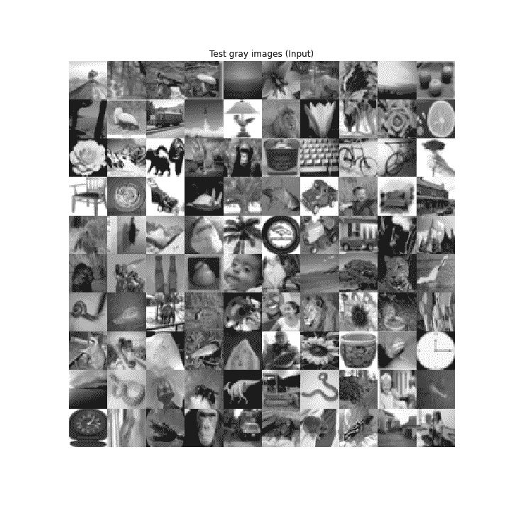
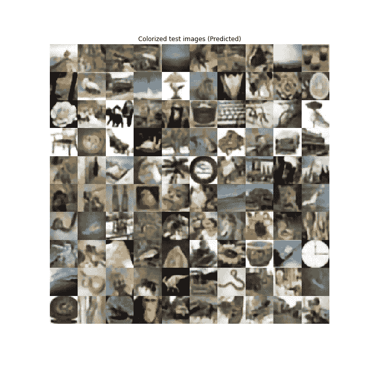

# 使用 Keras 的彩色化自动编码器

> 原文:[https://www . geesforgeks . org/colonization-auto encoders-using-keras/](https://www.geeksforgeeks.org/colorization-autoencoders-using-keras/)

本文给出了**自动编码器**的一个实际用例，即 ***灰度图像的彩色化*** 。我们将使用 [Keras](https://keras.io/) 对自动编码器进行编码。

众所周知，自动编码器有两个主要操作符:

> **编码器**这将输入转换为低维潜在向量。因为它降低了维度，所以它被迫学习输入的最重要的特征。
> **解码器:**这试图从潜在向量中尽可能多地重建输入。

在自动编码器的设计过程中，正确选择潜在尺寸至关重要。好像是
大于输入维度，Autoencoder 倾向于记忆输入。我们将使用 CNNs 实现编码器部分，并将使用 CNNs 转置用于自动编码器的解码器部分。

To keep things simple, we are going to use **CIFAR100 dataset**, which is readily available in [Keras datasets](https://keras.io/datasets/)The dataset contains **50k colour** images of shape **32 * 32 * 3** for training, and **10k colour** images of the same shape for testing purpose.**Code: Import all the libraries**

```py
import numpy as np
import matplotlib.pyplot as plt
import os

from keras.layers import Dense, Input, Conv2D, Conv2DTranspose, Flatten, Reshape
from keras.models import Model
from keras.callbacks import ReduceLROnPlateau, ModelCheckpoint
from keras.datasets import cifar100
from keras import backend as K
```

由于数据集只包含彩色图像，因此出于我们任务的目的，我们需要将其更改为灰度。因此，我们为此定义了一个函数。
**代码:将 RGB 图像转换为灰度的功能**

```py
def rgb_2_gray(image):
    return np.dot(image[..., :3], [0.299, 0.587, 0.114])
```

**代码:加载数据集**

```py
(x_train, _), (x_test, _) = cifar100.load_data()
```

为了让模型高效地学习，最好将图像转换为 float。我们还需要标准化这些值，使它们位于 **0 和 1** 之间。这样做是为了在反向传播期间，梯度不会失控。

**编码:数据归一化**

```py
x_train = x_train.astype('float32') / 255.
x_test = x_test.astype('float32') / 255.

x_train_gray = x_train_gray.astype('float32') / 255.
x_test_gray = x_test_gray.astype('float32') / 255.
```

深度学习模型的性能在很大程度上依赖于超参数集(包括层数、每层过滤器的数量、批次大小等)。).因此，选择好超参数是一项基本技能。为了获得最好的结果，我们需要尝试一套不同的方法。在这里，我们使用这些超参数集，
**代码:超参数**

```py
input_shape = (rows, cols, 1)
batch_size = 32
kernel_size = 3
latent_dim = 256
layer_filters = [64, 128, 256]
```

对于着色任务，输入是灰度图像。灰度图像只有一个通道，而彩色图像有三个通道，即红、绿、蓝。我们使用来自 Keras 库的输入来输入*(行，列，1)* 的形状。
编码器是一个由 3 个卷积层和越来越多的滤波器组成的堆栈，后面是一个具有 *256* 单元的密集层，用于生成潜在向量。

**代码:编码器**

```py
inputs = Input(shape = input_shape)
x = inputs
for filters in layer_filters:
  x = Conv2D(filters = filters,
           kernel_size = kernel_size,
           strides = 2,
           activation ='relu',
           padding ='same')(x)

shape = K.int_shape(x)
x = Flatten()(x)
latent = Dense(latent_dim, name ='latent_vector')(x)
encoder = Model(inputs, latent, name ='encoder')
```

自动编码器的解码器部分尝试解压缩潜在矢量，以便输入。在我们的例子中，解码器的输入是一层形状*(无，256)* 。它遵循三个反卷积层的堆叠，每个层中的过滤器数量递减。我们确保最后一层，在这种情况下，应该是形状*(无，32，32，3)* 。通道的数量应该是 3，以便在反向传播期间将图像的重建与地面真实情况进行比较。
编码器和解码器应该是两者的镜像，这不是强制性的。

**代码:解码器**

```py
latent_inputs = Input(shape =(latent_dim, ), name ='decoder_input')
x = Dense(shape[1]*shape[2]*shape[3])(latent_inputs)
x = Reshape((shape[1], shape[2], shape[3]))(x)
# stack of Conv2DTranspose(256)-Conv2DTranspose(128)-
# Conv2DTranspose(64)
for filters in layer_filters[::-1]:
  x = Conv2DTranspose(filters = filters,
                      kernel_size = kernel_size,
                      strides = 2,
                      activation ='relu',
                      padding ='same')(x)
outputs = Conv2DTranspose(filters = channels,
                          kernel_size = kernel_size,
                          activation ='sigmoid',
                          padding ='same',
                          name ='decoder_output')(x)
decoder = Model(latent_inputs, outputs, name ='decoder')
```

最后，我们定义了一个名为 autoencoder 的模型，它接受一个输入，然后将其传递给编码器，再通过解码器。

```py
autoencoder = Model(inputs, decoder(encoder(inputs)),
                    name ='autoencoder')
```

我们现在训练自动编码器模型，将整个数据分割成批次**批次大小=批次 _ 大小**，用于 *30 个时代*。这里需要注意的重要一点是，如果我们检查拟合函数，我们会发现，模型的输入是灰度图像数据集，相应的彩色图像用作标签。验证集也发生了类似的事情。
一般来说，对于分类任务，我们将图像作为输入馈送给模型，并且它们各自的类作为标签给出。在训练过程中，我们通过测量模型如何将图像分类到作为标签给出的各自类别来比较模型的性能。但是，对于这个任务，我们提供彩色图像作为标签，因为我们希望当我们向模型提供灰度图像时，模型提供 RGB 图像作为输出。
如果验证损失没有减少很多，我们也使用了回调来降低学习率。

```py
autoencoder.fit(x_train_gray,
                x_train,
                validation_data =(x_test_gray, x_test),
                epochs = 30,
                batch_size = batch_size,
                callbacks = callbacks)
```

**代码:结果与分析**


前 100 张测试图像的基本事实



自动编码器的灰度输入



自动编码器的彩色输出

自动编码器在着色工作中具有可接受的性能。它正确地预测了天空是蓝色的，黑猩猩有不同深浅的棕色，树叶是绿色的等等。但是，它也做了一些错误的预测，像向日葵有一些灰色的阴影，橙色没有预测的颜色，蘑菇是黑暗的，不是红色等。