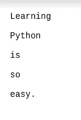

# 在 Python 中逐行比较两个文件

> 原文:[https://www . geeksforgeeks . org/python 中逐行比较两个文件/](https://www.geeksforgeeks.org/compare-two-files-line-by-line-in-python/)

在 Python 中，有许多方法可以进行这种比较。在本文中，我们将了解如何逐行比较两个不同的文件。Python 支持许多这样的模块，这里我们将讨论使用它的各种模块的方法。

本文使用两个示例文件来实现。

**正在使用的文件:**

*   [file.txt](https://drive.google.com/file/d/1kxbOVwiFj-SM7r3RXS3yTR4yHlvxL-Ss/view?usp=sharing)


*   [file1.txt](https://drive.google.com/file/d/1F9H06F9GFTS8CmhP4I9DGhLWUCSsZcBl/view?usp=sharing)



### 方法 1:使用 unified_diff()

Python 有一个模块，专门用于比较文件之间的差异。为了使用 **difflib** 库获得差异，我们必须调用 **unified_diff()** 函数来进行比较。

> **语法:**
> 
> unified_diff(文件 1、文件 2、fromfile、tofile、lineterm)
> 
> **参数:**
> 
> *   **文件 1:** 字符串列表如**文件 _ 1 _ 文本**
> *   **文件 2:** 字符串列表如**文件 _ 2 _ 文本**
> *   **fromfile:** 扩展名为的第一个文件名
> *   **tofile:** 扩展名为的第二个文件名
> *   **lineterm:** 参数为“”，这样输出将自动一致地无换行符

**接近**

*   导入模块
*   打开文件
*   使用具有适当属性的 unified_diff()进行比较

**示例:**

## 蟒蛇 3

```
# Importing difflib
import difflib

with open('file1.txt') as file_1:
    file_1_text = file_1.readlines()

with open('file2.txt') as file_2:
    file_2_text = file_2.readlines()

# Find and print the diff:
for line in difflib.unified_diff(
        file_1_text, file_2_text, fromfile='file1.txt', 
        tofile='file2.txt', lineterm=''):
    print(line)
```

**输出:**

> — file1.txt
> 
> +++ file2.txt
> 
> @@ -1,5 +1,5 @@
> 
> 学问
> 
> 计算机编程语言
> 
> 是
> 
> -也是
> 
> -很简单。
> 
> +所以
> 
> +简单。

### 方法 2:使用不同的

在 **difflib** 库中，有一个类可用于比较名为**different**的文件之间的差异。这个类用于比较文本行的序列，并产生人类可读的差异或增量。

<figure class="table">

| 密码 | 意义 |
| --- | --- |
| '-' | 序列 1 的唯一行 |
| '+' | 序列 2 的唯一行 |
| ' ' | 两个序列共有的行 |
| '?' | 在任一输入序列中都不存在行 |

</figure>

**接近**

*   导入模块
*   打开文件
*   读取内容行 bt 行
*   使用不同的类对象调用比较函数

**示例:**

## 蟒蛇 3

```
from difflib import Differ

with open('file1.txt') as file_1, open('file2.txt') as file_2:
    differ = Differ()

    for line in differ.compare(file_1.readlines(), file_2.readlines()):
        print(line)
```

**输出:**

> 学问
> 
> 计算机编程语言
> 
> 是
> 
> 也是
> 
> –简单。
> 
> +所以
> 
> +简单。

### 方法 3:使用 while 循环和交集方法

**接近**

*   以读取模式打开这两个文件
*   存储字符串列表
*   开始借助公共字符串的交集()方法来比较这两个文件
*   使用 while 循环比较两个文件的差异
*   关闭两个文件

**示例:**

## 蟒蛇 3

```
# Open File in Read Mode
file_1 = open('file1.txt', 'r')
file_2 = open('file2.txt', 'r')

print("Comparing files ", " @ " + 'file1.txt', " # " + 'file2.txt', sep='\n')

file_1_line = file_1.readline()
file_2_line = file_2.readline()

# Use as a COunter
line_no = 1

print()

with open('file1.txt') as file1:
    with open('file2.txt') as file2:
        same = set(file1).intersection(file2)

print("Common Lines in Both Files")

for line in same:
    print(line, end='')

print('\n')
print("Difference Lines in Both Files")
while file_1_line != '' or file_2_line != '':

    # Removing whitespaces
    file_1_line = file_1_line.rstrip()
    file_2_line = file_2_line.rstrip()

    # Compare the lines from both file
    if file_1_line != file_2_line:

        # otherwise output the line on file1 and use @ sign
        if file_1_line == '':
            print("@", "Line-%d" % line_no, file_1_line)
        else:
            print("@-", "Line-%d" % line_no, file_1_line)

        # otherwise output the line on file2 and use # sign
        if file_2_line == '':
            print("#", "Line-%d" % line_no, file_2_line)
        else:
            print("#+", "Line-%d" % line_no, file_2_line)

        # Print a empty line
        print()

    # Read the next line from the file
    file_1_line = file_1.readline()
    file_2_line = file_2.readline()

    line_no += 1

file_1.close()
file_2.close()
```

**输出:**

> 比较文件
> 
> @ file1.txt
> 
> # file2.txt
> 
> 两个文件中的公共行
> 
> 学问
> 
> 计算机编程语言
> 
> 是
> 
> 两个文件中的不同行
> 
> @-第 4 行也是
> 
> #+第 4 行 so
> 
> @-第 5 行简单。
> 
> #+第 5 行简单。