# 在 Docker 容器上配置 HTTPD 服务器并设置 Python 解释器

> 原文:[https://www . geesforgeks . org/configuration-httpd-server-on-docker-container-and-setting-python-interpreter/](https://www.geeksforgeeks.org/configuring-httpd-server-on-docker-container-and-setting-up-python-interpreter/)

在本文中，我们将讨论如何在 docker 容器上配置 apache web 服务器以及设置 Python 解释器的分步指南。基本上，我们正在安装 apache 的产品，也就是 docker 容器上的 HTTPD。

## **什么是 Docker？**

简单来说，如果非要我定义 docker 的话，就是一个可以在几秒钟内启动操作系统(安装任何操作系统)的工具。如果你已经注意到，当我们安装任何操作系统时，启动大约需要一个小时，但是 docker 为你提供了在几秒钟内启动任何操作系统的便利，httpd 只是我们用来创建网页的 apache web 服务的一个产品。

### **先决条件:**

*   您需要在操作系统中安装虚拟机箱
*   并在虚拟机中启动一个 Linux 操作系统(RHEL-8，Linux (64 位))来执行此练习。
*   Yum，应该在您的虚拟机中配置。

## **如何在 Docker 容器上配置 HTTPD 服务器？**

*   首先，我们需要在您的虚拟机中安装 docker，因此首先使用以下命令进入 repo 文件夹。

```
cd /etc/yum.repos.d/
```

*   通过命令 **vim d.repo** 给任何名称创建一个 repo，并给这个 [URL](https://download.docker.com/linux/centos/7/x86_64/stable/) 。您必须在 docker repo 中添加这个 [URL](https://download.docker.com/linux/centos/7/x86_64/stable/) ，如下图所示。


托布鲁克休息

*   之后，您可以使用以下命令安装 docker:

```
yum install docker-ce  --nobest
```

*   要检查 docker 是否已安装，请运行以下命令:

```
rpm -q docker-ce
```

*   要启动服务并检查 docker 的状态，您可以运行以下命令:

启动码头工人服务:

```
systemctl start docker
```

检查码头工人状态:

```
systemctl status docker
```

### **现在要在 docker 容器的顶部配置 web 服务器，这些步骤是:**

*   启动带有图像的 docker 容器
*   我们在其中安装网络服务器程序(Apache 服务器)
*   启动服务器
*   在 docker 中，我们安装了 python 解释器(python3)

**在 docker 中启动容器之前，确保停止防火墙，然后重新启动 docker。**

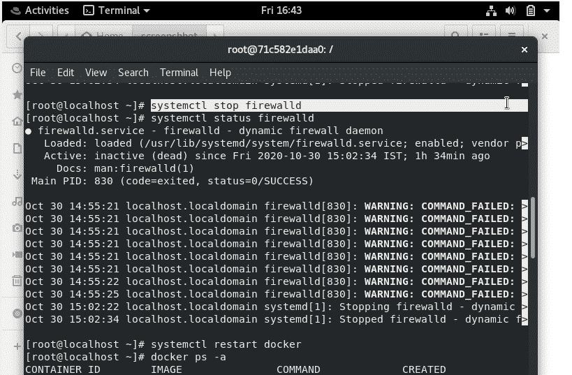

停止防火墙

*   现在要在 docker 上启动一个 *os /container* 我们需要一个图像你可以使用这个图像，我们正在使用 ubuntu: 20.10 图像，你可以从[https://hub.docker.com/](https://hub.docker.com/)获得它，要下载这个图像我们只需要使用一个命令

```
docker pull ubuntu:20.10
```

*   现在你可以通过这个图像来启动容器:**docker run-I-t-name taskd Ubuntu:20.10**，从容器中出来的命令是 **exit** ，你可以通过使用以下命令来检查有多少操作系统停止并运行:

```
docker ps -a
```

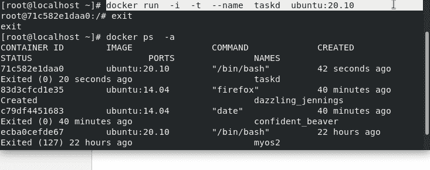

午餐集装箱

*   要进入已退出的 docker 容器，我们有一个命令 **docker 附加任务**这里*任务*是你在启动容器时给出的名称，你可以根据需要给出任何名称。在进入容器之前，您必须首先通过以下命令启动停止的容器:

```
docker start taskd
```

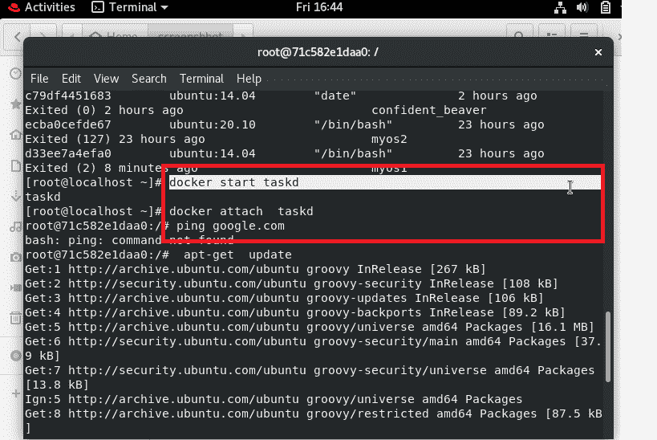

进入码头集装箱

*   现在我们可以在 docker 容器中开始安装了首先我们使用命令 **apt-get update** ，这个命令用于从所有配置的来源下载包信息。因此，当您运行更新命令时，它会从互联网下载包信息。获取包的更新版本或它们的依赖关系的信息是很有用的。

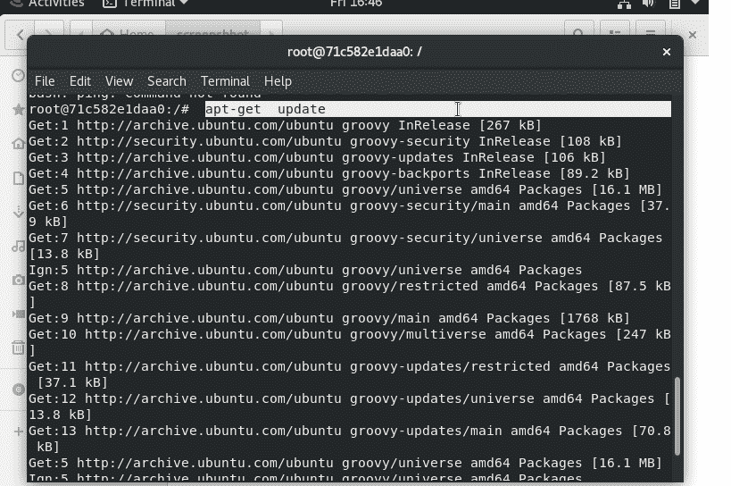

apt-get 更新

*   现在我们可以通过命令 **apt-get install apache2** 在 docker 容器的顶部安装一个 apache web 服务器，在 ubuntu 中我们有这个命令 **apt-get** 来下载和安装任何软件。


在容器上安装 web 服务器(Apache)

*   现在我们必须使用以下命令来安装 *systemctl* :

```
apt-get install systemctl
```

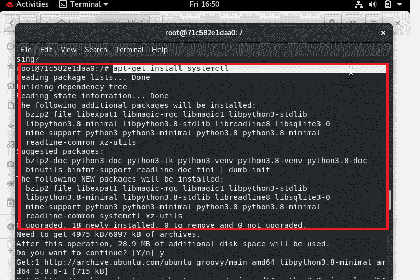

在容器中安装 systemctl 命令

*   命令: **apt-get 安装网络工具**将帮助您运行 *ifconfig* 命令。

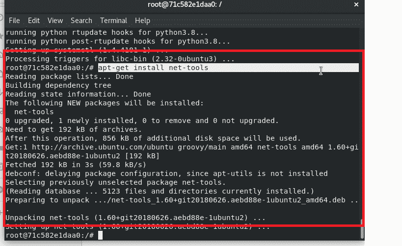

安装网络工具

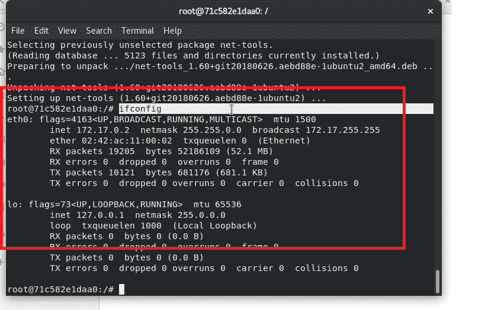

运行 ifconfig 查看 IP

*   使用以下命令安装 vim:

```
apt-get install vim
```

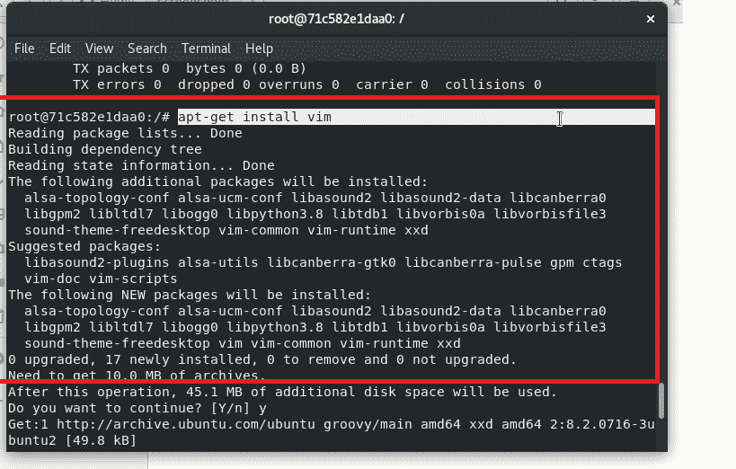

安装 vim 以创建文件

*   现在这个安装部分完成后，我们必须配置网络服务器，我们需要转到 **cd /var/www/html/** ，在那里我们必须使用**vim hello.html**创建一个网站。

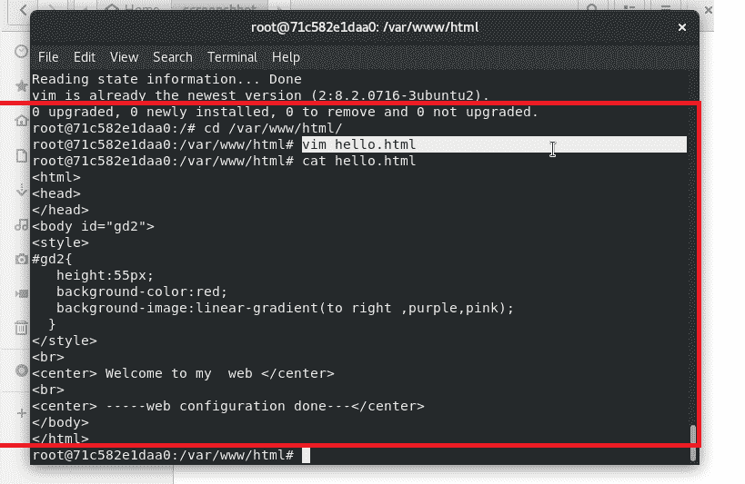

创建网站

*   现在通过命令启动服务， **systemctl start appache2** 并检查状态，确保其处于活动状态。

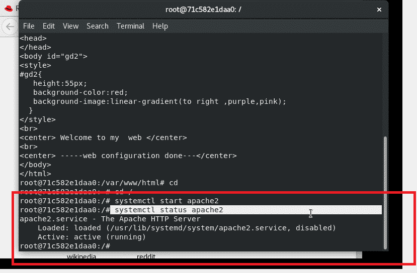

启动 web 服务

*   现在通过 *ifconfig* 命令获取 IP，并在浏览器中使用 URL **IP/hello.html** 。

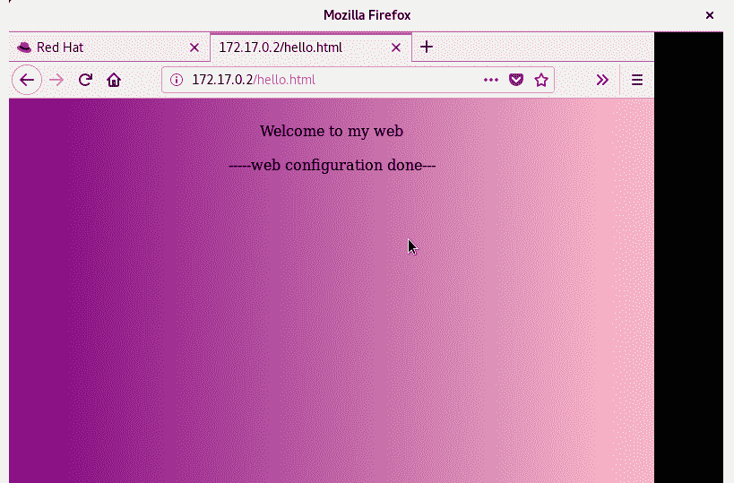

查看火狐中的网站

## **在 Docker 容器中设置 Python 解释器**

*   首先，我们需要通过以下命令安装 python3:

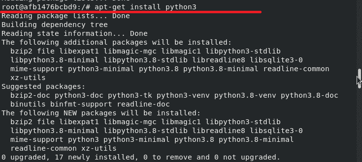

*   查看 python3 是否安装

```
python3 -V
```

