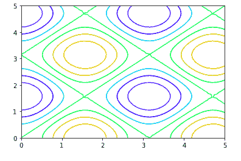
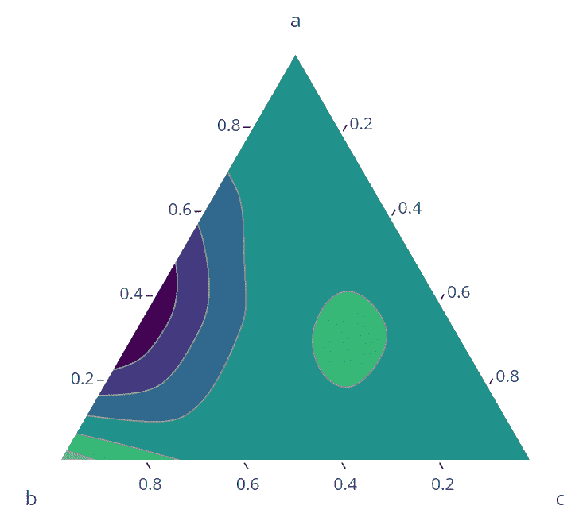

# 等高线图

> 原文:[https://www.geeksforgeeks.org/contour-plots/](https://www.geeksforgeeks.org/contour-plots/)

等高线图是一种图形方法，通过以二维格式绘制称为等高线的恒定 Z 切片来可视化三维表面。等高线图是三维曲面图的替代方案

等高线图由以下部分组成:

*   *纵轴*:自变量 2
*   *横轴*:自变量 1
*   *行*:等响应值，可以借助(x，y)计算。

独立变量通常被限制在一个规则的网格中。确定正确等响应值的实际技术相当复杂，而且几乎总是由计算机生成的。

等高线图用于描述 Z 值相对于 X 和 Y 值的变化。如果数据(或函数)没有形成规则网格，通常需要执行二维插值来形成规则网格。

对于一个变量数据，运行序列/直方图被认为是必要的。对于双变量数据，散点图被认为是必要的。等高线图也可以是极坐标(r，θ)而不是传统的直角(x，y，z)坐标。

#### 等高线图的类型:

*   **矩形等高线图**:2D 投影-2D 地块-矩形画布。这是等高线图最常见的形式。
*   **极坐标等高线图** *:* 极坐标等高线图是利用极坐标 *r* 和*θ*绘制的。这里的响应变量是将 r 和θ传递给给定函数时生成的值的集合，其中 r 是距原点的距离，θ是距正 x 轴的角度。
*   **三元等值线图** *:* 三元等值线图以填充三角形的形式表示 3 个解释变量与响应变量之间的关系。

等高线图可以用不同的编程语言绘制:

*   **Python/ Matplotlib** :等高线图可以使用 *plt.contour* 或 *plt.contourf* 函数绘制，其中 *plt* 为 *matplotlib.pyplot* 。这两者的区别在于*生成空心等高线图，而*生成实心等高线图。
*   **Matlab** :轮廓绘制可以使用*轮廓图(二维图)和轮廓图 3(三维图)等功能*
*   **R** :可以用*填充创建等高线图，等高线*功能在 R 中

#### 实现:

*   **矩形等高线图:**下面是用 Python 和 matplotlib 绘制矩形等高线图的示例代码。

## 蟒蛇 3

```py
#  imports
import numpy as np
import matplotlib.pyplot as plt
#
# define a function
def func(x, y):
    return np.sin(x) ** 2 +  np.cos(y) **2
# generate 50 values b/w 0 a5
x = np.linspace(0, 5, 50)
y = np.linspace(0, 5, 50)

# Generate combination of grids
X, Y = np.meshgrid(x, y)
Z = func(X, Y)

# Draw rectangular contour plot
plt.contour(X, Y, Z, cmap='gist_rainbow_r');
```

<center></center>

*   **极坐标等高线图:**为了绘制极坐标等高线图，我们需要首先定义 r 和θ。下面是使用 matplotlib 子图绘制极坐标等高线图的示例代码。

## 蟒蛇 3

```py
# generate r and theta arrays
rad_arr = np.radians(np.linspace(0, 360, 20))
r_arr = np.arange(0, 1, .1)
# define function
def func(r, theta):
  return r * np.sin(theta) 

r, theta = np.meshgrid(r_arr, rad_arr)
# get the values of response variables
values = func(r,theta)

# plot the polar coordinates
fig, ax = plt.subplots(subplot_kw=dict(projection='polar'))
ax.contourf(theta, r, values, cmap='Spectral_r')

plt.show()
```

<center>


极坐标等高线图

</center>

*   **三元等高线图:** Matplotlib 没有提供绘制三元等高线图的明确的应用编程接口，但是，有许多其他包可以做到这一点。在这个例子中，我们将使用 Plotly 库。

## 蟒蛇 3

```py
# install & import plotly
! pip install plotly
import plotly.figure_factory as ff

# Define variables
a = np.array([0\. , 0\. , 0., 0., 1./3, 1./3, 1./3, 2./3, 2./3, 1.])
b = np.array([0., 1./3, 2./3, 1., 0., 1./3, 2./3, 0., 1./3, 0.])
c = 1 - a - b
# Define function that generates response variable
func = (a - 0.02) * b * (a - 0.5) * (b - 0.4) * (c - 1)**2

# plot ternary contour
fig = ff.create_ternary_contour(np.array([a, b, c]), func,
                                pole_labels=['a', 'b', 'c'],
                                interp_mode='cartesian',
                                colorscale='Viridis',)
fig.show()
```

<center>


三元等高线图

</center>

#### **参考文献:**

*   [NIST 手册](https://www.itl.nist.gov/div898/handbook/eda/section3/contour.htm)
*   [剧情库](https://plotly.com/python/ternary-contour/)