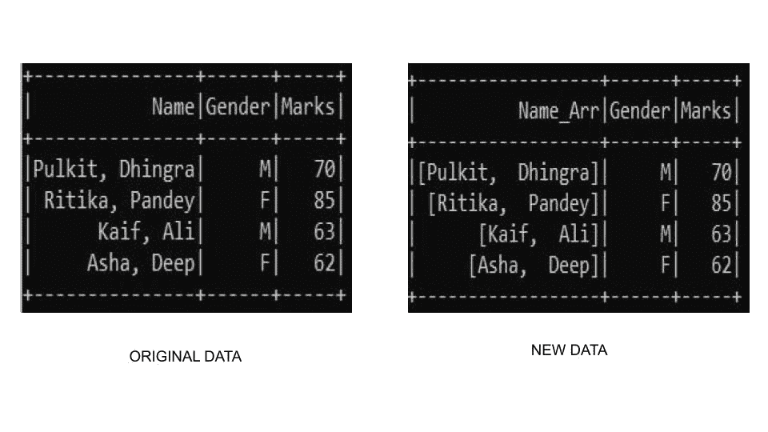

# 将逗号分隔的字符串转换为 PySpark 数据框中的数组

> 原文:[https://www . geesforgeks . org/convert-逗号分隔字符串到数组 in-pyspark-dataframe/](https://www.geeksforgeeks.org/convert-comma-separated-string-to-array-in-pyspark-dataframe/)

在本文中，我们将学习如何在 pyspark dataframe 中将逗号分隔的字符串转换为数组。

在 pyspark SQL 中， **split()** 函数将**分隔符**分隔的字符串转换为数组。这是通过基于分隔符(如空格、逗号)拆分字符串，并将它们堆叠成一个数组来实现的。此函数返回数组类型的 pyspark.sql.Column。

> **语法:***pyspark . SQL . functions . split(str，pattern，limit=-1)*
> 
> ***参数:***
> 
> *   **字符串:-** 要拆分的字符串。
> *   **限制:-** 控制模式应用次数的整数
> *   **模式:-** 用于拆分字符串的分隔符。

### **示例**

让我们看几个例子来理解代码的工作原理。

**示例 1:使用字符串值**

让我们看一个示例，看看 split 函数是如何工作的。对于本例，我们已经创建了自定义数据框，并使用 split 函数创建了一个与学生姓名相联系的姓名。这里我们将对字符串数据格式的列应用 split。

## 蟒蛇 3

```py
# import required modules
from pyspark.sql import SparkSession
from pyspark.sql.functions import split, col

# start the spark session
spark = SparkSession.builder \
         .appName('GeeksforGeeks') \
         .getOrCreate()

# create the dataframe
data = [("Pulkit, Dhingra","M",70),
            ("Ritika, Pandey","F",85),
            ("Kaif, Ali","M",63),
            ("Asha, Deep","F",62)
            ]

columns=["Name","Gender","Marks"]
df=spark.createDataFrame(data,columns)

# use split function 
df2 = df.select(split(col("Name"),",").alias("Name_Arr"),
                col("Gender"),col("Marks")) \
    .drop("Name")

df2.show()

# stop session
spark.stop()
```

**输出:**



**示例 2:使用整数值**

如果我们想转换成数字类型，我们可以使用 cast()函数和 split()函数。在本例中，我们使用 cast()函数来构建整数数组，因此我们将使用 cast(ArrayType(IntegerType()))，其中它明确指定我们需要转换为整数类型的数组。

## 蟒蛇 3

```py
# import required modules
from pyspark.sql import SparkSession
from pyspark.sql.functions import split, col
from pyspark.sql.types import ArrayType, IntegerType

# start the spark session
spark = SparkSession.builder \
         .appName('GeeksforGeeks') \
         .getOrCreate()

# create the dataframe
data = [("Pulkit, Dhingra","M","70,85"),
            ("Ritika, Pandey","F","85,95"),
            ("Kaif, Ali","M","63,72"),
            ("Asha, Deep","F","62,92")
            ]

columns=["Name","Gender","Marks"]
df=spark.createDataFrame(data,columns)
df.show()

# use split function 
df2 = df.select(col("Name"),col("Gender"),
split(col("Marks"),",").cast(
  ArrayType(IntegerType())).alias("Marks_Arr"))

df2.show()

# stop session
spark.stop()
```