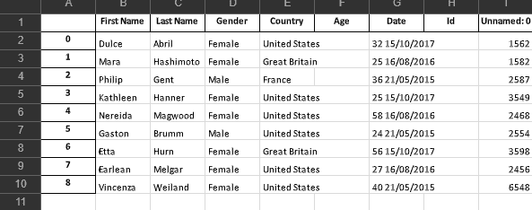

# 使用 Python 将 Excel 转换为 PDF

> 原文:[https://www . geesforgeks . org/convert-excel-to-pdf-using-python/](https://www.geeksforgeeks.org/convert-excel-to-pdf-using-python/)

Python 是一种高级、通用且非常流行的编程语言。Python 编程语言(最新的 Python 3)正被用于网络开发、机器学习应用以及软件行业的所有前沿技术。

在本文中，我们将学习如何使用 Python 将 Excel 文件转换为 PDF 文件

这里我们将使用 **win32com** 模块进行文件转换。

## **win 32 com 是什么？**

微软视窗的 Python 扩展提供了对大部分 Win32 应用编程接口的访问，创建和使用 COM 对象的能力，以及 Pythonwin 环境。

```
pip install pywin32
```

**进场:**

*   首先，我们将使用**调度()**方法创建一个 **COM** 对象。
*   然后我们将阅读 Excel 文件传递“Excel。调度方法中的“应用”
*   传递 Excel 文件路径
*   然后我们将使用 **ExportAsFixedFormat()** 方法将其转换为 PDF

**ExportAsFixedFormat():-**ExportAsFixedFormat 方法用于以 PDF 或 XPS 格式发布工作簿。

> **语法:**
> 
> 导出固定格式(类型，文件名，质量，包括属性，忽略重印区域，从，到，
> 
> OpenAfterPublish，FixedFormatExtClassPtr)

**Excel 文件** [**点击此处**](https://drive.google.com/file/d/1Hxa1tElp_gRN46HUul-UjNJVczKZeqTG/view?usp=sharing)

**输入:**



**EXCEL 文件**

**下面是实现:**

## 蟒蛇 3

```
# Import Module
from win32com import client

# Open Microsoft Excel
excel = client.Dispatch("Excel.Application")

# Read Excel File
sheets = excel.Workbooks.Open('Excel File Path')
work_sheets = sheets.Worksheets[0]

# Convert into PDF File
work_sheets.ExportAsFixedFormat(0, 'PDF File Path')
```

**输出:**


**PDF 文件**