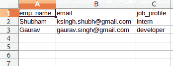

# 用 Python 将 JSON 转换成 CSV

> 原文:[https://www . geesforgeks . org/convert-JSON-to-CSV-in-python/](https://www.geeksforgeeks.org/convert-json-to-csv-in-python/)

**JSON 的完整形式是 JavaScript 对象标注**。这意味着由编程语言中的文本组成的脚本(可执行)文件用于存储和传输数据。Python 通过一个名为 JSON 的内置包支持 JSON。为了使用这个特性，我们在 Python 脚本中导入 JSON 包。JSON 中的文本是通过带引号的字符串完成的，该字符串包含{ }内键值映射中的值。它类似于 Python 中的字典。

**CSV(逗号分隔值)**是一种简单的文件格式，用于存储表格数据，如电子表格或数据库。CSV 文件以纯文本形式存储表格数据(数字和文本)。文件的每一行都是数据记录。每条记录由一个或多个字段组成，用逗号分隔。使用逗号作为字段分隔符是这种文件格式的名称来源。

> 参考下面的文章，了解 JSON 和 CSV 的基础知识。
> 
> *   [使用 Python 中的 JSON 数据](https://www.geeksforgeeks.org/working-with-json-data-in-python/)
> *   [用 Python 处理 CSV 文件。](https://www.geeksforgeeks.org/working-csv-files-python/)

#### 将 JSON 转换为 CSV

对于由键和值对组成的简单 JSON 数据，键将是 CSV 文件的头，值是描述性数据。

**示例:**假设 JSON 文件是这样的:


我们想把上面的 JSON 转换成 CSV 文件，用 key 作为头文件。

## 蟒蛇 3

```py
# Python program to convert
# JSON file to CSV

import json
import csv

# Opening JSON file and loading the data
# into the variable data
with open('data.json') as json_file:
    data = json.load(json_file)

employee_data = data['emp_details']

# now we will open a file for writing
data_file = open('data_file.csv', 'w')

# create the csv writer object
csv_writer = csv.writer(data_file)

# Counter variable used for writing
# headers to the CSV file
count = 0

for emp in employee_data:
    if count == 0:

        # Writing headers of CSV file
        header = emp.keys()
        csv_writer.writerow(header)
        count += 1

    # Writing data of CSV file
    csv_writer.writerow(emp.values())

data_file.close()
```

**输出:**



如果您正在处理像下面这样的 JSON 数据:

> [
> 
> { '年龄':18.0，'工资':20000.0，'性别':'男性'，'国家':'德国'，'购买':' N'}
> 
> { '年龄':19.0，'工资':22000.0，'性别':'女性'，'国家':'法国'，'购买':' N'}
> 
> { '年龄':20.0，'工资':24000.0，'性别':'女性'，'国家':'英国'，'购买':' N'}
> 
> ]

下面的代码将为您完美地工作(请在运行前格式化代码)

## 蟒蛇 3

```py
import json
import csv

with open('G:\Akhil\jsonoutput.json') as json_file:
    jsondata = json.load(json_file)

data_file = open('G:\Akhil\jsonoutput.csv', 'w', newline='')
csv_writer = csv.writer(data_file)

count = 0
for data in jsondata:
    if count == 0:
        header = data.keys()
        csv_writer.writerow(header)
        count += 1
    csv_writer.writerow(data.values())

data_file.close()
```