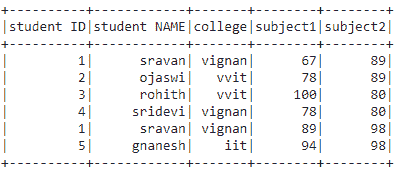

# 将 PySpark 数据帧转换为元组列表

> 原文:[https://www . geesforgeks . org/convert-py spark-data frame-to-list-of-tuples/](https://www.geeksforgeeks.org/convert-pyspark-dataframe-to-list-of-tuples/)

在本文中，我们将把 Pyspark 数据帧转换成元组列表。

数据框中的行存储在由逗号运算符分隔的列表中。因此，我们将使用嵌套列表创建一个数据帧

**创建用于演示的数据框:**

## 蟒蛇 3

```py
# importing module
import pyspark

# importing sparksession from pyspark.sql module
from pyspark.sql import SparkSession

# creating sparksession and giving an app name
spark = SparkSession.builder.appName('sparkdf').getOrCreate()

# list  of students  data
data = [["1", "sravan", "vignan", 67, 89],
        ["2", "ojaswi", "vvit", 78, 89],
        ["3", "rohith", "vvit", 100, 80],
        ["4", "sridevi", "vignan", 78, 80],
        ["1", "sravan", "vignan", 89, 98],
        ["5", "gnanesh", "iit", 94, 98]]

# specify column names
columns = ['student ID', 'student NAME',
           'college', 'subject1', 'subject2']

# creating a dataframe from the lists of data
dataframe = spark.createDataFrame(data, columns)

# display
dataframe.show()
```

**输出:**



## **方法一:使用 collect()方法**

通过将每一行转换成一个元组，并将这些行附加到一个列表中，我们可以获得元组格式列表中的数据。

**元组():**用于将数据转换为元组格式

> **语法:**元组(行)

**示例:**将数据帧转换为元组列表。

## 蟒蛇 3

```py
# define a list
l=[]

# collect data from the  dataframe
for i in dataframe.collect():
   l.append(tuple(i))
   # convert to tuple and append to list

# print list of data
print(l)
```