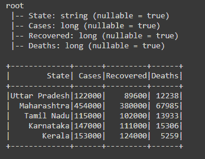
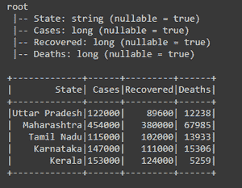

# 将 PySpark RDD 转换为数据帧

> 原文:[https://www . geesforgeks . org/convert-py spark-rdd-to-data frame/](https://www.geeksforgeeks.org/convert-pyspark-rdd-to-dataframe/)

在本文中，我们将讨论如何在 PySpark 中将 RDD 转换为数据帧。有两种方法可以将 RDD 转换为数据帧。

1.  使用 createDataframe(rdd，架构)
2.  使用 toDF(模式)

但是在继续将 RDD 转换为数据帧之前，让我们先创建一个 RDD

**示例:**

## 计算机编程语言

```py
# importing necessary libraries
from pyspark.sql import SparkSession

# function to create new SparkSession
def create_session():
    spk = SparkSession.builder \
        .appName("Corona_cases_statewise.com") \
        .getOrCreate()
    return spk

# function to create RDD
def create_RDD(sc_obj, data):
    df = sc.parallelize(data)
    return df

if __name__ == "__main__":

    input_data = [("Uttar Pradesh", 122000, 89600, 12238),
                  ("Maharashtra", 454000, 380000, 67985),
                  ("Tamil Nadu", 115000, 102000, 13933),
                  ("Karnataka", 147000, 111000, 15306),
                  ("Kerala", 153000, 124000, 5259)]

    # calling function to create SparkSession
    spark = create_session()

    # creating spark context object
    sc = spark.sparkContext

    # calling function to create RDD
    rd_df = create_RDD(sc, input_data)

    # printing the type
    print(type(rd_df))
```

**输出:**

```py
<class 'pyspark.rdd.RDD'>
```

### **方法 1:使用 createDataframe()函数。**

创建 RDD 之后，我们使用 createDataframe()函数将其转换为数据帧，在该函数中，我们传递了 RDD 并定义了数据帧的模式。

**语法:**

```py
spark.CreateDataFrame(rdd, schema)
```

## 计算机编程语言

```py
# importing necessary libraries
from pyspark.sql import SparkSession

# function to create new SparkSession
def create_session():
  spk = SparkSession.builder \
      .appName("Corona_cases_statewise.com") \
      .getOrCreate()
  return spk

# function to create RDD
def create_RDD(sc_obj,data):
  df = sc.parallelize(data)
  return df

# function to convert RDD to dataframe
def RDD_to_df(spark,df,schema):

  # converting RDD to df using createDataframe()
  # in which we are passing RDD and schema of df
  df1 = spark.createDataFrame(df,schema)
  return df1

if __name__ == "__main__":

  input_data = [("Uttar Pradesh",122000,89600,12238),
          ("Maharashtra",454000,380000,67985),
          ("Tamil Nadu",115000,102000,13933),
          ("Karnataka",147000,111000,15306),
          ("Kerala",153000,124000,5259)]

  # calling function to create SparkSession
  spark = create_session()

  # creating spark context object
  sc = spark.sparkContext

  # calling function to create RDD
  rd_df = create_RDD(sc,input_data)

  schema_lst = ["State","Cases","Recovered","Deaths"]

  # calling function to covert RDD to dataframe
  converted_df = RDD_to_df(spark,rd_df,schema_lst)

  # visualizing the schema and dataframe
  converted_df.printSchema()
  converted_df.show()
```

**输出:**



### **方法二:使用 toDF()函数。**

在创建 RDD 之后，我们使用 toDF()函数将其转换为数据帧，在该函数中，我们传递了为数据帧定义的模式。

**语法:**

```py
df.toDF(schema)
```

## 计算机编程语言

```py
# importing necessary libraries
from pyspark.sql import SparkSession

# function to create new SparkSession
def create_session():
  spk = SparkSession.builder \
      .appName("Corona_cases_statewise.com") \
      .getOrCreate()
  return spk

# function to create RDD
def create_RDD(sc,data):
  df = sc.parallelize(data)
  return df

# function to convert RDD to dataframe
def RDD_to_df(df,schema):

  # converting RDD to dataframe using toDF()
  # in which we are passing schema of df
  df = rd_df.toDF(schema)
  return df

if __name__ == "__main__":

  input_data = [("Uttar Pradesh",122000,89600,12238),
          ("Maharashtra",454000,380000,67985),
          ("Tamil Nadu",115000,102000,13933),
          ("Karnataka",147000,111000,15306),
          ("Kerala",153000,124000,5259)]

  # calling function to create SparkSession
  spark = create_session()

  # creating spark context object
  sc = spark.sparkContext

  # calling function to create RDD
  rd_df = create_RDD(sc,input_data)

  schema_lst = ["State","Cases","Recovered","Deaths"]

  # calling function to covert RDD to dataframe
  converted_df = RDD_to_df(rd_df,schema_lst)

  # visualizing the schema and dataframe
  converted_df.printSchema()
  converted_df.show()
```

**输出:**

