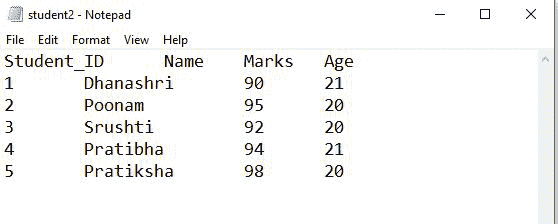

# 在 Python 中将 TSV 转换为 TXT

> 原文:[https://www.geeksforgeeks.org/convert-tsv-to-txt-in-python/](https://www.geeksforgeeks.org/convert-tsv-to-txt-in-python/)

在本文中，我们将看到如何在 Python 中将 TSV 文件转换为文本文件。

## **进场:**

*   使用 Open()函数打开 TSV 文件
*   打开 txt 文件，我们将在其中写入 TSV 文件数据
*   然后使用 csv.reader()它将返回一个 reader 对象，该对象将遍历给定 TSV 文件中的行。(设置分隔符="\t ")
*   将数据逐行写入打开的 txt 文件
*   关闭打开的文件

**语法:**

```py
csv.reader(file_name, delimiter="\t")
```

**参数:**

*   文件名是输入文件
*   分隔符是制表符分隔符

**例 1:**

**使用的文件:**


## 蟒蛇 3

```py
# importing library
import csv

# Open tsv and txt files(open txt file in write mode)
tsv_file = open("Student.tsv")
txt_file = open("StudentOutput.txt", "w")

# Read tsv file and use delimiter as \t. csv.reader
# function retruns a iterator
# which is stored in read_csv
read_tsv = csv.reader(tsv_file, delimiter="\t")

# write data in txt file line by line
for row in read_tsv:
    joined_string = "\t".join(row)
    txt_file.writelines(joined_string+'\n')

# close files
txt_file.close()
```

**输出:**


**例 2:**

**使用的文件:**


## 蟒蛇 3

```py
# importing library
import csv

# Open tsv and txt files(open txt file in write mode)
tsv_file = open("Downloads/Student-1.tsv")
txt_file = open("Downloads/student2.txt", "w")

# Read tsv file and use delimiter as \t. csv.reader
# function retruns a iterator
# which is stored in read_csv
read_tsv = csv.reader(tsv_file, delimiter="\t")

# write data in txt file line by line
for row in read_tsv:
    joined_string = "\t".join(row)
    txt_file.writelines(joined_string+'\n')

# close files
txt_file.close()
```

**输出:**

