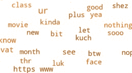

# 使用 Python 将 WhatsApp 聊天数据转换为文字云

> 原文:[https://www . geeksforgeeks . org/converting-whatsapp-chat-data-to-word-cloud-use-python/](https://www.geeksforgeeks.org/converting-whatsapp-chat-data-into-a-word-cloud-using-python/)

让我们看看如何使用 **WhatsApp** 聊天文件创建单词云。

将 WhatsApp 聊天文件从。txt 格式到。csv 文件。这可以用熊猫来完成。创建一个读取。txt 文件。那个。txt 文件没有像在。csv 文件。

然后，通过分隔数据并为每列命名，将数据拆分为列。聊天文件中数据集的第一行包含加密细节，这里不需要。然后，将剩下的 2 个部分命名为**日期**和**车队**，这两个部分用逗号隔开，即“，”。

## 蟒蛇 3

```
df = df.drop(0)
df.columns = ['Date', 'Convo']
```

现在，将 Convo 数据集分为“**时间**”和“**内容**两列，两列之间用连字符即“-”隔开。卷积栏中的数据制作成数据框**聊天**。

## 蟒蛇 3

```
Chat = df["Convo"].str.split("-", n = 1, 
                             expand = True)
df['Time'] = Chat[0]
df['Content'] = Chat[1]
```

内容列被创建到另一个数据集 **Chat1** 中，以将其进一步分成两个列，“**用户**和“**消息**”，这两个列都由冒号分隔，即:“”。

## 蟒蛇 3

```
Chat1 = df["Content"].str.split(":", n = 1, 
                                expand = True)
df['User'] = Chat1[0]
df['Message'] = Chat1[1]
```

现在，删除卷积列，并将消息列转换为小写。所有列媒体都省略了单元格，已删除的消息由字符串“共享媒体”和“删除媒体”替换。

## 蟒蛇 3

```
df = df.drop(columns = ['Convo'])
df[['Message'] = df['Message'].str.lower()
df['Message'] = df['Message'].str.replace('<media omitted>', 
                                          'Media Shared')
df['Message'] = df['Message'].str.replace('this message was deleted', 
                                          'DeletedMsg')
```

最后，数据帧被转换为名为“ **new_csv.csv** ”的. csv 文件。

## 蟒蛇 3

```
df.to_csv("new_csv.csv", index = False)
```

现在我们必须从这个 CSV 文件中制作一个单词云。为此，我们需要 word cloud 和 matplotlib.plyplot 包。使用 new_csv.csv 文件从中读取数据并创建一个数据框。创建一组停止词和一个变量来存储从词云函数生成的所有数据。从包含所有聊天文本的**消息**列中提取数据，并将其转换为小写字符串。

## 蟒蛇 3

```
# importing the modules
import matplotlib.plyplot as mpl
from worcloud import WordCloud,STOPWORDS

# reading the csv file as a DataFrame
df1 = pd.read_csv("new_csv.csv")

# defining the stop words
stopwords = set(STOPWORDS)
words=''.join(df1.Message.astype(str)).lower()

# making the word cloud
wordcloud = WordCloud(stopwords = stopwords, 
                      min_font_size = 10,
                      background_color = 'white', 
                      width = 800,
                      height = 800,
                      color_func = random_color_func).generate(words)
```

这里，函数“ **random_color_func** ”用于为单词渲染随机的橙色。这是通过改变 hsl(色调、饱和度、亮度)值来实现的。

## 蟒蛇 3

```
def random_color_func(word = None, 
                      font_size = None, 
                      position = None,  
                      orientation = None, 
                      font_path = None, 
                      random_state = None):
    h = int(360.0 * 21.0 / 255.0)
    s = int(100.0 * 255.0 / 255.0)
    l = int(100.0 * float(random_state.randint(60, 120)) / 255.0)
```

然后使用 mpl 来绘制单词 cloud 变量中的单词并可视化。

## 蟒蛇 3

```
mpl.figure(figsize = (8, 8), facecolor = None)
mpl.imshow(wordcloud, interpolation = "bilinear")
mpl.axis("off")
mpl.tight_layout(pad = 0)
mpl.show()
```



完整的代码如下:

## 蟒蛇 3

```
import pandas as pd
import matplotlib.plyplot as mpl
from worcloud import WordCloud, STOPWORDS

df = pd.read_csv(r"WhatsAppChat.txt", 
                 header = None, 
                 error_bad_lines = False, 
                 encoding = 'utf8')
df = df.drop(0)
df.columns = ['Date', 'Convo']
Chat = df["Convo"].str.split("-", n = 1, 
                             expand = True)
df['Time'] = Chat[0]
df['Content'] = Chat[1]
Chat1 = df["Content"].str.split(": ", n = 1, 
                                expand=True)
df['User'] = Chat1[0]
df['Message'] = Chat1[1]
df = df.drop(columns = ['Convo'])
df['Message'] = df['Message'].str.lower()
df['Message'] = df['Message'].str.replace('< media omitted >', 'Media Shared')
df['Message'] = df['Message'].str.replace('this message was deleted', 'DeletedMsg')
df.to_csv("new_csv.csv", index = False)

def random_color_func(word = None, 
                      font_size = None, 
                      position = None,  
                      orientation = None, 
                      font_path = None, 
                      random_state = None):
    h = int(360.0 * 21.0 / 255.0)
    s = int(100.0 * 255.0 / 255.0)
    l = int(100.0 * float(random_state.randint(60, 120)) / 255.0)

df1 = pd.read_csv("new_csv.csv")
stopwords = set(STOPWORDS)
words = ''.join(df1.Message.astype(str)).lower()

wordcloud = WordCloud(stopwords = stopwords, 
                      min_font_size = 10, 
                      background_color = 'white', 
                      width = 800, 
                      height = 800, 
                      color_func = random_color_func).generate(words)

mpl.figure(figsize = (8, 8), facecolor = None)
mpl.imshow(wordcloud, interpolation = "bilinear")
mpl.axis("off")
mpl.tight_layout(pad = 0)
mpl.show()
```