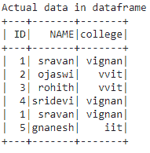

# 根据 Pyspark 数据框中的条件计数行

> 原文:[https://www . geesforgeks . org/count-rows-基于条件的 in-pyspark-dataframe/](https://www.geeksforgeeks.org/count-rows-based-on-condition-in-pyspark-dataframe/)

在本文中，我们将讨论如何根据 Pyspark 数据框中的条件来计算行数。

为此，我们将使用以下方法:

*   使用 where()函数。
*   使用 filter()函数。

**创建用于演示的数据框:**

## 蟒蛇 3

```
# importing module
import pyspark

# importing sparksession from pyspark.sql module
from pyspark.sql import SparkSession

# creating sparksession and giving an app name
spark = SparkSession.builder.appName('sparkdf').getOrCreate()

# list  of students  data 
data =[["1","sravan","vignan"],
       ["2","ojaswi","vvit"],
       ["3","rohith","vvit"],
       ["4","sridevi","vignan"],
       ["1","sravan","vignan"], 
       ["5","gnanesh","iit"]]

# specify column names
columns = ['ID','NAME','college']

# creating a dataframe from the lists of data
dataframe = spark.createDataFrame(data,columns)

print('Actual data in dataframe')
dataframe.show()
```

**输出:**



**注意:**如果想得到所有的行数，可以使用 **count()** 函数

> **语法:** dataframe.count()
> 
> 其中，dataframe 是 pyspark 输入数据帧

**示例:** Python 程序获取所有行计数

## 蟒蛇 3

```
print('Total rows in dataframe')
dataframe.count()
```