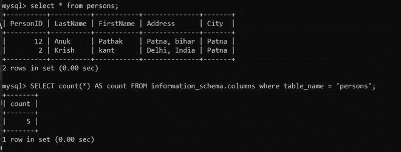
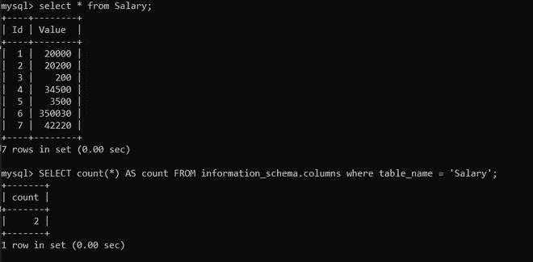

# 使用 Python 对 SQL 表列进行计数

> 原文:[https://www . geesforgeks . org/count-SQL-table-column-use-python/](https://www.geeksforgeeks.org/count-sql-table-column-using-python/)

**先决条件:** [Python: MySQL 创建表](https://www.geeksforgeeks.org/python-mysql-create-table/)

在本文中，我们将看到如何使用 Python 对 MySQL 表的表列进行计数。Python 允许广泛的数据库服务器与应用程序的集成。从 Python 访问数据库需要数据库接口。 [**MySQL 连接器**](https://www.geeksforgeeks.org/mysql-connector-python-module-in-python/) -Python 模块是 Python 中的一个 API，用于与 MySQL 数据库进行通信。

我们要用**极客**(数据库名)数据库和表格描述工资。

**进场:**

*   导入模块。
*   向数据库发出连接请求。
*   为数据库游标创建一个对象。
*   执行以下 MySQL 查询:

> 从信息模式中选择计数(*)作为新列名。列，其中表名=“表名”；

**例 1:**

在本例中，我们将该数据库用于以下查询；



## 蟒蛇 3

```
# Establish connection to MySQL database
import mysql.connector

mydb = mysql.connector.connect(
    host="localhost",
    user="root",
    password="root123",
    database="geeks"
)

# Create a cursor object
mycursor = mydb.cursor()

# Execute the query
query = "SELECT count(*) AS New_column_name FROM information_schema.columns where table_name = 'Persons';"
mycursor.execute(query)

myresult = mycursor.fetchall()

print(myresult[-1][-1])

# Close database connection
mydb.close()
```

**输出；**

```
5
```

**例 2:**

在本例中，我们将该数据库用于以下查询；



## 蟒蛇 3

```
# Establish connection to MySQL database
import mysql.connector

mydb = mysql.connector.connect(
    host="localhost",
    user="root",
    password="root123",
    database="geeks"
)

# Create a cursor object
mycursor = mydb.cursor()

# Execute the query
query = "SELECT count(*) AS New_column_name FROM information_schema.columns where table_name = 'Salary';"
mycursor.execute(query)

myresult = mycursor.fetchall()

print(myresult[-1][-1])

# Close database connection
mydb.close()
```

**输出:**

```
2
```