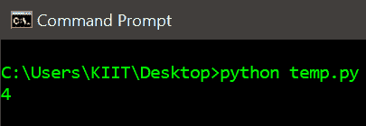

# 统计一个字母在 Python 文本文件中出现的次数

> 原文:[https://www . geesforgeks . org/count-一个字母在 python 文本文件中出现的次数/](https://www.geeksforgeeks.org/count-the-number-of-times-a-letter-appears-in-a-text-file-in-python/)

在本文中，我们将学习不同的方法来计算一个字母在 Python 文本文件中出现的次数。以下是我们将在下面的程序 *:* 中使用的文本文件*的内容*


现在我们将讨论获取文本文件中字母频率的各种方法。

**方法 1:** 使用内置的*计数()*方法。

**进场:**

*   阅读文件。
*   将文件内容存储在变量中。
*   使用 *count()* 方法，将参数作为一个字母，其频率是必需的。
*   显示信件的数量。

**实施:**

## 蟒蛇 3

```
# Program to get letter count in a text file

# explit function to return the letter count
def letterFrequency(fileName, letter):
    # open file in read mode
    file = open(fileName, 'r')

    # store content of the file in a variable
    text = file.read()

    # using count()
    return text.count(letter)

# call the function and display the letetr count
print(letterFrequency('gfg.txt', 'g'))
```

**输出:**


**方法 2:** 遍历文件内容，以便将每个字符与给定的字母进行比较。

**进场:**

*   阅读文件。
*   将文件内容存储在变量中。
*   分配一个计数器*计数*变量为 0。
*   遍历每个字符，如果发现该字符是给定的字母，则递增计数器。
*   显示信件的数量。

**实施:**

## 蟒蛇 3

```
# Program to get letter count in a text file

# explit function to return the letter count
def letterFrequency(fileName, letter):
    # open file in read mode
    file = open(fileName, "r")

    # store content of the file in a variable
    text = file.read()

    # declare count variable
    count = 0

    # iterate through each character
    for char in text:

        # compare each character with
        # the given letter
        if char == letter:
            count += 1

    # return letter count
    return count

# call function and display the letter count
print(letterFrequency('gfg.txt', 'g'))
```

**输出:**

